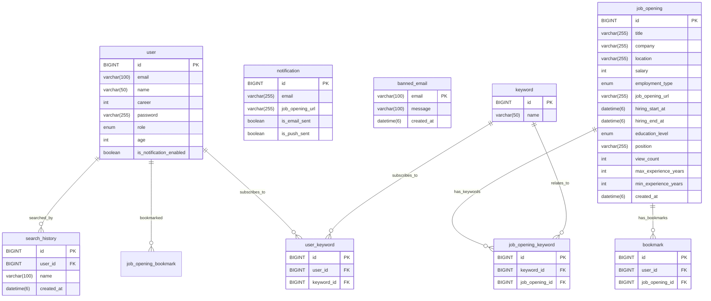

# 3조 - 👑 취하여 (Cheer-ha)

## 🚀 서비스 소개
### ✨ 서비스 개요

<aside>

### "취업을 위하여! 똑똑한 개발자 취업, 클릭 한 번으로 시작하세요!"

‘취하여’는 포트폴리오와 코딩 테스트 준비로 바쁜 개발자들이 여러 사이트를 돌아다니며 채용 공고를 찾는 수고를 덜고, 원하는 채용 정보를 빠르고 편리하게 확인할 수 있도록 지원하는 서비스입니다.

다양한 사이트에 분산된 개발자 채용 공고를 한곳에 모아 보여주고, 사용자의 기술 역량으로 지원할 수 있는 채용 공고를 이메일 알림으로 제공합니다.

</aside>

### 🎯 **‘취하여’가 해결하는 세 가지 불편함**
.jpg?raw=true)

🔹 **정확한 단어 검색 필요** ➡️ **단어 일부만 입력해도 검색 가능!** 🔍    
🔹 **인기 기준 모호** ➡️ **연령대·기술 요건 기반 인기 공고 제공!** 🔥  
🔹 **반복 입력 불편** ➡️ **기술 역량 등록 시 맞춤 공고 이메일 발송!** 📩  

### 🏷️ **도메인 용어**

| **항목**  | **키워드**                                        | **채용 공고**                             |
|---------|------------------------------------------------|---------------------------------------|
| **정의**  | 채용 공고 안에 있는 기술 요건 목록                           | 여러 채용 사이트를 크롤링하여 가져온 개발자 채용 공고 목록     |
| **특징**  | 백엔드 및 프론트엔드에서 쓰이는 스택 위주                        | 고용 형태, 학력, 직무 등 자격 요건 및 URL 포함        |
| **종류**  | 프로그래밍 언어, 프레임워크, 라이브러리 등                 | 백엔드 개발자 채용 공고, 데이터 엔지니어 채용 공고 등       |
| **예시**  | Java, Python, Spring Boot, Kafka, AWS, Jira    | ‘토스 백엔드 개발자 모집’, ‘카카오뱅크 서버 개발자 모집’    |

### 👤 사용자 이용 흐름


### 🔄 서비스 작동 흐름


### 🔑 핵심 기능

<aside>

#### 🔍 **클린 코드처럼 깔끔한 검색 기능!**
- **자동 완성 & 부분 검색 지원**
  - 한 글자만 입력해도 추천 검색어 제공
  - 오탈자를 입력해도 정확한 채용 공고 조회 가능
- **검색 우선순위 적용**
  - `제목 → 회사명 → 키워드` 순으로 검색
    <details>
      <summary> 필터 항목 보기 </summary>
      <ul>
        <li>지역</li>
        <li>채용 형태: 정규직, 계약직, 아르바이트, 인턴, 프리랜서</li>
        <li>학력: 무관, 고졸, 전문학사, 학사, 석사, 박사</li>
        <li>채용 시작일 & 마감일</li>
        <li>최소 경력 & 최고 경력</li>
        <li>채용 공고 제목, 회사명, 기타 자격 요건</li>
      </ul>
    </details>

#### 🔥 **HOT한 채용 공고만 모아 모아!**
- **조회수 Top 100 인기 채용 공고**
- **연령대마다 가장 많이 즐겨찾기로 등록한 채용 공고 Top 10**
- **연령대별로 많이 등록된 키워드 Top 10**

#### 🔖 **즐겨찾기와 이메일 알림으로 취업을 위하여!**
- **관심 있거나 자신의 기술 역량을 키워드로 등록, 조회, 삭제 가능**
- **맞춤형 채용 공고 이메일 알림**
  - 등록한 키워드를 기반으로 `하루 1회` 맞춤형 채용 공고 20건 이메일 발송
  - 이메일 인증 필수
  - 20건 선정 기준: 사용자가 등록한 키워드가 많이 겹치는 순 내림차순
- **즐겨찾기 기능**
  - 관심 있는 채용 공고를 즐겨찾기에 등록, 조회, 삭제 가능
  - 최대 200개 등록 가능: 초과 시 가장 오래된 항목 자동 삭제
  - 마감된 공고도 즐겨찾기에서 확인 가능
  
<aside>

--- 

## ⚡ 성능 개선, 어디까지 해봤니?

<details>
  <summary> <strong>🏎️ MySQL vs Elasticsearch, 채용 공고 검색 시 무엇을 사용할까요?</strong> </summary>

### 환경
- **Elasticsearch 버전**: 8.17.2
- **QueryDSL**: MySQL을 이용한 데이터 조회
- **테스트 도구**: Apache JMeter
- **테스트 요청**: HTTP GET 요청
- **동시 요청**: 200개 (100개씩 총 2번 요청)
- **서버 환경**: 로컬 서버 (localhost)
- **클라이언트 환경**: JMeter 클라이언트

### 비교
| **테스트 항목**    | **MySQL 조회 (QueryDSL)**  | **Elasticsearch 조회**  | **성능 향상률**  |
|---------------|--------------------------|-----------------------|-------------|
| **평균 응답 시간**  | 48ms                     | 14ms                  | 70.83%      |
| **최소 응답 시간**  | 39ms                     | 9ms                   | 77%         |
| **최대 응답 시간**  | 117ms                    | 41ms                  | 65%         |
| **표준편차**      | 9.37ms                   | 3.28ms                | 64%         |
| **TPS**       | 8.63/sec                 | 9.5/sec               | +10.1%      |
| **수신량**       | 8.63KB/sec               | 65.01KB/sec           | +653.5%     |
| **전송된 데이터**   | 0.57KB                   | 3.94KB                | +591.2%     |
| **평균 바이트**    | 6300.9 Byte              | 6971.9 Byte           | +10.7%      |

### 결론
- **응답 시간**: 최소 응답 시간은 77%, 최대 응답 시간은 65% 향상됨
- **표준편차**: 약 64% 향상됨
- **TPS**: 약 10% 증가함
- **수신량 및 전송량**: 수신량은 653.5%, 전송량은 591.2% 증가함
- **대규모 데이터 조회 성능 개선이 필요할 때는 Elasticsearch 사용**
</details>

<details>
  <summary> <strong>🏎️ 채용 공고를 조회할 때 스레드 수는 얼마나 늘릴 수 있을까요?</strong> </summary>

###  환경
- **Elasticsearch 버전**: 8.17.2
- **Elasticsearch QueryDSL**: Elasticsearch에서 데이터를 직접 조회하여 처리
- **테스트 도구**: Apache JMeter
- **테스트 요청**: HTTP GET 요청
- **동시 요청**: 100개 ~ 2100개까지 100씩 증가하며 테스트 (10초로 설정)
- **서버 환경**: 로컬 서버 (localhost)
- **클라이언트 환경**: JMeter 클라이언트

### 비교 


| **요청 개수**      | **시스템 상태**          | **응답 시간**            | **TPS**             | **기타 영향**       |
|-----------------|-------------------|--------------------|----------------|--------------|
| 🟢 **1600개 이하** | 안정적으로 처리 가능     | ⏳ 일정하게 유지 (8-7ms)  | 📈 일정하게 증가   | -            |
| 🟡 **1600개 이상** | 시스템 자원이 부족해짐   | ⏳ 일정하게 유지 (8-7ms)  | 📉 일부 구간 정체   | 성능 저하 발생  |
| 🔴 **2100개 이상** | 시스템 한계 초과       | ⏳ 느려짐 (11ms)         | 📉 처리량 감소     | 심각한 성능 저하  |

### 결론
- 스레드 수가 증가함에 따라 응답 시간과 TPS가 명확하게 변화함 
- 스레드 수가 1600개일 때까지는 시스템이 원활하게 요청을 처리 
- 스레드 수가 2100개 이상 늘어나면 성능이 저하됨 
- **성능 한계 전에 자원을 효율적으로 관리하고 병목을 예방해야 함**
</details>

<details>
  <summary> <strong>🏎️ 연령대별 인기 키워드 조회 기능의 속도와 처리량을 어떻게 늘릴까요?</strong> </summary>

### 환경
- **서버**: 로컬 환경 및 배포 서버에서 테스트 수행
- **사용된 도구**: Postman, JMeter, QueryDSL
- **연령대**: 취업 연령층이 가장 많은 25세에서 40세로 고정
- **테스트 도구**: Apache JMeter
- **스레드**: 100 스레드로 고정

### 비교

**1. 쿼리 변경 전후 비교 결과**
- QueryDSL을 사용하여 서브 쿼리 제거
- 단일 쿼리 안에서 `count`를 바로 계산

(1) 스레드 100개를 10초로 나누어서 요청 처리 시 ⬇️

| **비교 항목**         | **서브 쿼리 적용 시** | **단일 쿼리 적용 시** | **성능 향상률** | **배율** |
|----------------------|----------------------|----------------------|----------------|----------|
| **평균 응답 시간**    | 41493ms              | 50ms                 | 99.88%         | 829.86배 |
| **최소 응답 시간**    | 30012ms              | 33ms                 | 99.89%         | 909.45배 |
| **최대 응답 시간**    | 145268ms             | 102ms                | 99.93%         | 1424.2배 |
| **표준 편차**         | 34426.78ms           | 8.05ms               | 99.98%         | 4276.62배 |
| **에러 발생 비율**    | 90.00%               | 0.00%                | 100.0%         | 완전 개선 |
| **처리량**            | 41.2/min             | 606/min              | 1370.87%       | 14.71배  |

  (2) 스레드 100개를 120초로 나누어서 요청 처리 시 ⬇️

| **비교 항목**         | **서브 쿼리 적용 시** | **단일 쿼리 적용 시** | **성능 향상률** | **배율** |
|----------------------|----------------------|----------------------|----------------|----------|
| **평균 응답 시간**    | 48315ms              | 65ms                 | 99.87%         | 743.31배 |
| **최소 응답 시간**    | 30011ms              | 54ms                 | 99.82%         | 555.76배 |
| **최대 응답 시간**    | 145738ms             | 145ms                | 99.9%          | 1005.09배 |
| **표준 편차**         | 40427.71ms           | 10.06ms              | 99.98%         | 4018.66배 |
| **에러 발생 비율**    | 83.00%               | 0.00%                | 100.0%         | 완전 개선 |
| **처리량**            | 23.9/min             | 50.5/min             | 111.3%         | 2.11배   |

**2. **`user`** 테이블의 **`age`** 컬럼에 인덱스 추가**  
(1) 인덱스 적용 전후 **`EXPLAIN`** 비교

| **비교 항목**             | **인덱스 적용 전**      | **인덱스 적용 후**        | **개선 사항**                  |
|--------------------------|------------------------|--------------------------|----------------------------|
| **user 테이블 조회 방식** | ALL (Full Table Scan)   | range (Index Range Scan) | ✅ 인덱스 적용으로 테이블 전체 스캔 제거    |
| **JOIN 방식**             | ref                    | ref                      | -                          |
| **keyword 테이블 조회 방식** | eq_ref                 | eq_ref                   | -                          |
| **조회된 user 테이블 행 개수** | 2000                   | 1118                     | ✅ 인덱스 적용으로 조회 대상 감소        |
| **Filtered 비율**         | 11.11%                 | 100%                     | ✅ 불필요한 행 단위 스캔 제거          |
| **Extra**                 | Using temporary; Using filesort | Using where; Using index; Using temporary | ✅ 파일 정렬 제거<br> ✅ 인덱스 활용 증가 |
| **Possible Keys**         | PRIMARY                | PRIMARY, idx_user_age    | ✅ 추가 인덱스 활용 가능             |

(2) 인덱스 적용 전후 **`EXPLAIN ANALYZE`** 비교

| **비교 항목**             | **인덱스 적용 전** | **인덱스 적용 후** | **개선 사항**           |
|--------------------------|-------------------|-------------------|------------------------|
| **Nested Loop Join 시간** | 40.2ms            | 36ms              | ✅ 불필요한 연산 감소   |
| **필터링된 row 개수**     | 2000              | 1118              | ✅ 불필요한 행 단위 스캔 감소 |
| **Using Index 적용 여부** | No                | Yes               | ✅ Covering Index Scan 활용 |
| **실행 시간**             | 62.5ms            | 52.4ms            | ✅ 약 16% 속도 개선     |

### 결론 

- **서브 쿼리 최적화 후 성능 개선**
   - 실행 시간: 31.49s → 146ms로 **99.5% 단축**
   - 에러 발생 비율: 90% → **0%로 완전 개선**
   - 응답 시간: 평균 50ms로 안정적 유지 
- **인덱스 적용 후 성능 비교**
   - 실행 시간: 62.5ms → 52.4ms로 **약 16% 개선**
   - 인덱스를 적용한 결과는 성능 개선이 크게 이루어지지 않음 
   - 또한, 인덱스를 적용하면 쓰기 성능에 영향을 미치는 만큼, 인덱스 적용 ❌
</details>

<details>
  <summary> <strong>🏎️ 서브 쿼리 vs 단일 쿼리, 연령대별 인기 즐겨찾기 조회에는 무엇이 좋을까요?</strong> </summary> 

### 환경 

- **테스트 도구**: Apache JMeter
- **테스트 요청**: HTTP 요청 (GET)
- **동시 요청**: 100개의 스레드로 테스트 (10초 동안)
- **서버 환경**: 로컬 서버 (localhost)
- **클라이언트 환경**: JMeter 클라이언트
- **데이터베이스**: MySQL
- **쿼리 처리 도구**: MySQL QueryDSL

### 비교

| **비교 항목** | **서브쿼리로 조회 시** | **단일쿼리로 조회 시** | **성능 개선 비율**  |
| --- | --- | --- | --- |
| **평균 응답 시간** | 29s 767ms | 787ms | 97.36% |
| **최소 응답 시간** | 12s 860ms | 553ms | 95.70% |
| **최대 응답 시간** | 38s 828ms | 1s 81ms | 97.21% |
| **표준편차** | 6s 145.32ms | 106.37ms | 98.27% |
| **에러 비율** | 70.00% | 0.00% | 100.00% |
| **처리량** | 2.4/sec | 9.5/sec | 295.83% |

### 결론
- 평균 응답 시간: **97.36% 개선**
- 처리량: **295.83% 향상**
- 에러 비율: **70%에서 0%로 완전 개선**
- Postman 로컬 서버에서 조회: 3s 62ms → 376ms로 **87.76% 향상**
- Postman 배포 서버에서 조회: 11s 13ms → 50ms로 **99.55% 향상**
- Jmeter 테스트: 29s 737ms → 787ms로 **97.36% 향상**

</details>

<details>
  <summary> <strong>🏎️ 21초에서 9초, 이메일 알림 발송 속도를 어떻게 개선할 수 있을까요?</strong> </summary>

### 환경  
- **서버 환경**: 로컬 서버 (localhost)  
- **이메일 발송 방식**: Gmail SMTP  
- **SMTP 설정**: Gmail SMTP (포트 587)  
- **이메일 발송 요청 방식**: Spring Boot MailSender 사용  
- **총 이메일 발송 건수**: 9건 (3명 × 3회)  
- **데이터 ⬇️** 

   (1) 사용자 

  | **사용자 ID (user_id)**    | **키워드 ID (keyword_id)**   | **이메일 (email)**      |
  |-------------------------|---------------------------|----------------------|
  | **1**                   | 1, 2, 5                   | test1@gmail.com      |
  | **2**                   | 4, 5                      | test2@gmail.com      |
  | **3**                   | 1, 2, 7                   | test3@gmail.com      |

   (2) 채용 공고

  | **채용 공고 ID (job_opening_id)**    | **키워드 ID (keyword_id)**   | **URL (job_opening_url)**    |
  |----------------------------------|---------------------------|------------------------------|
  | **1**                            | 1, 2, 3                   | url1                         |
  | **2**                            | 4, 5                      | url2                         |

   (3) 같은 키워드끼리 연결한 결과

  | **키워드 ID (keyword_id)**    | **채용 공고 ID (job_opening_id)**    | **사용자 ID (user_id)**    |
  |----------------------------|----------------------------------|-------------------------|
  | **1, 2, 3**                | 1                                | 1, 3                    |
  | **4, 5**                   | 2                                | 1, 2                    |

### 비교
- `transform()` 메서드로 불필요한 연산 제거 
- `ThreadPoolTaskScheduler`를 10개로 설정하여 발송 작업을 비동기로 처리

(1) 개선 전 테스트 (채용 공고 및 사용자 조회는 2회차부터 데이터베이스 캐싱이 적용되므로, 해당 값 반영 ❌)

| **회차** | **채용 공고 조회** | **사용자 조회**  | **전체 발송**       | **전체 작업**       | **발송 1** | **발송 2** | **발송 3** |
|-------|--------------|-------------|-----------------|-----------------|----------|----------|----------|
| **1** | 150 ms       | 3 ms        | 22 s 490 ms     | 22 s 644 ms     | 9 s 58 ms | 4 s 199 ms | 9 s 231 ms |
| **2** | - ms         | - ms        | 21 s 550 ms     | 21 s 556 ms     | 8 s 419 ms | 4 s 113 ms | 9 s 17 ms |
| **3** | - ms         | - ms        | 21 s 458 ms     | 21 s 470 ms     | 8 s 808 ms | 3 s 415 ms | 9 s 95 ms |
| **평균** | **150 ms**   | **3 ms**    | **21 s 832 ms** | **21 s 890 ms** | **8 s 808 ms** | **3 s 909 ms** | **9 s 114 ms** |

(2) 개선 후 테스트 (채용 공고 및 사용자 조회는 2회차부터 데이터베이스 캐싱이 적용되므로, 해당 값 반영 ❌)

| **회차** | **채용 공고 조회** | **사용자 조회** | **전체 발송**      | **전체 작업**   | **발송 1**   | **발송 2**   | **발송 3** |
|--------|--------------|------------|----------------|-------------|------------|------------|----------|
| **1**  | 100 ms       | 3 ms       | 9 s 830 ms     | 9 s 936 ms  | 9 s 829 ms | 9 s 292 ms | 9 s 432 ms |
| **2**  | - ms         | - ms       | 9 s 615 ms     | 9 s 623 ms  | 8 s 292 ms | 9 s 614 ms | 8 s 732 ms |
| **3**  | - ms         | - ms       | 9 s 762 ms     | 9 s 771 ms  | 9 s 762 ms | 9 s 406 ms | 8 s 553 ms |
| **평균** | **100 ms**   | **3 ms**   | **9 s 736 ms** | **9 s 777 ms** | **9 s 294 ms** | **9 s 437 ms** | **8s 906 ms** |

(3) 개선 전후 비교

| **테스트 항목**    | **개선 전 방식 (평균)** | **개선 후 방식 (평균)** | **성능 향상률** | **배율**   |
|---------------|------------------|------------------|------------|----------|
| **채용 공고 조회**  | 150 ms           | 100 ms           | 33.3%      | 1.5배 향상  |
| **사용자 조회**    | 3 ms             | 3 ms             | -          | **-**    |
| **전체 이메일 발송** | 21 s 832 ms      | 9 s 736 ms       | 55.4%      | 2.24배 향상 |
| **전체 작업**     | 21 s 890 ms      | 9 s 777 ms       | 55.4%      | 2.24배 향상 |

### 결론
- **발송 전 로직 개선 후 성능 비교**
    - 채용 공고 조회 속도: 150ms → 100ms로 **33.3% 단축**
- **발송 작업을 비동기로 처리 후 성능 비교**
    - 전체 이메일 발송 작업: 21s 832ms → 9s 736ms로 **55.4% 개선**
    - 전체 작업 완료: 21s 890ms → 9s 777ms로 **55.4% 개선**
- **스레드 풀과 비동기 처리를 제대로 적용하면 기능 최적화 가능** 
</details>
</aside>

---

<aside>

## 🏗️ System Architecture
### ☁️ Cloud Architecture


### ⛓️ CI/CD Pipeline


### 📐 설계 과정

<details>
  <summary> Cloud Architecture </summary>

<details>
  <summary> 백엔드 </summary>

- 백엔드는 **Spring Boot** 기반 애플리케이션으로 **AWS EC2 인스턴스 내의 Docker** 에서 실행됩니다.
- ALB (Application Load Balancer)를 사용하여 사용자 요청을 여러 백엔드 서버로 라우팅하여 부하를 분산하고, 주기적인 Health Check와 ASG로 높은 가용성을 제공합니다.
- EC2 인스턴스는 Auto Scaling Group에 속하여 트래픽 증가에도 안전하게 대응할 수 있도록 설정되었습니다.
</details>

<details>
  <summary> 데이터베이스 및 캐시 </summary>

- **MySQL (RDS)**: 고가용성과 편리한 파라미터 설정을 위해 **RDS**에서 관리됩니다.
- **Redis (ElastiCache)**: Redis는 보안이 취약하므로 **ElastiCache에서 제공하는 높은 보안 수준을** 통해 관리됩니다.
- **Elasticsearch**: 신버전을 편리하게 사용할 수 있는 공식 클라우드서비스인 Elastic Cloud를 사용하였습니다. 플러그인 추가가 편리하고, 까다로운 Security 설정을 직접 하지 않아도 됩니다.
</details>

<details>
  <summary> 네트워크 관리 </summary>

- **Route 53**을 사용하여 도메인을 관리하고, 사용자가 접근하는 요청을 **ALB**를 통해 처리하도록 설정합니다.
- **ALB에 SSL 인증서**를 연결해 **HTTPS 요청만 처리**하도록 합니다. **HTTP 요청은 자동으로 HTTPS로 리디렉션됩니다.**
- **VPC** 내에서 **메인 애플리케이션의 Auto Scaling Group**, **RDS MySQL**과 **ElastiCache Redis, 모니터링/로깅 서버를** 함께 관리하여 보안을 강화하고, Private IP를 이용하여 통신해 네트워크 연결을 빠르고 효율적으로 처리합니다.
- **Web Application Firewall**이 봇, 악성 사용자, SQL injection 공격을 막고 로그를 남겨줍니다.
</details>

<details>
  <summary> 모니터링 및 로깅 </summary>
- Prometheus + Grafana / Fluentd를 VPC 내의 EC2에 각각 도커를 이용해 모니터링-로깅 전용 서버를 구축하였습니다.
- 메인 애플리케이션과 Private IP로 통신하므로, 모니터링 정보(exporter)와 로그(logback) 정보 전달 속도가 빠릅니다.
</details>

</details>

<details>
  <summary> CI/CD Pipeline </summary>

<details>
  <summary> 코드 병합 및 CI 테스트 </summary>

- 배포용 브랜치에 **코드가 병합**되면, **GitHub Actions**를 사용하여 **CI 테스트**를 자동으로 실행합니다.
- 이 단계에서 **코드의 안정성**을 검증하여, 문제가 있는 코드는 배포되지 않도록 합니다.
</details>

<details>
  <summary> 도커 이미지 빌드 및 푸시 </summary>

- 테스트가 **성공적으로 통과**하면, **도커 이미지**를 빌드합니다.
- 빌드된 도커 이미지는 **Docker Hub**에 **푸시**되어, 이후의 배포 과정에서 사용할 수 있도록 준비됩니다.
</details>

<details>
  <summary> CD 단계 (배포 자동화) </summary>

- **CD** 단계에서 **AWS의 Auto Scaling Group**을 활용하여 **롤링 업데이트**를 트리거합니다.
- 롤링 업데이트는 서비스의 가용성을 유지하며 **새로운 버전의 애플리케이션**을 **점진적으로 배포**합니다. 새로운 인스턴스가 완전히 배포되고 헬스체크가 완료되면 구버전 인스턴스를 삭제합니다.
- 시작 템플릿에서 Shell Script를 작성해 완벽히 자동화 했습니다.
</details>

<details>
  <summary> 무중단 배포 </summary>

- **무중단 배포**(Zero-Downtime Deployment) 방식이 적용되어, 서비스의 **다운타임 없이** 배포가 진행됩니다.
- 롤링 업데이트 방식 선택: 별다른 설정 없이 ASG로 편리하게 사용 가능합니다.
- 블루-그린과 비교했을 때 배포 도중 트래픽이 일시적으로 몰리는 현상이 없어 서버 관리 비용 부담이 덜하지만, 배포 중에 신버전과 구버전이 혼재합니다. 하지만 저희 서비스에서는 API가 크게 바뀔 상황이 많지 않고, 모니터링-로깅을 구축해 혹시 모를 상황에 대비하도록 설계했습니다.
- 이를 통해 사용자에게 영향을 주지 않고, 새로운 버전의 애플리케이션을 안전하게 배포할 수 있습니다.
- 새로운 버전에 이상이 있을 때에도 버전 롤백을 통해 기존 버전을 그대로 사용할 수 있습니다.
</details>
</details>


### 📝 **Wireframe**


### 💬 **ERD**



---

## 📑 **API 명세서**
- [API 명세서](https://docs.google.com/spreadsheets/d/1CQm7sV-ETn0w-FFe7nOCRKrPIp3i5TQWhKw9B1IDT9s/edit?gid=0#gid=0)

---

## 🎬 **보러 가기**
- [최종 발표 PPT](https://www.canva.com/design/DAGhg82nibo/w6wIMRrulPlgRl9aj5KqSA/view?utm_content=DAGhg82nibo&utm_campaign=designshare&utm_medium=link2&utm_source=uniquelinks&utlId=haeeb4a3bb7)
- [최종 발표 시연 영상]()
- [팀 브로슈어](https://www.notion.so/3-Cheer-ha-1b300cdad765800e9582c3251531bde9)

---

</aside>

<aside>

## 🛠️ 기술 스택                                                                          

**🖥 Language**    
 


**📲 Interface Description Language**     


                                                                                                    
**🧑🏻‍💻 Backend**     
 

 
**🗃 Data Base & Optimization**    
  

 
**🔐 Security**     


**🚢 Deployment & Distribution**     
               

 
**📟 Test**    
  

 
**👥 Collaboration Tool**     
       


**📧 Notification Service**    
 


**📈 Logging & Monitoring & Analytics**     
    

---

</aside>

<aside>
  
## 🔧 기술적 의사결정

<details>
  <summary> <strong>💡 JWT만 사용하기로 했습니다! 그런데 어떻게 해야 안전하게 사용할 수 있을까요?</strong> </summary>

### 요구사항
  - **보안**: 토큰 탈취 방지 및 안전한 저장 방식 필요
  - **성능**: 인증 처리 속도 최적화 및 데이터베이스 서버 부하 최소화
  - **상태 변경에 취약함**: 무상태 인증 방식이므로 로그아웃 및 세션 무효화가 어려움

### 구현

  

  1. **JWT 사용 방식**
      - AccessToken의 유효기간을 짧게 설정하여, 토큰 탈취 시 피해를 최소화 (30분)
      - RefreshToken을 사용하여 재발급 로직을 적용해 장기적으로 인증이 유지되게 함 (7일)
      - RefreshToken을 Redis에 저장하여 DB와의 통신 최소화
  2. **로그아웃 처리**
      - Redis를 활용해 만료된 AccessToken을 BlackList 형식으로 차단
      - RefreshToken을 Redis와 Cookie에서 삭제하여 재발급 방지
  3. **보안 강화**
      - RefreshToken을 HttpOnly & Secure Cookie에 저장하여 XSS공격 방지
      - CSRF 방어를 위해 SameSite=Strict 설정 적용하여 외부 요청에서 쿠키 자동 전송 차단
      - Rotation 전략으로 한번 사용한 RefreshToken은 즉시 만료시켜 재사용 금지, 보안 강화
      - Token의 Payload를 AES256으로 암호화하여 데이터 보호 및 변조 방지
      - HTTPS를 강제 적용해 네트워크에서 토큰 유출 방지

       | **Refresh Token 저장 위치** | ❌ **Authorization Header** | ✅ **HttpOnly Cookie** |
       |-------------------------|----------------------------|-----------------------|
       | **XSS 공격**              | ❌ 취약함 (JavaScript 접근가능)    | ✅ 안전함 (Http Only)     |
       | **CSRF 공격**             | ✅ 안전함 (자동 전송 X)            | ❌ 취약함 (브라우저 자동 전송)    |
       | **클라이언트 편의성**           | ❌ 불편함 (헤더에 직접 포함해야 함)      | ✅ 편리함 (브라우저 자동 전송)    |

</details>

<details>
  <summary> <strong>💡 MySQL vs Elasticsearch, 원하는 채용 공고만 검색할 때 어떤 기술을 적용해야 할까요?</strong> </summary>
 
### 요구사항
- **검색 성능**: 대규모 데이터셋에 대한 빠르고 효율적인 검색을 제공해야 함  
- **한글 텍스트 처리**: 한글 형태소 분석을 통한 정확한 검색 필요  
- **확장성**: 서버의 부하를 분산하고 대규모 트래픽도 원활하게 처리하는 수평 확장이 가능해야 함  
- **자동 완성 및 부분 일치**: 사용자 경험을 향상시킬 수 있는 기능 구현이 가능해야 함  
- **성능 최적화**: 검색 성능을 최적화하여 효율적인 데이터 처리 및 빠른 응답 시간을 보장해야 함  

###  고려한 대안
  | **비교 항목**         | **MySQL**                 | **Elasticsearch**                |
  |-------------------|---------------------------|----------------------------------|
  | **검색 성능**         | ❌ 비효율적, `Full Table Scan` | ✅ 빠르고 효율적, 인덱스 기반                |
  | **한글 텍스트 처리**     | ❌ 비효율적 (형태소 분석 부족)        | ✅ `Nori Analyzer`로 가능함           |
  | **확장성**           | ❌ 수직 확장만 가능               | ✅ 분산 처리로 수평 확장이 가능함              |
  | **자동 완성 및 부분 일치** | ❌ 어려움                     | ✅ 가능                             |
  | **성능 최적화**        | ❌ 제한적                     | ✅ `Ngram`, `Edge-Ngram`으로 최적화 가능 |
    
### 결정 및 근거
**✅ Elasticsearch 선택**
  - 분산형 아키텍처와 인덱싱을 활용해 빠르고 효율적인 검색 성능을 제공함
  - `Nori Analyzer`로 한글 형태소 분석이 가능함
</details>

<details>
    <summary> <strong>💡 @Async vs 비동기 로직 직접 구현, 이메일 알림 발송 시 무엇을 적용할까요?</strong> </summary>

### 요구사항
  - **쉬운 관리**: 스레드 풀을 간단하게 관리할 수 있어야 함
  - **사용 편의성**: 설정 및 관리가 직관적이고 복잡하지 않아야 함

### 고려한 대안

| **비교 항목** | **@Async 어노테이션** | **비동기 로직 직접 구현**                                                      |
| --- | --- |-----------------------------------------------------------------------|
| **관리 난이도** | ✅ 설정이 간단하고 스프링이 관리 | ❌ 별도의 스케줄러 관리 및 설정 필요                                                 |
| **사용 편의성** | ✅ 직관적이고 간편한 설정 | ❌ 설정과 관리가 다소 복잡할 수 있음                                                 |
| **장점** | 🌟 직관적이고 가독성이 좋음 | 🌟 우리가 원하는 대로 비동기 처리 가능                                               |
| **단점** | ⚠️ 별도 설정 없으면 매번 새로운 스레드가 생성되어 자원 낭비 가능 | ⚠️ 초기 설정이 복잡하고 관리가 어려움 <br> ⚠️ 비즈니스 로직과 같은 선상에 로직이 추가되어 가독성이 떨어질 수 있음 |

### 결정 및 근거
✅ **`@Async` 어노테이션 선택**
  - 직관적이고 가독성이 좋음  
  - 스프링이 내부적으로 스레드 풀을 관리하여 직접 관리할 필요가 없고, 관리 부담이 적음  
  - 다른 비동기 작업에도 어노테이션을 사용해 쉽게 비동기 처리 가능
</details>

<details>
    <summary> <strong>💡 데이터베이스에는 어떤 알림 정보를 저장해야 할까요?</strong> </summary>

### 요구사항
- **발송 상태 추적 시 필요**: 알림의 발송 상태를 추적할 때 필요해야 함
- **재발송 처리 시 필요**: 발송에 실패한 알림을 다시 보낼 때 필요해야 함
- **영속성 여부**: 데이터베이스에 저장되어야 할 필요가 있어야 함
- **확장성**: 이메일 외에 다른 형태로 알림을 발송할 때도 활용할 수 있어야 함

### 고려한 후보

| **후보 항목**          | **발송 상태 추적 시**  | **재발송 시**  | **영속성 여부**         | **확장성**          |
|--------------------|-----------------|------------|--------------------|------------------|
| **isSent**         | ✅ 필요            | ✅ 필요       | ❌ 발송 후 저장할 필요 없음   | ✅ 다양한 알림에 적용 가능  |
| **jobOpeningUrl**  | ✅ 필요            | ✅ 필요       | ❌ 발송 후 저장할 필요 없음   | ✅ 다양한 알림에 적용 가능  |
| **email**          | ✅ 필요            | ✅ 필요       | ❌ 발송 후 저장할 필요 없음   | ✅ 다양한 알림에 적용 가능  |
| **readAt**         | ❌ 선택            | ❌ 선택       | ✅ 기능의 유용성 확인 시 필요  | ✅ 다양한 알림에 적용 가능  |
        

### 결정 및 근거
✅ **`isSent`  + `jobOpeningUrl` + `email` 선택**
  - 발송 상태를 추적하고 발송 실패 시 재발송 시도 가능  
  - 동일한 정보를 가진 알림이 중복으로 발송되는 일 방지 가능  
  - 데이터베이스에 저장된 알림 정보로 다른 유형의 알림을 보내는 등 재사용 가능
</details>


<details>
    <summary><strong>💡 MySQL 인덱스 vs Redis, 무엇을 적용해야 검색한 사항을 더 빠르게 조회할 수 있을까요?</strong> </summary>

### 요구사항
  - **사용자 검색어 저장**: 입력한 검색어를 저장하고 빠르게 조회할 수 있도록 관리해야 함
  - **최신 검색어 조회**: 사용자 별 최근 검색어를 최대 10개까지 최신순으로 정렬하여 제공해야 함
  - **빠른 응답 속도**: 대량의 요청에도 즉각적으로 검색어를 반환할 수 있어야 함
  - **불필요한 데이터 관리**: 오래된 검색어는 자동으로 제거하여 불필요하게 축적되지 않도록 해야 함

### 고려한 대안

  | **비교 항목**    | **MySQL 인덱스 적용**                          | **Redis 적용**                                 |
  |--------------|-------------------------------------------|----------------------------------------------|
  | **저장 방식**    | 테이블을 사용하여 인덱스로 검색 최적화                     | Key-Value 방식으로 사용자별 검색어 관리                   |
  | **조회 방식**    | ❌ 인덱스를 활용하여 빠르게 조회가 가능하지만, 요청 증가 시 부하 증가  | ✅ 메모리 기반 저장으로 매우 빠른 조회 속도 제공                 |
  | **데이터 관리**   | ❌ 불필요한 데이터는 수동으로 정리 필요                    | ✅ 최신 10개만 유지하며 초과 데이터는 자동 삭제                 |
  | **데이터 최신성**  | ✅ 실시간 데이터 반영 가능                           | ✅ TTL 설정으로 자동 만료 관리 가능                       |
  | **시스템 부하**   | ❌ 검색 요청 증가 시 데이터베이스 부하 증가                 | ✅ 데이터베이스 부하를 최소화하면서 빠른 응답 제공                 |
  | **확장성**      | ❌ 수직 확장(Scale-Up) 필요, 분산 환경에서 성능 저하 가능    | ✅ 수평 확장(Scale-Out) 가능, 분산 환경에서도 안정적으로 운영 가능  |
    
### 결정 및 근거
**✅ Redis 적용을 선택**
  - 메모리 기반 저장소로 빠른 데이터 조회 및 검색 가능
  - TTL 기능을 활용하여 일정 시간이 지나면 데이터를 자동으로 삭제하여 저장 공간을 효율적으로 활용 가능 
  - Sorted Set 자료구조를 활용하여 검색어를 삽입할 때 자동 정렬 및 중복 제거 가능
  - 수평 확장이 가능하여 대량의 요청을 안정적으로 처리
  - 분산 환경에서도 높은 성능과 안정성을 유지 가능
</details>

<details>
    <summary><strong> 💡 모니터링과 로깅이 필요한 순간이 찾아왔습니다! 필요한 이유와 적절한 기술은 무엇일까요?</strong> </summary>

### 요구사항
  - **비용 최소화**: 모니터링-로깅이 프로젝트 전체의 비용을 높여선 안 됨
  - **자원 재사용:** 이미 프로젝트에서 사용하고 있는 자원을 최대한 재사용해야 함
  - **실시간 반영:** 문제에 빠르게 대응하려면 시스템이 가벼워야 함

  ### 고려한 대안

  | **비교 항목: 모니터링** | **Prometheus + Grafana** | **VictoriaMetrics + Grafana** |
  |-----------------|--------------------------|-------------------------------|
  | **성능**          | 단일 노드에서 100만개 이상 처리 가능   | Prometheus보다 10배 빠름           |
  | **데이터 저장**      | 메모리 기반 저장 후 디스크 저장       | 디스크 기반 저장                     |
  | **확장성**         | 수평 확장 어려움                | 수직,수평 확장에 용이함                 |
  | **운영 비용**       | 오픈소스이지만, 스토리지 비용 발생      | 저장 효율이 높아 스토리지 비용 절약          |
  | **난이도**         | 설치와 설정이 간단함              | 단일 노드는 쉽지만 클러스터링은 복잡          |

  | **비교 항목: 로깅** | **Fluentd**                 | **Logstash**            |
  |---------------|-----------------------------|-------------------------|
  | **성능**        | 가볍고 빠름(멀티스레드 지원)            | 무겁고 싱글스레드 기반, 튜닝 필요     |
  | **리소스 사용**    | RAM, CPU 사용량 적음             | RAM, CPU 사용량 많음         |
  | **운영 난이도**    | 설정이 직관적이고 가벼움               | 설정이 복잡하지만 고급 기능 제공      |
  | **확장성**       | 컨테이너 친화적(Docker,Kubernetes) | 대용량 데이터 처리에 강함          |
  | **데이터 처리**    | JSON 기반 스트리밍 처리(리소스 절약)     | 이벤트 기반 파이프라인(JVM 튜닝 필요) |
    
### 결정 및 근거
✅ **모니터링에 Prometheus + Grafana + Slack 선택**


  - DataDog, CloudWatch 등 다른 대안이 많았지만, 오픈소스가 아니며 유료라 비용 문제 발생
  - VictoriaMetrics: 운영 효율이 좋아 고민했지만, 비교적 한국 문서가 많은 Prometheus 선택
  - 단일 노드에서 100만개 정도면 현재 서비스 기준으론 성능상 문제 없다고 판단함

✅ **로깅에 ElasticSearch + Fluentd + Kibana 선택**


  - 현재 프로젝트에서 Elasticsearch + Kibana를 이미 사용중이어서 ELK vs EFK 스택 중 고민
  - Fluentd 선택: C++ 기반으로 가볍고 빠르며, yaml 기반으로 설정이 편함
  - Logstash 선택 X:  JVM + 이벤트 기반이므로 추가적인 파이프라인 설정이 부담으로 다가옴
</details>

<details>
    <summary><strong> 💡 어떤 락을 적용하여 페이지 조회수 집계 시 발생하는 동시성 문제를 해결할 수 있을까요?</strong> </summary>

### 요구사항
  - **정합성 유지**: 다수의 사용자가 동시에 조회해도 정합성이 유지되어야 함
  - **조회 부하 감소**: 조회를 할 때 불필요한 연산을 하지 않아야 함
  - **응답 속도 안정성 유지**: 조회 할 때마다 응답 속도가 안정적이어야 함

### 고려한 대안

  | **비교 항목**      | **Optimistic Lock**     | **Pessimistic Lock**       | **집계 테이블 Pessimistic Lock** | **Redis와 Distributed Lock 스케줄러**     |
  |----------------|-------------------------|----------------------------|-----------------------------|--------------------------------------|
  | **정합성**        | ❌ 재시도해도 15% 미만          | ✅ 정합성 100%                 | ✅ 정합성 100%                  | ✅ 원자적 연산으로 정합성 100%                  |
  | **조회 시 부하 정도** | ✅ 조회 시 업데이트로 인한 락이 없음   | ❌ 조회 시 락이 걸린 갱신으로 인한 부하 상승 | ✅ 조회 시 갱신하지 않으므로 부하 감소      | ✅ 조회는 RDB이고  집계는 Redis(인메모리)라서 부하 낮음 |
  | **응답 속도 안정성**  | ✅ 업데이트 락이 없으므로 속도가 안정적임 | ❌ 락의 대기로 인해 응답 속도의 불규칙적    | ❌ 락의 대기로 인해 응답 속도가 불규칙적     | ✅ 집계에서 락을 사용하지 않으므로 응답 속도가 안정적       |
  | **단점**         | ⚠️ 충돌 시 정합성이 매우 떨어짐     | ⚠️ DeadLock가능성이 높음         | ⚠️ 충돌 시 응답속도 차이가 있음         | ⚠️ 데이터의 휘발성                          |

### 결정 및 근거
✅ **Redis와 Distributed Lock 스케줄러 선택**
  - Redis의 원자적 연산 incr 사용으로 정합성 유지
  - 조회 시 RDB가 바로 갱신되는 것이 아니므로 부하가 낮음
  - 동시성 관리 자체에는 Lock이 사용되지 않으므로 응답 속도가 안정적임
</details>

</aside>

---

## 🚨 트러블슈팅

<details>
<summary><strong>🔩  Elasticsearch를 적용해서 응답 속도는 빨라졌는데, TPS는 감소했습니다!</strong> </summary> 

### 문제 정의

- Elasticsearch를 도입한 다음, 스레드를 5,000개로 설정했을 때 평균 응답 속도는 단축되었으나, TPS는 오히려 감소함

| **비교 항목**  | **Elasticsearch 적용 전**  | **Elasticsearch 적용 후**  | **배율**       |
|------------|-------------------------|-------------------------|--------------|
| **응답 속도**  | 28ms                    | 7ms                     | **4배 단축**    |
| **TPS**    | 249.1건/sec              | 35.1건/sec               | **7.1배 감소**  |


### 원인 파악
- 너무 많은 동시 요청이 들어와서 CPU와 메모리 같은 자원이 한계에 도달하는 병목 현상이 발생함

### 해결 과정
- 스레드 수를 5,000개에서 200개로 줄인 다음 테스트를 다시 진행함

### 결과
- 스레드 수를 200개로 조정하여 성능이 안정되면서 TPS가 증가함


| **비교 항목**  | **Elasticsearch 적용 전**  | **Elasticsearch 적용 후**  | **배율**       |
|------------|-------------------------|-------------------------|--------------|
| **응답 속도**  | 48ms                    | 14ms                    | **3.4배 단축**  |
| **TPS**    | 1.4건/sec                | 9.5건/sec                | **6.8배 증가**  |

</details>

<details>
<summary><strong>🔩  많은 사용자가 동시에 채용 공고를 조회할 때 응답 시간이 너무 다릅니다!</strong></summary>
    
### 문제 정의

채용 공고 페이지 조회 API에서 동시에 다수의 사용자가 페이지를 조회할 때 조회수 집계 과정에서 동시성 문제가 발생함


### 원인 파악
- 비관적 락 때문에 병목 현상 또는 경쟁 상태(Race Condition) 발생

### 해결 과정
- Redis를 집계 테이블처럼 사용하면서, 분산 락이 적용된 작업 스케줄러로 조회수를 정기적으로 채용 공고 테이블에 업데이트하는 방식 적용

### 결과

| **비교 항목**     | **Redis 적용 전**  | **Redis 적용 후**  | **배율**      |
|---------------|-----------------|-----------------|-------------|
| **평균 응답 시간**  | 431.42ms        | 4.28ms          | 약 100배 단축   |
| **최악 응답 시간**  | 1s 153.94ms     | 6.00ms          | 약 192배 단축   |
| **TPS**       | 210.66          | 398.33          | 약 1.89배 증가  |

</details>

<details>
<summary><strong>🔩  다중 인스턴스 환경에서 스케줄러가 인스턴스 개수만큼 실행됩니다!</strong></summary> 

### 문제 정의
인스턴스 내부 애플리케이션별로 스케줄러가 실행되는데, 다중 인스턴스 환경이라면 이메일 알림 발송 스케줄러가 동시에 실행될 수 있는 위험 존재

### 원인 파악
- 애플리케이션에 등록된 스케줄러가 인스턴스의 개수만큼 실행됨


### 해결
- **Redis 활용**
    - 스케줄링 실행 자체를 ‘단일 인스턴스 환경’에 맡겨서, 중앙에서 제어하는 방식이 필요
    - Redis를 이용하여 작업들을 queue에 넣고, 하나의 인스턴스만 실행되는 구조로 변경
    - 스케줄링을 짧은 주기로 확인해야 하는 만큼, 빠른 읽기 I/O가 요구되는 구조이므로 Redis 사용
- **다중 인스턴스용 스케줄러 아키텍처 적용**

- **누구나 쉽게 사용할 수 있도록 인터페이스 구현**
</details>

<details>
<summary><strong>🔩  사이트마다 프론트도 데이터 형식도 다른데 어떻게 채용 공고 데이터를 크롤링할 수 있을까요?</strong> </summary> 

### 문제 정의
- 크롤링에는 Kotlin 사용  
- 두 채용 공고 사이트 `사람인`과 `잡코리아`를 크롤링했을 때, 두 사이트의 html 태그와 Javascript 형식, 데이터 생김새가 크게 달랐음  

### 원인

- 잡코리아의 개발자 채용 공고 목록 페이지를 `RequestParam`으로 접근할 수 없음
- 사람인의 페이지가 Javascript 랜더링을 사용함
- 학력, 회사 이름 등 데이터가 정리되지 않음

.png?raw=true)

### 해결 과정  
- 잡코리아
  - 목록에서는 `Selenium`으로 버튼을 클릭하여 ‘개발자 채용 공고’ 탭으로 접근 후 URL 크롤링 진행
  - 세부 페이지는 목록에서 가져온 URL로 `jsoup` 크롤링 진행
- 사람인  
  - 사용할 모든 페이지에 Javascript 렌더링이 걸림
  - 목록에서는 `selenium`으로 페이지 끝까지 스크롤 후 URL 크롤링 진행  
  - 세부 페이지 또한 `selenium`으로 크롤링 진행  
- 데이터 정형화  
  - OpenAI API 사용


### 결과
.png?raw=true)

</details>

<details>
<summary><strong>🔩  크롤링하다가 오류가 생기면 채용 공고가 하나도 저장되지 않습니다!</strong> </summary> 

### 문제 정의
- ‘오류 이전의 데이터는 저장이 되었으려나?’ 하였지만 반복문 전체에 트랜잭션을 걸어버린 탓에 데이터가 모두 유실됨
 
### 원인
- 페이지를 순회하는 `forEach`문 전체를 한 트랜잭션으로 감싸버림  
  - 오류 원인 자체는 트랜잭션과 상관없지만, 오류에 대응할 수 있는 코드가 필요해짐  
- 긴 트랜잭션은 다양한 문제를 일으킬 수 있었음  
  - 긴 트랜잭션은 데이터에 오랜 시간 락을 유지하여 동시성 저하와 처리량 감소 가능성 존재  
  - 대기 중인 트랜잭션들은 여전히 시스템 리소스를 점유함
  - 긴 트랜잭션이 더 많은 자원을 더 오래 점유하기 때문에 데드락이 발생할 수 있음
  - 긴 트랜잭션이 많은 수의 행에 락을 설정해서 락 에스컬레이션 발생 확률이 높아짐
        
### 해결
- 트랜잭션 전파 속성을 사용함
- forEach문 내부의 반복되는 코드를 메서드로 분리
- 트랜잭션 전파 속성 중 하나인 `REQUIRES_NEW` 사용
- 페이지마다 새로운 트랜잭션이 생성되도록 리팩토링 진행
  - 한 페이지에서 예외 발생 시 해당 페이지의 작업만 롤백되고 다른 페이지의 크롤링 작업은 정상적으로 진행되도록 함
</details>

<details>
<summary><strong>🔩  이메일 알림으로 보낼 채용 공고가 중복되어 조회됩니다!</strong> </summary> 

### 문제 정의
- 채용 공고가 중복 조회를 방지하고자 생성일을 `ZonedDateTime`으로 추가했는데도 여전히 중복으로 조회되는 문제 발생

### 원인 파악
 - `ZonedDateTime` 사용 시 MySQL에서 서버 시간과 무관하게 자동으로 `UTC`로 저장함
    - MySQL은 `TIMESTAMP` 값을 현재 시간대에서 `UTC`로 변환하여 저장하고, 저장된 값을 다시 `UTC`에서 현재 시간대로 변환하여 조회함

### 해결 과정
- 조회 시간을 UTC로 변경함
- 이전 조회 시간 이후에 올라온 채용 공고만 조회하는 로직은 변경하지 않음

### 4. 결과
- 조회 시간은 `UTC`로 변환되어 출력되고, 한 번 조회된 채용 공고가 중복으로 조회되지 않음
    


</details>

<details>
<summary><strong>🔩  이메일 알림을 발송하려는데 ‘Too many login attempts’ 오류가 발생했습니다!</strong> </summary> 

### 문제 정의
- `Gmail`로 이메일 알림을 발송하려고 할 때, 대량 발송이 아니었는데도 `Too many login attempts` 오류가 발생함

%20(1).png?raw=true)

%20(1).png?raw=true)

### 원인 파악 
- 이메일 알림을 짧은 시간 안에 여러 번 발송하면, `Gmail` 서버가 이를 무차별 대입 공격으로 간주함

### 해결 과정
- 기존의 `Gmail SMTP`를 `SendGrid API`로 대체
%20(1).png?raw=true)
                
%20(1).png?raw=true)
                
%20(1).png?raw=true)
                
%20(1).png?raw=true)

### 결과
- `Too many login attempts` 오류 없이 이메일 알림 발송에 성공함
        
%20(1).png?raw=true)

</details>
</aside>

---

<aside>

## 🏦비즈니스적 의사결정

<details>
<summary><strong>💰 사용자 관리를 어떻게 하면 좋을까요? 이메일 인증과 밴 기능을 추가합시다! </strong></summary>
    
### 문제 정의
- 현재 서비스의 회원가입 및 로그인 절차가 너무 간단하여 누구나 쉽게 가입 및 로그인 가능 
- 서비스에서 사용자의 나이와 경력처럼 민감한 정보를 다루기 때문에, 무분별한 아이디-비밀번호 입력 시도를 방지하는 보안 조치가 필요함

### 설계 및 구현
- 이메일 알림 인증을 받은 사용자에게만 이메일 알림을 발송하도록 개선
- 이메일 서비스 남용 방지 차원에서 한 이메일 당 하루 최대 3번으로 제한
- 인증코드 실패 횟수 체크 및 3회 이상 실패 시 코드 무효화
- 밴 당한 IP는 모든 API를 사용할 수 없도록 전체 차단
- 아이피 밴
  - 한 IP에서 4개 이상의 계정에 로그인 시도 시 밴, 시도 실패 정보는 Redis에 저장
  - IPv6을 우선적으로 수집
  - 공유 네트워크를 고려하여 30초만 Redis에 밴 정보 저장
- 이메일 밴
  - 3일 내에 로그인 5회 이상 실패하면 해당 이메일 밴
  - 실패 정보는 Redis, 밴 정보는 DB에 저장

### 결과
- 이메일 인증으로 회원가입, 이메일 알림 구독, 비밀번호 리셋 가능 ⬇️   
 
- Kibana의 로그 대시보드로 이상 사용자의 IP를 확인하고, 지속적으로 올바르지 않은 요청을 보낸 IP는 WAF에서 차단 가능 ⬇️   

 
</details>

<details>
<summary><strong>💰 채용 공고에서 중요한 제목을 최우선으로, 검색순위를 설정하면 어떨까요?</strong> </summary> 

### 배경
- 채용 공고의 제목, 회사명, 자격 요건 등의 필드에 동일한 우선순위가 적용되어 사용자가 원하는 결과를 빠르게 찾기 어려움

### 요구사항
- **검색 결과의 우선순위 설정**: 채용 공고 검색 시, 중요한 필드인 제목을 가장 높은 우선순위로 설정
- **검색 품질 향상**: 중요한 필드들이 상위에 노출되어 사용자가 보다 빠르게 원하는 검색 결과를 찾을 수 있도록 함

### 고려한 대안

  | **비교 항목**   | **기존 검색 시스템**               | **Boost 기능 적용 후**              |
  |-------------|-----------------------------|--------------------------------|
  | **우선순위 설정** | ❌ 모든 필드에 동일한 우선순위 적용        | ✅ 각 필드에 점수를 부여하여 우선순위 적용       |
  | **검색 품질**   | ❌ 동일한 우선순위로 인해 중요한 정보 노출 부족 | ✅ 중요한 정보(제목)가 먼저 노출되어 검색 품질 향상 |

### 결정 및 근거
✅Elasticsearch의 Boost 기능을 적용
- Title 필드: `boost(2.0f)`를 사용하여 다른 필드들보다 더 높은 우선순위 부여
- Company 필드: `boost(1.5f)`를 적용하여 제목 다음으로 높은 우선순위 부여
- RequiredSkills 필드:`boost(1.0f)`를 설정하여 회사명보다 낮은 우선순위 부여

### 결과
- Spring 으로 검색 시 ⬇️ 


- Java 로 검색 시 ⬇️

</details>

<details>
<summary><strong>💰 비정형 데이터로도 정확한 검색 결과를 얻을 수 있으면 어떨까요?</strong> </summary> 
    
### 배경
- MySQL 기반의 채용 공고 검색 시스템은 오탈자 입력 시 제대로 된 검색 결과를 제공하지 못하여 사용자 경험이 저하됨

### 요구사항
- **오타 처리 기능:** 사용자가 오타가 포함된 검색어를 입력해도 정확한 검색 결과를 제공할 수 있어야 함
- **검색 편의성 향상:** 오타나 변형된 단어를 포함한 유사 단어도 검색 결과에 포함시킬 수 있어야 함
- **사용자 편의성:** 사용자가 오타나 변형된 단어를 포함한 검색어로도 원하는 결과를 빠르게 얻을 수 있도록 해야 함

### 고려한 대안

  | **비교 항목**       | **기존 검색 시스템 (정확한 일치)**        | **Fuzzy 기능 적용 (오타 검색)**              |
  |-----------------|-------------------------------|--------------------------------------|
  | **비정형 데이터 처리**  | ❌ 오타나 변형된 단어가 있으면 검색 결과 미제공   | ✅ 오타나 변형된 단어가 있어도 유사한 단어로 검색 가능      |
  | **검색 편의성**      | ❌ 정확한 일치만 처리, 편의성 저하          | ✅ 오타 및 변형된 단어와 유사한 단어를 포함한 검색 결과 제공  |
  | **사용자 편의성**     | ❌ 오타나 복수형 데이터를 검색 결과에 포함하지 못함 | ✅ 오타나 복수형 단어를 검색어에 포함하여 정확한 검색 결과 제공 |

### 결정 및 근거
**✅Elasticsearch의 Fuzzy 기능 적용**
- 사용자가 실수로 오타(철자 오류, 띄어쓰기 실수)를 입력해도 원하는 결과를 얻을 수 있음
- 사용자가 변형된 단어(복수형, 어미변화)를 입력해도 원하는 결과를 얻을 수 있음

### 결과 
- `머비스`로 검색 시 `모비스`를 찾아옴 ⬇️


- `쿠카오`로 검색 시 `카카오`를 찾아옴 ⬇️


- `나이버`로 검색 시 `네이버`를 찾아옴 ⬇️

</details>

<details>
<summary><strong>💰 자동 완성 기능을 분리하면 원하는 채용 공고만 조회할 수 있을까요? </strong></summary> 

### 배경
- 부분 검색과 자동 완성 검색이 동일한 로직에서 수행되면서 불필요한 검색 결과가 반환됨

### 요구사항
- **검색 성능 최적화**: 불필요한 검색 결과 제거해야 함
- **자동 완성 기능 개선**: 입력된 검색어와 관련된 검색 결과를 빠르게 제공해야 함
- **사용자 경험 개선**: 정확한 검색어를 입력하지 않아도 원하는 검색 결과를 제공해야 함

### 고려한 대안
    
   | **비교 항목**       | **현재 로직 유지**                             | **자동 완성 검색 로직 분리**                |
   |-----------------|------------------------------------------|-----------------------------------|
   | **검색 성능 최적화**   | ❌ 부분 검색과 자동 완성이 동일한 로직에서 수행되어 불필요한 결과 포함 | ✅ 자동 완성 전용 API를 통해 더 정확한 검색 결과 제공 |
   | **자동 완성 기능 개선** | ❌ 자동 완성 기능이 부분 검색과 섞여 있어 추천 정확도 낮음       | ✅ 검색어 입력하면 적절한 자동 완성 검색 결과 제공     |
   | **사용자 경험 개선**   | ❌ 검색어 입력 시 원하는 결과를 찾기 어려움                | ✅ 검색어를 입력하면 적절한 자동 완성 검색 결과 제공 가능 |

### 결정 및 근거
**✅ 자동 완성 검색 로직 분리 결정**
  - 자동 완성 기능 개선으로 검색 시 적절한 자동 완성 검색 결과 제공 가능
  - 검색어 입력 시 적절한 검색 결과를 제공으로 사용자 경험 개선 가능

### 결과 
- `구`로 검색 시 `구`로 시작하는 채용 공고를 찾아옴 ⬇️  

- `하`로 검색 시 `하`로 시작하는 채용 공고를 찾아옴 ⬇️ 

</details>

<details>
<summary><strong>💰 스팸처럼 보이지 않도록 채용 공고는 딱 20개만! 선정 기준은 무엇이 좋을까요?</strong> </summary>

###  배경
- 기존 로직은 기술 요건이 하나만 일치해도 모든 채용 공고를 포함하여 사용자 맞춤성이 낮음

### 2. 요구사항
- **복잡하지 않은 로직**: 채용 공고를 20개 추출하는 로직이 간단해야 함
- **수치화 가능 여부**: 내림차순으로 정렬해야 하므로 숫자로 변환할 수 있어야 함
- **사용자 맞춤화**: 사용자의 수요를 잘 반영할 수 있어야 함

### 고려한 대안

| **비교 항목**       | **기술 요건이 겹치는 순**         | **연봉이 높은 순**                     | **무작위 순**         |
|-----------------|--------------------------|----------------------------------|-------------------|
| **복잡하지 않은 로직**  | ✅ 쿼리로 해결 가능              | ✅ 이미 저장된 값을 조회해 오기 때문에 간단함       | ✅ 가장 간단함          |
| **수치화 가능 여부**   | ✅ 내림차순 정렬 가능             | ❌ ‘면접 후 결정’이 대부분이라 수치화 어려움       | ✅ 수치화할 필요 없음      |
| **사용자 맞춤화**     | ✅ 사용자가 선택한 기술 요건 반영 가능   | ✅ 인기 있는 채용 공고 전달 가능              | ❌ 사용자의 선호 반영 불가능  |
| **단점**          | ⚠️ 쿼리문을 실행하면서 성능 저하 가능성  | ⚠️ 희망 연봉과 맞지 않는 채용 공고가 포함될 수 있음  | ⚠️ 사용자 관심 충족이 어려움 |

### 결정 및 근거
**✅ 기술 요건이 겹치는 순 선택**
  - 쿼리 문으로 복잡하지 않은 로직을 구현하여 내림차순 정렬이 가능함
  - 사용자가 선택한 기술 요건을 반영할 수 있어, 보다 맞춤화된 이메일 알림 제공 가능

### 결과 
- 사용자가 선택한 기술 요건이 많이 겹치는 순으로 상위 20개 알림을 이메일 한 개로 발송하는 데 성공함 
</details>
</aside>

<aside>

## 🏭’취하여’ 팀의 리팩토링

<details>
<summary> 객체 지향 프로그래밍 </summary> 

<details>
<summary>  이메일 발송 서비스 리팩토링! </summary>

### 리팩토링 전

<details>
<summary> 리팩토링 전 코드 </summary>

```java
            @Slf4j
            @Service
            @RequiredArgsConstructor
            public class EmailSender {
            
                private final UserToJobOpeningMappingRepository userToJobOpeningMappingRepository;
            
                @Value("${SENDGRID_API_KEY}")
                private String sendGridApiKey;
            
                @Value("${SENDGRID_FROM_EMAIL}")
                private String senderEmail;
            
                @Async
                public void sendEmails() {
                    // 이메일별로 해당하는 Mapping들을 묶는 Map
                    Map<String, Set<UserToJobOpeningMapping>> emailToMappings = new HashMap<>();
            
                    // (1) 이메일로 발송되지 않은 Mapping 목록 조회
                    // (2) 이메일별로 emailToMappings에 Mapping을 묶음
                    userToJobOpeningMappingRepository.findByIsEmailSentFalse()
                        .forEach(mapping -> {
                            emailToMappings.computeIfAbsent(
                                mapping.getEmail(),
                                emailAsKey -> new HashSet<>()
                            ).add(mapping);
                            // 해당 이메일에 맞는 Mapping을 Set<Mapping>에 추가
                        });
            
                    // 이메일 주소별로 이메일 발송
                    emailToMappings.forEach(this::sendMail);
                }
            
                // 이메일 발송
                private void sendMail(
                    String recipientEmail,
                    Set<UserToJobOpeningMapping> userToJobOpeningMappings
                ) {
                    try {
                        // 이메일 발송에 필요한 정보 설정
                        // from: 보내는 사람 이메일 주소
                        // to: 받는 사람 이메일 주소
                        Email from = new Email(senderEmail);
                        Email to = new Email(recipientEmail);
                        String subject = "📢 새로운 맞춤 채용 공고가 도착했어요!";
                        StringBuilder content = new StringBuilder();
            
                        // 내용 추가
                        content.append("<h1>🚀 새로운 채용 공고가 준비됐어요! 🎉</h1>");
                        content.append("<p>맞춤형 채용 공고가 도착했답니다! 💼</p>");
                        content.append("<p>아래 링크에서 확인해보세요! ⬇️</p>");
                        content.append("<ul>");
            
                        // Mapping에 저장된 채용 공고 URL 목록을 내용에 추가
                        for (UserToJobOpeningMapping userToJobOpeningMapping : userToJobOpeningMappings) {
                            content.append("<li>👉 <a href=\"")
                                .append(userToJobOpeningMapping.getJobOpeningUrl())
                                .append("\" target=\"_blank\">")
                                .append("채용 공고 자세히 보기</a></li>");
                        }
            
                        content.append("</ul>");
                        content.append("<p>행운을 빕니다! 🙌</p>");
            
                        // 내용 설정
                        Content emailContent = new Content(
                            "text/html", // HTML 형식의 이메일
                            content.toString() // 작성된 내용
                        );
            
                        // SendGrid Mail 객체 생성
                        sendSendGridEmail(from, subject, to, emailContent);
            
                        log.info("이메일 전송 완료: {}", recipientEmail);
            
                        userToJobOpeningMappings.forEach(mapping -> {
                            mapping.markEmailAsSent(); // 발송 완료 상태로 변경
                            userToJobOpeningMappingRepository.save(mapping); // 변경된 상태 저장
                        });
            
                    } catch (IOException e) {
                        log.error("이메일 전송 실패: {}", recipientEmail, e);
                    }
                }
            
                public void sendVerificationEmail(String recipientEmail, String code) {
                    try {
                        Email from = new Email(senderEmail);
                        Email to = new Email(recipientEmail);
                        String subject = "이메일 인증 코드";
                        String content = "<p>인증 코드: <strong>" + code + "</strong></p>";
                        Content emailContent = new Content("text/html", content);
                        sendSendGridEmail(from, subject, to, emailContent);
            
                        log.info("인증 코드 이메일 전송 완료: {}", recipientEmail);
                    } catch (IOException e) {
                        log.error("인증 코드 이메일 전송 실패: {}", recipientEmail, e);
                    }
                }
            
                private void sendSendGridEmail(Email from, String subject, Email to, Content emailContent) throws IOException {
                    Mail mail = new Mail(from, subject, to, emailContent);
            
                    SendGrid sendGrid = new SendGrid(sendGridApiKey);
                    Request request = new Request();
                    request.setMethod(Method.POST);
                    request.setEndpoint("mail/send");
                    request.setBody(mail.build());
            
                    sendGrid.api(request);
                }
            }
 ```
</details>

### 현재 코드의 문제점
        
#### ⚠️**SRP 위반!**
- 이메일 알림 생성, SendGrid API 호출 등 한 클래스가 너무 많은 책임을 집니다.
- 알림 발송용과 사용자 인증용 이메일 발송을 한 클래스에서 동시에 수행합니다.
        
#### ⚠️**OCP 위반!**
- 다른 이메일 서비스를 추가하기 어렵습니다.
        
#### ⚠️**DIP 위반!**
- SendGrid와 강하게 결합되어 다른 서비스로 이전하기 힘듭니다.
 
### 리팩토링 과정
        
♻️책임을 분리합시다!
- Notification, Verification Email Sender를 분리합시다!

<details>
<summary> VerificationEamilSender </summary>
                 
```java
                @Slf4j
                @Service
                @RequiredArgsConstructor
                public class VerificationEmailSender {
                
                    private final EmailSender emailSender;
                
                    public void sendVerificationEmail(String recipientEmail, String code) {
                        try {
                            String[] emailData = VerificationFormat.createVerification(code);
                            String subject = emailData[0];
                            String content = emailData[1];
                
                            emailSender.send(recipientEmail, subject, content);
                
                        } catch (IOException e) {
                            log.error("인증 코드 이메일 전송 실패: {}", recipientEmail, e);
                        }
                    }
                }
```
</details>

- Email 발송 내용도 static으로 분리합시다!

<details>
<summary> VerificationFormat </summary>
                
```java
                public class VerificationFormat {
                
                    public static String[] createVerification (String code) {
                        String subject = "이메일 인증 코드";
                        String content = "<p>인증 코드: <strong>" + code + "</strong></p>";
                
                        return new String[] {subject, content};
                    }
                }
```
</details>                
        
♻️다른 이메일 API를 사용해야 한다면?
- 이메일을 실제 발송하는 클래스를 추상화하고, 이를 API가 구현하게 해볼까요?  

<details>
<summary> SendGridEmailSender </summary>
                
```java
                @Slf4j
                @Component
                @RequiredArgsConstructor
                public class SendGridEmailSender implements EmailSender {
                
                    @Value("${SENDGRID_API_KEY}")
                    private String sendGridApiKey;
                
                    @Value("${SENDGRID_FROM_EMAIL}")
                    private String senderEmail;
                
                    /**
                     * 이메일을 SendGrid로 전송
                     *
                     * @param recipientEmail 수신자 이메일
                     * @param subject        이메일 제목
                     * @param content        이메일 본문 (HTML)
                     */
                    @Override
                    public void send(String recipientEmail, String subject, String content) throws IOException {
                        Email from = new Email(senderEmail);
                        Email to = new Email(recipientEmail);
                        Content emailContent = new Content("text/html", content);
                
                        Mail mail = new Mail(from, subject, to, emailContent);
                        SendGrid sendGrid = new SendGrid(sendGridApiKey);
                        Request request = new Request();
                        request.setMethod(Method.POST);
                        request.setEndpoint("mail/send");
                        request.setBody(mail.build());
                
                        sendGrid.api(request);
                
                        log.info("이메일 전송 완료: {}", recipientEmail);
                    }
                }
                
```
</details>           
        
♻️새로운 이메일 서비스를 추가한다면, 추상화 된 객체를 호출하면 돼요!

<details>
<summary> EmailSender </summary>
            
```java
            import java.io.IOException;
            
            public interface EmailSender {
                void send(String recipientEmail, String subject, String content) throws IOException;
            }
            
```
</details>        

### 리팩토링 결과
✅새로운 이메일 서비스를 추가하기도, 다른 API를 사용하기도 쉬운 구조가 되었어요!  
✅코드의 가독성이 좋아졌어요!  
✅단위 테스트를 수행하기 편해졌어요!  

</details>

<details>
<summary> 데이터 마이그레이션 서비스 리팩토링! </summary>

## 1. 리팩토링 전

<details>
<summary> 리팩토링 전 코드 </summary>
            
```java
            @Slf4j
            @Service
            @RequiredArgsConstructor
            public class MysqlToElasticsearchSyncService {
            
                private final JobOpeningRepository jobOpeningRepository;
                private final JobOpeningDocumentRepository jobOpeningDocumentRepository;
            
                private boolean isFirstExecutionDone = false;  // 최초 실행 여부를 체크하는 변수
            
                /**
                 * 매일 자정에 실행되도록 하는 스케줄러입니다.
                 * 이 메서드는 매일 자정(00:00)마다 주기적으로 실행됩니다.
                 *
                 * 최초 실행 시 데이터 동기화를 한 번 실행한 후, 이후에는 정해진 주기에 맞춰
                 * MySQL 데이터를 Elasticsearch로 동기화하는 작업이 계속해서 실행됩니다.
                 *
                 * @Scheduled(cron = "0 0 0 * * *")
                 * 매일 자정에 반복적으로 실행됩니다.
                 */
                @Scheduled(cron = "0 0 0 * * *")  // 매일 자정(00:00) 실행
                @Transactional
                public void syncDataToElasticsearch() {
                    try {
                        // 최초 실행 여부 확인
                        if (!isFirstExecutionDone) {
                            log.info("최초 한 번 실행되는 데이터 동기화 시작...");
                            // 최초 실행 시 데이터 동기화
                            syncDataOnce();
                            isFirstExecutionDone = true;  // 최초 실행 완료 플래그 설정
                        } else {
                            log.info("주기적으로 실행되는 데이터 동기화 시작...");
                            // 이후 매일 자정에 주기적으로 실행
                            syncDataOnce();
                        }
                    } catch (Exception e) {
                        log.error("데이터 동기화 중 오류 발생", e);
                    }
                }
            
                /**
                 * MySQL에서 채용 공고 데이터를 조회하여 Elasticsearch에 동기화하는 메서드입니다.
                 *
                 * 이 메서드는 MySQL에서 채용 공고와 관련된 키워드를 포함한 데이터를 가져오고,
                 * 이를 Elasticsearch 형식에 맞게 변환하여 저장합니다.
                 *
                 * 1. MySQL에서 모든 채용 공고 데이터를 조회합니다.
                 * 2. 각 채용 공고에 대해 관련된 키워드를 추출하여 `requiredSkills` 리스트에 추가합니다.
                 * 3. `JobOpeningDocument` 객체로 변환하고 Elasticsearch에 저장합니다.
                 *
                 * @throws Exception 데이터 동기화 중 오류가 발생할 경우 예외를 발생시킵니다.
                 */
                private void syncDataOnce() {
                    try {
                        List<JobOpening> jobOpeningList = jobOpeningRepository.findAllWithJobOpeningKeywords();  // 적절한 ID 또는 쿼리 매개변수를 사용하여 조회
                        log.info("총 {}개의 JobOpening 데이터를 조회했습니다.", jobOpeningList.size());
            
                        List<JobOpeningDocument> jobOpeningDocuments = new ArrayList<>();
            
                        // 각 JobOpening에 대해 키워드 리스트를 추출하여 requiredSkills에 추가
                        for (JobOpening jobOpening : jobOpeningList) {
                            List<String> requiredSkills = new ArrayList<>();
                            for (JobOpeningKeyword jobOpeningKeyword : jobOpening.getJobOpeningKeywordList()) {
                                Keyword keyword = jobOpeningKeyword.getKeyword();
                                if (keyword != null) {
                                    requiredSkills.add(keyword.getName());
                                }
                            }
            
                            // JobOpening을 JobOpeningDocument로 변환
                            JobOpeningDocument jobOpeningDocument = JobOpeningDocument.create(jobOpening);
                            jobOpeningDocument.getRequiredSkills().addAll(requiredSkills);
                            jobOpeningDocuments.add(jobOpeningDocument);
                        }
            
                        // Elasticsearch에 데이터 저장
                        jobOpeningDocumentRepository.saveAll(jobOpeningDocuments);
                        log.info("Mysql 데이터가 Elasticsearch에 성공적으로 동기화되었습니다");
            
                    } catch (Exception e) {
                        log.error("데이터 동기화 중 오류 발생", e);
                    }
                }
            }
            
```
</details>        
        
---
        
## 2. 현재 코드의 문제점
        
### ⚠️**SRP 위반!**
        
- 스케줄러 및 실제로 데이터를 동기화하는 메서드가 한 클래스에 있습니다.
        
### ⚠️**DIP 위반!**
        
- ‘데이터를 동기화하는 작업’ 자체가 Elasticsearch와 강하게 결합되어 있습니다.
- 다른 서비스로 이전하기가 힘듭니다.
        
### ⚠️OCP, ISP 위반!
        
- 데이터 동기화는 스케줄러에서도, API 호출로도 가능하므로 추상화한다면 재사용하기 편리합니다.
        
---
        
## 3. 리팩토링 과정
        
♻️우선, 추상화합시다!
        
- 동기화 메서드를 추상화하면 어디서든 고수준의 인터페이스를 호출하므로 결합이 느슨해집니다.
<details>
<summary> DataSync </summary>
                
```java
                public interface DataSync {
                
                    void sync();
                }
```
</details> 

<details>
<summary> MysqlToElasticsearchDataSync </summary>
                
```java
                @Slf4j
                @Component
                @RequiredArgsConstructor
                public class MysqlToElasticsearchDataSync implements DataSync {
                
                    private final JobOpeningRepository jobOpeningRepository;
                    private final JobOpeningDocumentRepository jobOpeningDocumentRepository;
                
                    /**
                     * MySQL에서 채용 공고 데이터를 조회하여 Elasticsearch에 동기화하는 메서드입니다.
                     *
                     * 이 메서드는 MySQL에서 채용 공고와 관련된 키워드를 포함한 데이터를 가져오고,
                     * 이를 Elasticsearch 형식에 맞게 변환하여 저장합니다.
                     *
                     * 1. MySQL에서 모든 채용 공고 데이터를 조회합니다.
                     * 2. 각 채용 공고에 대해 관련된 키워드를 추출하여 `requiredSkills` 리스트에 추가합니다.
                     * 3. `JobOpeningDocument` 객체로 변환하고 Elasticsearch에 저장합니다.
                     */
                    @Override
                    public void sync() {
                        try {
                            List<JobOpening> jobOpeningList = jobOpeningRepository.findAllWithJobOpeningKeywords();  // 적절한 ID 또는 쿼리 매개변수를 사용하여 조회
                            log.info("총 {}개의 JobOpening 데이터를 조회했습니다.", jobOpeningList.size());
                
                            List<JobOpeningDocument> jobOpeningDocuments = new ArrayList<>();
                
                            // 각 JobOpening에 대해 키워드 리스트를 추출하여 requiredSkills에 추가
                            for (JobOpening jobOpening : jobOpeningList) {
                                List<String> requiredSkills = new ArrayList<>();
                                for (JobOpeningKeyword jobOpeningKeyword : jobOpening.getJobOpeningKeywordList()) {
                                    Keyword keyword = jobOpeningKeyword.getKeyword();
                                    if (keyword != null) {
                                        requiredSkills.add(keyword.getName());
                                    }
                                }
                
                                // JobOpening을 JobOpeningDocument로 변환
                                JobOpeningDocument jobOpeningDocument = JobOpeningDocument.create(jobOpening);
                                jobOpeningDocument.getRequiredSkills().addAll(requiredSkills);
                                jobOpeningDocuments.add(jobOpeningDocument);
                            }
                
                            // Elasticsearch에 데이터 저장
                            jobOpeningDocumentRepository.saveAll(jobOpeningDocuments);
                            log.info("Mysql 데이터가 Elasticsearch에 성공적으로 동기화되었습니다");
                
                        } catch (Exception e) {
                            log.error("데이터 동기화 중 오류 발생", e);
                        }
                    }
                }
                
```
</details>
        
♻️추상화된 인터페이스를 바탕으로 책임을 분리해 볼까요?
        
- Controller에서 호출하는 부분과 스케줄러를 나눕시다!

<details>
<summary> DataSyncService </summary>
                
```java
                @Slf4j
                @Service
                @RequiredArgsConstructor
                public class DataSyncService {
                
                    private final DataSync dataSync;
                
                    /**
                     * API 로 RDB 데이터를 검색 API 에 동기화 합니다.
                     */
                    @Transactional
                    public void syncData() {
                        try {
                            dataSync.sync();
                        } catch (Exception e) {
                            log.error("데이터 동기화 중 오류 발생", e);
                        }
                    }
                }
                
 ```
</details>

<details>
<summary> DataSyncTaskHandler (Scheduler) </summary>
                
   (다중인스턴스 스케줄러의 구현체입니다)
                
```java
                @Slf4j
                @Component
                @RequiredArgsConstructor
                public class DataSyncTaskHandler implements TaskHandler {
                
                    private final DataSync dataSync;
                
                    @Override
                    public String getTaskType() {
                        return "dataSync";
                    }
                
                    /**
                     * 데이터를 동기화하는 작업이 계속해서 실행됩니다.
                     */
                    @Override
                    @Transactional
                    public void handle(Map<String, Object> payload) {
                        try {
                            dataSync.sync();
                        } catch (Exception e) {
                            log.error("데이터 동기화 중 오류 발생", e);
                        }
                    }
                
                    @Override
                    public long getScheduleIntervalMillis() {
                        return 7200000L;    //2시간
                    }
                }
                
```
</details>          
        
---
        
## 4. 리팩토링 결과
        
✅Elasticsearch에서 다른 서비스로 이전한다면, DataSync의 구현체만 수정하면 돼요!
        
✅코드의 가독성이 좋아졌어요!
        
✅단위 테스트를 수행하기 편해졌어요!

</details>

<details>
<summary> RedisTemplate 의존성 리팩토링! </summary>

## 1. 리팩토링 전
        

        
‘common/redis’ 안에 RedisTemplate에 의존하는 서비스가 너무 많이 존재합니다.

<details>
<summary> RedisRefreshTokenService </summary>
            
```java
            @Component
            @RequiredArgsConstructor
            public class RedisRefreshTokenService {
            
                private final RedisTemplate<String, String> redisTemplate;
                private final JwtSecurityProperties jwtSecurityProperties;
            
                /**
                 * RefreshToken 을 redis 저장소에 삽입하는 메서드
                 * @param userId 현재 사용자의 식별자
                 * @param refreshToken AuthService 에서 만들어진 현재 사용자의 refreshToken
                 */
                public void createRefreshToken(Long userId, String refreshToken) {
                    long expiration = jwtSecurityProperties.token().refreshExpiration();
                    String key = getKey(userId);
                    redisTemplate.opsForValue().set(key, refreshToken, expiration, TimeUnit.MILLISECONDS);
                }
            
                /**
                 * redis 저장소에서 RefreshToken 을 가져오는 메서드
                 * @param userId 현재 사용자의 식별자
                 * @return 토큰이 존재한다면 RefreshToken 반환, 아닐 시 빈 값 반환
                 */
                public String getRefreshToken(Long userId) {
                    String key = getKey(userId);
                    String token = redisTemplate.opsForValue().get(key);
                    if (token == null || token.isBlank()) {
                        throw new UnAuthorizedException(AuthErrorCode.TOKEN_UNAUTHORIZED);
                    }
                    return token;
                }
            
                /**
                 * 사용자의 식별자로 RefreshToken 을 삭제하는 메서드
                 * @param userId 현재 사용자의 식별자
                 */
                public void deleteRefreshToken(Long userId) {
                    String key = getKey(userId);
                    redisTemplate.delete(key);
                }
            
                private String getKey(Long userId) {
                    String prefix = jwtSecurityProperties.token().refreshPrefix();
                    return prefix + userId;
                }
            }
            
```
</details> 
        
---
        
## 2. 현재 코드의 문제점
        
### ⚠️**DIP 위반!**
        
- RedisTemplate을 직접 호출하다 보니 다른 Key-Value 저장소, 또는 **`Redisson`**과 **`Lettuce`**로 이전할 때 코드를 전부 바꿔야 합니다.
- 테스트 코드 작성 시 RedisTemplate Mocking 과정이 상당히 불편합니다.
        
---

## 3. 리팩토링 과정
        
♻️우선, 추상화합시다!

- RedisTemplate 호출을 추상화된 인터페이스의 구현체에 맡겨볼까요?

<details>
<summary> KeyValueRepository </summary>
                
```java
                public interface KeyValueRepository {
                
                    //Key-Value
                    String getValue(String key);
                
                    void setValue(String key, String number, Duration duration);
                    void setValue(String key, String value, long ttl, TimeUnit timeUnit);
                
                    void removeValue(String key);
                }
                
```
</details>

<details>
<summary> RedisKeyValueRepository </summary>
                
```java
                @Repository
                @RequiredArgsConstructor
                public class RedisKeyValueRepository implements KeyValueRepository {
                
                    private final RedisTemplate<String, String> redisTemplate;
                
                    @Override
                    public String getValue(String key) {
                        return redisTemplate.opsForValue().get(key);
                    }
                
                    @Override
                    public void setValue(String key, String value, Duration duration){
                        redisTemplate.opsForValue().set(key, value, duration);
                    }
                
                    @Override
                    public void setValue(String key, String value, long ttl, TimeUnit timeUnit){
                        redisTemplate.opsForValue().set(key, value, ttl);
                    }
                
                    @Override
                    public void removeValue(String key){
                        redisTemplate.delete(key);
                    }
                }

```
</details> 
        
♻️이제 Redis 결합도가 느슨해졌어요!

<details>
<summary> RefreshTokenService </summary>

```java
            @Component
            @RequiredArgsConstructor
            public class RefreshTokenService {
            
                private final KeyValueRepository keyValueRepository;
                private final JwtSecurityProperties jwtSecurityProperties;
            
                /**
                 * RefreshToken 을 저장소에 삽입하는 메서드
                 * @param userId 현재 사용자의 식별자
                 * @param refreshToken AuthService 에서 만들어진 현재 사용자의 refreshToken
                 */
                public void createRefreshToken(Long userId, String refreshToken) {
                    long expiration = jwtSecurityProperties.token().refreshExpiration();
                    String key = getKey(userId);
                    keyValueRepository.setValue(key, refreshToken, expiration, TimeUnit.MILLISECONDS);
                }
            
                /**
                 * 저장소에서 RefreshToken 을 가져오는 메서드
                 * @param userId 현재 사용자의 식별자
                 * @return 토큰이 존재한다면 RefreshToken 반환, 아닐 시 빈 값 반환
                 */
                public String getRefreshToken(Long userId) {
                    String key = getKey(userId);
                    String token = keyValueRepository.getValue(key);
                    if (token == null || token.isBlank()) {
                        throw new UnAuthorizedException(AuthErrorCode.TOKEN_UNAUTHORIZED);
                    }
                    return token;
                }
            
                /**
                 * 사용자의 식별자로 RefreshToken 을 삭제하는 메서드
                 * @param userId 현재 사용자의 식별자
                 */
                public void deleteRefreshToken(Long userId) {
                    String key = getKey(userId);
                    keyValueRepository.removeValue(key);
                }
            
                private String getKey(Long userId) {
                    String prefix = jwtSecurityProperties.token().refreshPrefix();
                    return prefix + userId;
                }
            }
            
```
</details> 
        
♻️Mocking도 훨씬 쉬워졌고요!
        
- 더는 **`@BeforeEach`**로 RedisTemplate 행동을 미리 정의하지 않아도 돼요!
<details>
<summary> 테스트 코드 (전) </summary>
                
```java
                @BeforeEach
                void setUp() {
                    when(redisTemplate.opsForValue()).thenReturn(valueOperations);
                }
                
                @Test
                void incrementDailyLimit_첫번째요청_카운트_1증가_만료시간설정() {
                    when(valueOperations.get(REDIS_KEY)).thenReturn(null);
                
                    assertDoesNotThrow(() -> checkDailyEmailCount.incrementDailyLimit(TEST_EMAIL, OPERATION_KEY));
                
                    verify(valueOperations, times(1)).increment(REDIS_KEY);
                    verify(redisTemplate, times(1)).expire(eq(REDIS_KEY), anyLong(), eq(TimeUnit.SECONDS));
                }
```
</details>

<details>
<summary> 테스트 코드 (후) </summary>
                
```java
                @Test
                void incrementDailyLimit_첫번째요청_카운트_1증가_만료시간설정() {
                    when(keyValueRepository.getValue(REDIS_KEY)).thenReturn(null);
                
                    assertDoesNotThrow(() -> checkDailyEmailCount.incrementDailyLimit(TEST_EMAIL, OPERATION_KEY));
                
                    verify(keyValueRepository, times(1)).incrementValue(REDIS_KEY);
                    verify(keyValueRepository, times(1)).expireValue(eq(REDIS_KEY), anyLong(), eq(TimeUnit.SECONDS));
                }
```
</details>            
        
---
        
 ## 4. 리팩토링 결과
        
✅RedisTemplate에서 **`Redisson`**과 **`Lettuce`**를 사용할 때, Repository의 구현체만 수정하면 돼요!
        
✅Redis에서 다른 Key-Value 저장소로 이전하기 쉬워졌어요!
        
✅단위 테스트를 수행하기 편해졌어요!

</details>

<details>
<summary> 정말 많이 사용하는 Redis, 리팩토링! </summary>

## 1. 리팩토링 전

<details>
<summary> 리팩토링 전 코드 </summary>
            
 ```java
            public interface KeyValueRepository {
            
                //Key-Value
                String getValue(String key);
                Set<String> getKeys(String key);
            
                void setValue(String key, String value);
                void setValue(String key, String number, Duration duration);
                void setValue(String key, String value, long ttl, TimeUnit timeUnit);
            
                void removeValue(String key);
            
                long incrementValue(String key);
            
                void expireValue(String key, long ttl, TimeUnit timeUnit);
            
                Boolean hasKey(String key);
            
                List<String> opsForListRange(String key, long start, long end);
                void opsForListLeftPush(String key, String value);
            
                Set<String> opsForZSet(String key, long start, long end);
                void opsForZSetAdd(String key, String value, long score);
                Long opsForZSetCard(String key);
                Set<String> opsForZSetReverseRange(String key, long start, long end);
                void opsForZSetRemoveRange(String key, long start, long end);
            
            }
            
```
</details> 
        
---
        
## 2. 현재 코드의 문제점
        
### ⚠️**SRP 위반!**
        
- 하나의 Repository에 너무 많은 메서드가 있고, 이들의 공통점은 Key-value 저장소를 사용한다는 점뿐입니다.
- 새로운 팀원이 합류한다면, 어떤 메서드를 어디서 찾아서 사용해야 할지 헷갈립니다.

## 3. 리팩토링 과정

♻️CQRS 아이디어를 차용해 볼까요?
        
- 읽기 작업과 쓰기 작업으로 분리합시다!
<details>
<summary> 읽기(Query) 작업을 담는 KeyValueQueryRepository </summary>
                
 ```java
                public interface KeyValueQueryRepository {
                
                    //읽기 전용
                    String getValue(String key);
                    Set<String> getKeys(String key);
                    Boolean hasKey(String key);
                    List<String> getListRange(String key, long start, long end);
                    Set<String> getZSetRange(String key, long start, long end);
                    Long getZSetCard(String key);
                    Set<String> getZSetReverseRange(String key, long start, long end);
                }
                
```
</details>

<details>
<summary> 쓰기(Command) 작업을 담는 KeyValueCommandRepository </summary>
                
```java
                public interface KeyValueCommandRepository {
                
                    //쓰기 전용
                    void setValue(String key, String value);
                    void setValue(String key, String value, Duration duration);
                    void setValue(String key, String value, long ttl, TimeUnit timeUnit);
                    void removeValue(String key);
                    long incrementValue(String key);
                    void expireValue(String key, long ttl, TimeUnit timeUnit);
                    void pushToListLeft(String key, String value);
                    void addToZSet(String key, String value, long score);
                    void removeFromZSetRange(String key, long start, long end);
                }
                
 ```
</details>         
        
---
        
 ## 4. 리팩토링 결과
        
✅로직을 나누어 협업하기 쉬워졌어요!
        
✅유지 보수하기 편해졌어요!
        
✅패턴이 명확하여 다른 Key-Value 저장소로 이전하기 쉬워졌어요!

</details>
</details>

<details>
<summary> 함수형 프로그래밍 </summary>

<details>
<summary> 크롤러 코드 길이가 이게 맞나요? </summary>

## 1. 리팩토링 전

<details>
<summary> 리팩토링 전 코드 </summary>

```kotlin
            @Service
            class JobKoreaCrawler(
                private val jobOpeningRepository: JobOpeningRepository,
                private val jobOpeningKeywordService: JobOpeningKeywordService,
                private val webDriverFactory: WebDriverFactory
            ) : Crawler {
            
                @Transactional
                override fun crawl(maxPages: Int) {
                    val driver = webDriverFactory.createDriver()
            
                    //기본 페이지 url
                    val baseUrl = "https://www.jobkorea.co.kr/recruit/joblist?menucode=search#anchorGICnt_1"
                    driver.get(baseUrl)
            
                    try {
                        //첫 페이지 로딩 대기 (5초)
                        val wait = WebDriverWait(driver, Duration.ofSeconds(5))
            
                        //"직무" 필터 클릭
                        val jobButton = wait.until(
                            ExpectedConditions.elementToBeClickable(By.cssSelector("p.btn_tit"))
                        )
                        jobButton.click()
                        Thread.sleep(3000)  //UI 대기 (3초)
            
                        //"개발 / 데이터" 필터 클릭
                        val mainJobElement = wait.until(
                            ExpectedConditions.presenceOfElementLocated(By.cssSelector("label[for='duty_step1_10031']"))
                        )
                        wait.until(ExpectedConditions.elementToBeClickable(mainJobElement)).click()
                        Thread.sleep(3000) //UI 대기 (3초)
            
                        //세부 직무에서 요소 체크
                        val jobValues = listOf("1000229", "1000230", "1000231", "1000232") //백엔드, 프론트엔드, 웹, 앱 개발자
                        for (jobValue in jobValues) {
                            val jobElement = wait.until(
                                ExpectedConditions.presenceOfElementLocated(By.cssSelector("label[for='duty_step2_$jobValue']"))
                            )
                            wait.until(ExpectedConditions.elementToBeClickable(jobElement)).click()
                            Thread.sleep(1000) //UI 대기 (3초)
                        }
            
                        //"검색" 버튼 클릭
                        val searchButton = wait.until(
                            ExpectedConditions.elementToBeClickable(By.id("dev-btn-search"))
                        )
                        searchButton.click()
                        Thread.sleep(3000) //UI 대기 (3초)
            
                        //정렬 기준 선택 "최신업데이트순"
                        val orderSelect = wait.until(
                            ExpectedConditions.presenceOfElementLocated(By.id("orderTab"))
                        )
                        val select = Select(orderSelect)
                        select.selectByValue("3") //최신업데이트순 value="3"
                        Thread.sleep(3000) //UI 대기 (3초)
            
                        for (currentPage in 1..maxPages) {
                            val pageUrl = "https://www.jobkorea.co.kr/recruit/joblist?menucode=search#anchorGICnt_$currentPage"
                            driver.get(pageUrl)
                            println("현재 페이지: $currentPage")
            
                            //페이지 로딩 대기
                            WebDriverWait(driver, Duration.ofSeconds(5)).until(
                                ExpectedConditions.presenceOfElementLocated(By.cssSelector("strong a.link.normalLog"))
                            )
            
                            //해당 페이지의 채용공고 크롤링 (기본 정렬 개수인 40개만 가져옴)
                            val jobListings = driver.findElements(By.cssSelector("strong a.link.normalLog")).take(40)
                            if (jobListings.isEmpty()) {
                                println("채용공고를 찾을 수 없으므로 크롤링 종료")
                                break
                            }
            
                            for (job in jobListings) {
                                val title = job.text
                                val link = job.getAttribute("href")
                                println("채용공고: $title ($link)")
            
                                //채용공고가 이미 존재하는지 먼저 확인
                                if (jobOpeningRepository.existsByJobOpeningUrl(link)) {
                                    println("이미 존재하는 채용공고: 건너뜀")
                                    continue
                                }
            
                                //랜덤 대기 (봇 탐지 방어)
                                val randomDelay = Random.nextLong(500, 5000)
                                println("⏳ 잡코리아 랜덤 대기 중: ${randomDelay / 1000}초")
                                Thread.sleep(randomDelay)
            
                                //Jsoup 으로 상세 페이지 크롤링
                                val jobDoc: Document = Jsoup.connect(link).get()
            
                                val company = jobDoc.select("span.coName").text()
            
                                //지역
                                val location = jobDoc.select("dt:contains(지역) + dd a").text()
            
                                //고용형태 (<dd> 태그 안의 모든 <li> 요소를 , 로 분리해 가져옴)
                                val employmentType = jobDoc.select("dt:contains(고용형태) + dd ul.addList li strong").eachText().joinToString(", ")
                                val educationLevel = jobDoc.select("dt:contains(학력) + dd").text()
            
                                //일단 포지션은 개발자로 통일
                                val position = "개발자"
            
                                //급여 처리 (숫자가 없으면 -1)
                                val salaryText = jobDoc.select("dt:contains(급여) + dd").text()
                                val firstNumber = Regex("\\d{1,3}(,\\d{3})*").find(salaryText)?.value
                                    ?.replace(",", "")
                                    ?.toIntOrNull() ?: -1
                                val salary = if (firstNumber != -1) {
                                    if (salaryText.contains("연봉")) firstNumber else firstNumber * 12
                                } else -1
            
                                //경력 (최소 / 최대 구분, 최대 = 최소 + 3)
                                val experienceText = jobDoc.select("dt:contains(경력) + dd span.tahoma").text()
                                val experienceYears = experienceText.replace("[^0-9]".toRegex(), "").toIntOrNull() ?: 0
            
                                //채용 시작 & 마감일 (ZonedDateTime)
                                val dateFormatter = DateTimeFormatter.ofPattern("yyyy.MM.dd")
                                val zoneId = ZoneId.of("Asia/Seoul")
            
                                val hiringStartText = jobDoc.select("dt:contains(시작일) + dd span.tahoma").text()
                                val hiringStartAt = runCatching {
                                    LocalDate.parse(hiringStartText, dateFormatter).atStartOfDay(zoneId)
                                }.getOrNull()
            
                                val hiringEndText = jobDoc.select("dt:contains(마감일) + dd span.tahoma").text()
                                val hiringEndAt = runCatching {
                                    LocalDate.parse(hiringEndText, dateFormatter).atStartOfDay(zoneId)
                                }.getOrNull()
            
                                //채용공고 저장
                                val jobOpening = JobOpening.toEntity(
                                    title,
                                    company,
                                    location,
                                    salary,
                                    employmentType,
                                    educationLevel,
                                    link,
                                    experienceYears + 3,
                                    experienceYears,
                                    position,
                                    hiringStartAt,
                                    hiringEndAt,
                                )
                                jobOpeningRepository.save(jobOpening)
            
                                //스킬 키워드 추출 및 저장
                                val skills = jobDoc.select("dt:contains(스킬) + dd").text().split(",").map { it.trim() }
                                jobOpeningKeywordService.saveKeywordList(skills, jobOpening)
                            }
                        }
            
                    } catch (e: Exception) {
                        println("크롤링 중 오류 발생: ${e.message}")
                    } finally {
                        driver.quit()
                    }
                }
            }
            
```
</details>

---
        
## 2. 현재 코드의 문제점
        
### ⚠️**SRP 위반!**
        
- 필터 클릭, 목록 페이지 크롤링, 상세 페이지 크롤링, 데이터 저장 등등 모두 한 클래스에 있습니다.
- 유지 보수하기 정말 어려운 구조입니다.
        
### ⚠️이거 코틀린 맞아?

- 현재는 잦은 변수 선언, 세로로 읽히는 코드 등 함수형 프로그래밍의 장점을 전혀 살리지 못합니다.
        
---
        
## 3. 리팩토링 과정
        
♻️우선 책임을 분리합시다!
        
- 상세 페이지 크롤링은 Data Class로 처리합시다!
- 버튼을 클릭하는 과정은 Object로 처리해 볼까요?
<details>
<summary> JobKoreaContentData </summary>
                
```java
                data class JobKoreaContentData(
                    val company: String,
                    val location: String,
                    val employmentType: String,
                    val educationLevel: String,
                    val salary: Int,
                    val experienceYears: Int,
                    val hiringStartAt: ZonedDateTime?,
                    val hiringEndAt: ZonedDateTime?,
                    val skills: List<String>
                ) {
                    companion object {
                        private val dateFormatter = DateTimeFormatter.ofPattern("yyyy.MM.dd")
                        private val zoneId = ZoneId.of("Asia/Seoul")
                
                        fun from(jobDoc: Document): JobKoreaContentData {
                            //세부 페이지 크롤링
                            //위의 리팩토링 전과 로직 같음
                            return JobKoreaContentData(
                                company = company,
                                location = location,
                                employmentType = employmentType,
                                educationLevel = educationLevel,
                                salary = salary,
                                experienceYears = experienceYears,
                                hiringStartAt = hiringStartAt,
                                hiringEndAt = hiringEndAt,
                                skills = skills
                            )
                        }
                    }
                }
```
</details>
                
- 이제 조금 짧아졌군요!

<details>
<summary> JobKoreaCrawler </summary>
                
```java
                @Service
                class JobKoreaCrawler(
                    private val jobOpeningRepository: JobOpeningRepository,
                    private val jobOpeningKeywordService: JobOpeningKeywordService,
                    private val webDriverFactory: WebDriverFactory
                ) : Crawler {
                
                    @Transactional
                    override fun crawl(maxPages: Int) {
                        val driver = webDriverFactory.createDriver()
                        val wait = WebDriverWait(driver, Duration.ofSeconds(5))
                        val baseUrl = "https://www.jobkorea.co.kr/recruit/joblist?menucode=search#anchorGICnt_1"
                
                        driver.get(baseUrl)
                        try {
                		        //버튼 클릭
                            JobKoreaFilters.apply(wait)
                
                            (1..maxPages).forEach { currentPage ->
                                val pageUrl = "https://www.jobkorea.co.kr/recruit/joblist?menucode=search#anchorGICnt_$currentPage"
                                driver.get(pageUrl)
                                println("현재 페이지: $currentPage")
                
                                wait.until(ExpectedConditions.presenceOfElementLocated(By.cssSelector("strong a.link.normalLog")))
                                val jobListings = driver.findElements(By.cssSelector("strong a.link.normalLog")).take(40)
                                if (jobListings.isEmpty()) {
                                    println("채용공고를 찾을 수 없으므로 크롤링 종료")
                                    return@crawl
                                }
                
                                jobListings.forEach { job ->
                                    val title = job.text
                                    val link = job.getAttribute("href")
                                    println("채용공고: $title ($link)")
                
                                    //채용공고가 이미 존재하는지 먼저 확인
                                    if (jobOpeningRepository.existsByJobOpeningUrl(link)) {
                                        println("이미 존재하는 채용공고: 건너뜀")
                                        return@forEach
                                    }
                
                                    //랜덤 대기 (봇 탐지 방어)
                                    Random.nextLong(500, 5000)
                                        .also { delay ->
                                            println("⏳ 잡코리아 랜덤 대기 중: ${delay / 1000}초")
                                            Thread.sleep(delay)
                                        }
                
                                    //Jsoup 으로 상세 페이지 크롤링
                                    val jobDoc = Jsoup.connect(link).get()
                                    val data = JobKoreaData.from(jobDoc)
                
                                    //채용공고 저장
                                    JobOpening.toEntity(
                                        title,
                                        data.company,
                                        data.location,
                                        data.salary,
                                        data.employmentType,
                                        data.educationLevel,
                                        link,
                                        data.experienceYears + 3,
                                        data.experienceYears,
                                        "개발자",
                                        data.hiringStartAt,
                                        data.hiringEndAt,
                                    ).also { jobOpening ->
                                        jobOpeningRepository.save(jobOpening)
                                        // 스킬 키워드 추출 및 저장
                                        jobDoc.select("dt:contains(스킬) + dd").text()
                                            .split(",")
                                            .map(String::trim)
                                            .let { skills ->
                                                jobOpeningKeywordService.saveKeywordList(skills, jobOpening)
                                            }
                                    }
                                }
                            }
                        } catch (e: Exception) {
                            println("크롤링 중 오류 발생: ${e.message}")
                        } finally {
                            driver.quit()
                        }
                    }
                }
```
</details>               
        
♻️함수형 프로그래밍의 장점을 살려봅시다!
        
- 변수 선언을 그만하고 로직을 줄여볼까요?

<details>
<summary> JobKoreaContentData </summary>
                
```java
                data class JobKoreaContentData(
                    val company: String,
                    val location: String,
                    val employmentType: String,
                    val educationLevel: String,
                    val salary: Int,
                    val experienceYears: Int,
                    val hiringStartAt: ZonedDateTime?,
                    val hiringEndAt: ZonedDateTime?,
                    val skills: List<String>
                ) {
                    companion object {
                        private val dateFormatter = DateTimeFormatter.ofPattern("yyyy.MM.dd")
                        private val zoneId = ZoneId.of("Asia/Seoul")
                
                        fun from(jobDoc: Document): JobKoreaContentData = JobKoreaContentData(
                            company = jobDoc.select("span.coName").text(),
                            location = jobDoc.select("dt:contains(지역) + dd a").text(),
                            employmentType = jobDoc.select("dt:contains(고용형태) + dd ul.addList li strong")
                                .eachText().joinToString(", "),
                            educationLevel = jobDoc.select("dt:contains(학력) + dd").text(),
                            salary = jobDoc.select("dt:contains(급여) + dd").text().let { salaryText ->
                                val firstNumber = Regex("\\d{1,3}(,\\d{3})*")
                                    .find(salaryText)?.value
                                    ?.replace(",", "")
                                    ?.toIntOrNull() ?: -1
                                if (firstNumber != -1) if (salaryText.contains("연봉")) firstNumber else firstNumber * 12 else -1
                            },
                            experienceYears = jobDoc.select("dt:contains(경력) + dd span.tahoma").text()
                                .replace("[^0-9]".toRegex(), "").toIntOrNull() ?: 0,
                            hiringStartAt = jobDoc.select("dt:contains(시작일) + dd span.tahoma").text()
                                .takeIf { it.isNotEmpty() }
                                ?.let { runCatching { LocalDate.parse(it, dateFormatter).atStartOfDay(zoneId) }.getOrNull() },
                            hiringEndAt = jobDoc.select("dt:contains(마감일) + dd span.tahoma").text()
                                .takeIf { it.isNotEmpty() }
                                ?.let { runCatching { LocalDate.parse(it, dateFormatter).atStartOfDay(zoneId) }.getOrNull() },
                            skills = jobDoc.select("dt:contains(스킬) + dd").text()
                                .split(",").map(String::trim).filter { it.isNotEmpty() }
                        )
                    }
                }
                
```
                
        
---
        
## 4. 리팩토링 결과

✅코드의 가독성이 좋아졌어요!
        
✅유지 보수하기 편해졌어요!

</details>
</details>

</aside>


<aside>
</aside>

## 🤝 **팀 구성원 소개**
| **구성원** | **직책**  | **장점**                                       | **GitHub**                                | **Blog**                                      | **담당**                                                                                                                                                           |
|---------|---------|----------------------------------------------|-------------------------------------------|-----------------------------------------------|------------------------------------------------------------------------------------------------------------------------------------------------------------------|
| **이채영** | `👑팀장`  | `🎨아이디어 뱅크`<br> `❄️냉철한 시선`<br> `😄즐거움의 달인`   | [roqkfchqh](https://github.com/roqkfchqh) | [블로그](https://roqkfchqh.tistory.com/)         | 📌 JWT 인증-인가<br>📌 유저/이메일 인증 관련 CRD<br>📌 이상 사용자 차단 기능 구현<br>📌 클라우드 아키텍처 구성, CI/CD, 배포<br>📌 다중 인스턴스용 스케줄러 구현<br>📌 채용 공고 데이터 크롤러 구현<br>📌 발표회 총괄               |
| **신지현** | `👑부팀장` | `🔠오탈자 귀신`<br> `🎧인간GPT`<br> `💯MBTI J 100%` | [backswan0](https://github.com/backswan0) | [블로그](https://writingforever162.tistory.com/) | 📌 사용자 키워드 CRD 구현<br>📌 `Gmail`로 이메일 알림 기능 구현<br>📌 이메일 알림에 `SendGrid API` 적용<br>📌 이메일 알림 기능 성능 개선<br>📌 브로슈어(Brochure) 제작 총괄<br>📌 발표회 PPT 제작 및 검수             |
| **김리은** | `🎖️팀원` | `🐞버그헌터`<br> `☯️워라밸 마스터`<br> `👦바른어린이`       | [llRosell](https://github.com/llRosell)   | [블로그](https://carrot0911.tistory.com)         | 📌 `MySQL-Elasticsearch` 동기화 API 구현<br>📌 채용 공고 조회 사용자 편의 및 성능 개선<br>📌 채용 공고 즐겨찾기 CRD 구현<br>📌 채용 공고 즐겨찾기 CRD 성능 개선<br>📌 연령대별 인기 즐겨찾기 조회 성능 개선<br>📌 발표회 PPT 제작 |
| **이승찬** | `🏅팀원`  | `👂경청의 대가`<br> `🏆노력 끝판왕`<br> `✍️글의 조각가`     | [tmdcksdl](https://github.com/tmdcksdl)   | [블로그](https://carrot0911.tistory.com)         | 📌 사용자 최근 검색어 CRD 구현<br>📌 채용 공고 조회 구현<br>📌 채용 공고 조회 사용자 편의 및 성능 개선<br>📌 최근 검색어 조회 성능 개선<br>📌 연령대별 인기 키워드 조회 성능 개선<br>📌 중간 발표회 및 최종 발표회 발표                   |
| **진주양** | `🥇팀원`  | `❄️아이스 브레이커`<br> `🔥레벨업 장인`<br> `📅1일1독`     | [juyangjin](https://github.com/juyangjin) | [블로그](https://velog.io/@wndid2008/posts)      | 📌 Redis를 활용한 조회수 집계 동시성 제어<br>📌 즐겨찾기 및 키워드 검색 구현<br>📌 발표회 PPT 자료 수집                                                                    |
