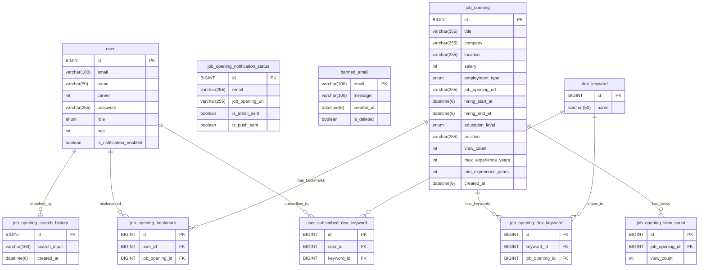

# 3조 - 👑 취하여 (Cheer-ha)

---

## 🗂️ CONTENTS

🚀 **서비스 소개**

**⚡ 성능 개선, 어디까지 해봤니?**

**🏗️ System Architecture**

**🛠️ 기술 스택**

**🔧 기술적 의사결정**

🚨 **트러블슈팅**

🏦 **비즈니스적 의사결정**

**🏭 ’취하여’ 팀의 리팩토링**

**🧑🏻‍💻 ’취하여’ 팀 구성원 소개**


## 🚀 서비스 소개

### ✨ 서비스 개요

<aside>

### "취업을 위하여! 똑똑한 개발자 취업, 클릭 한 번으로 시작하세요!"

‘취하여’는 포트폴리오와 코딩 테스트 준비로 바쁜 개발자들이 여러 사이트를 돌아다니며 채용 공고를 찾는 수고를 덜고, 원하는 채용 정보를 빠르고 편리하게 확인할 수 있도록 지원하는 서비스입니다.

다양한 사이트에 분산된 개발자 채용 공고를 한곳에 모아 보여주고, 사용자의 기술 역량으로 지원할 수 있는 채용 공고를 이메일 알림으로 제공합니다.

</aside>

---

### 📝 **기획 배경**


‘취하여’ 서비스는 그동안 취준생으로서 겪은 세 가지 불편함에서 탄생했습니다.

- 첫째, 우리가 가진 기술 역량에 맞는 채용 공고를 찾으려면 **반드시 정확한 단어로 검색해야** 했습니다.
- 둘째, 인기순으로 채용 공고를 조회해도 **인기 기준이 연령대인지 기술 요건인지 확인해야** 했습니다.
- 셋째, 채용 공고를 찾을 때마다 **같은 기술 역량을 반복적으로 입력해야** 하는 번거로움이 있었습니다.

‘취하여’는 이러한 불편함을 겪은 개발자 취준생을 위해 세 가지 기능을 제공하도록 기획되었습니다.

- 첫째, 사용자가 **단어 일부만 입력해도 원하는 채용 공고를 쉽게 검색할 수 있도록 편의 기능을 더해** 주자!
- 둘째, 조회수 높은 채용 공고뿐만 아니라 **연령대와 기술 요건에 맞춘 인기 채용 공고도 함께 제공해** 주자!
- 셋째, 사용자가 자신의 **기술 역량을 등록하면 해당 역량으로 지원할 수 있는 공고를 이메일로 보내** 주자!

---

### 🏷️ **도메인 용어**

| **항목** | **키워드** | **채용 공고** |
| --- | --- | --- |
| **정의** | 채용 공고 안에 있는 기술 요건 목록 | 여러 채용 사이트를 크롤링하여 가져온 개발자 채용 공고 목록 |
| **특징** | 백엔드 및 프론트엔드에서 쓰이는 스택 위주 | 고용 형태, 학력, 직무 등 자격 요건 및 URL 포함 |
| **종류** | 프로그래밍 언어, 프레임워크, 협업 툴, 라이브러리 등 | 백엔드 개발자 채용 공고, 데이터 엔지니어 채용 공고 등 |
| **예시** | Java, Python, Spring Boot, Kafka, AWS, Jira | ‘토스 백엔드 개발자 모집’, ‘카카오뱅크 서버 개발자 모집’ |

---

### 👤 사용자 이용 흐름


---

### 🔄 서비스 작동 흐름


---

### 🔑 핵심 기능

<aside>

🔍 **클린 코드처럼 깔끔한 검색 기능!**

<details>
  <summary> 반복과 수동은 이제 그만! 자동 완성 & 부분 검색! </summary>

- 한 글자만 입력해도 추천 검색어를 확인할 수 있는 **자동 완성 및 부분 검색 지원**
- 오탈자가 포함된 검색어도 **정확한 채용 공고 조회 가능**
- 검색어 입력 시 중요도에 따라 **`제목 → 회사명 → 키워드`** 순으로 검색 우선순위 적용
- **검색어와 기간을 설정하여 원하는 채용 공고만 조회 가능**
    - **검색 필터 항목**
        - **지역**
        - **채용 형태**: `정규직`, `계약직`, `아르바이트`, `인턴`, `프리랜서`
        - **학력**: `무관`, `고졸`, `전문학사`, `학사`, `석사`, `박사`
        - **채용 시작일 & 채용 마감일**
        - **최소 경력 & 최고 경력**
        - **채용 공고 제목**
        - **회사명**
        - **기타 자격 요건**
- 검색된 **채용 공고 개수 함께 표시**
</details>

<details>
  <summary> 요즘 채용 시장이 어떤지 보고 싶다면? 전체 채용 공고! </summary>

- 모든 채용 공고를 한곳에서 확인 가능
- 마감된 채용 공고는 조회 목록에서 제외
</details>

<details>
  <summary> 내가 어떤 채용 공고를 검색했더라? 검색 기록 조회! </summary>

- 이전에 검색한 채용 공고 목록을 쉽게 확인
</details>


<aside>

🔥 **HOT한 채용 공고만 모아 모아!**

<details>
  <summary> 채용 공고 검색이 어려운 주니어 개발자를 위한, 조회수 Top 100 인기 채용 공고! </summary>

- 조회수가 높은 순으로 인기 채용 공고 100건 제공
- 각 공고의 조회수 함께 표시
</details>

<details>
  <summary> 내 연령대 개발자들은 어떤 공고를 즐겨 찾을까? 연령대별 인기 즐겨찾기 Top 10! </summary>

- 연령대마다 가장 많이 즐겨찾기로 등록한 채용 공고 10건 제공
- 즐겨찾기로 등록한 사용자 수 함께 표시
</details>

<details>
  <summary> 내 연령대 개발자들이 지닌 기술 역량이 궁금하다면? 연령대별 인기 키워드 Top 10! </summary>

- 연령대별로 많이 등록된 키워드 10개 제공
- 키워드로 등록한 사용자 수 함께 표시
</details>
</aside>

<aside>

**🔖 즐겨찾기와 이메일 알림으로 취업을 위하여!**

<details>
  <summary> 나만의 기술 역량을 쉽게 관리하고 싶다면, 키워드 등록! </summary>

- 관심 있거나 사용자 자신의 기술 역량을 키워드로 등록, 조회, 삭제하는 기능 제공
- 등록한 키워드는 이메일 알림 발송 시 사용됨
</details>

<details>
  <summary> 내 기술 역량만 등록하면 끝! 맞춤형 채용 공고 이메일 알림! </summary>

- 사용자가 등록한 키워드를 기반으로 **`하루 1회`** 맞춤형 채용 공고 20건을 이메일 알림으로 발송
    - **이메일 인증을 완료한 사용자에게만 제공**
</details>

<details>
  <summary> 놓칠 수 없는 채용 공고는 콕콕 찜할 수 있도록, 즐겨찾기! </summary>

- 관심 있는 채용 공고를 즐겨찾기에 등록, 조회, 삭제하는 기능 제공
- 최대 200개까지 즐겨찾기 등록 가능
    - **200개 초과 시, 가장 오래된 즐겨찾기부터 자동 삭제**
        - **예시) 201번째 즐겨찾기 추가 시, ID 1번 즐겨찾기가 삭제됨**
- 마감 공고도 즐겨찾기에서 다시 볼 수 있도록 지원
</details>
</aside>

<aside>

## ⚡ 성능 개선, 어디까지 해봤니?

<details>
  <summary> 🏎️ MySQL vs Elasticsearch, 채용 공고 검색 시 무엇을 사용할까요? </summary>

### 1️⃣ 테스트 개요

이 테스트는 MySQL과 Elasticsearch를 사용한 채용 공고 조회 성능을 비교하고 분석하는 데 초점을 두었습니다.

두 성능을 비교할 때에는 검색 방식의 응답 시간, 처리량, 데이터 수신량 등을 기준으로 삼았습니다.

### 2️⃣ 테스트 환경 및 조건

- **Elasticsearch 버전**: 8.17.2
- **QueryDSL**: MySQL을 이용한 데이터 조회
- **테스트 도구**: Apache JMeter
- **테스트 요청**: HTTP GET 요청
- **동시 요청**: 200개 (100개씩 총 2번 요청)
- **서버 환경**: 로컬 서버 (localhost)
- **클라이언트 환경**: JMeter 클라이언트

### 3️⃣ 성능 비교

- 요약

| **테스트 항목** | **MySQL 조회 (QueryDSL)** | **Elasticsearch 조회** | **성능 향상률** |
| --- | --- | --- | --- |
| **평균 응답 시간** | 48ms | 14ms | 70.83% |
| **최소 응답 시간** | 39ms | 9ms | 77% |
| **최대 응답 시간** | 117ms | 41ms | 65% |
| **표준편차** | 9.37ms | 3.28ms | 64% |
| **TPS** | 8.63/sec | 9.5/sec | +10.1% |
| **수신량** | 8.63KB/sec | 65.01KB/sec | +653.5% |
| **전송된 데이터**  | 0.57KB | 3.94KB | +591.2% |
| **평균 바이트**  | 6300.9 Byte | 6971.9 Byte | +10.7% |

### 4️⃣ 테스트 결과 분석

- **응답 시간**: 최소 응답 시간은 77%, 최대 응답 시간은 65% 향상됨
- **표준편차**: 약 64% 향상됨
- **TPS**: 약 10% 증가함
- **수신량 및 전송량**: 수신량은 653.5%, 전송량은 591.2% 증가함

### 5️⃣ 결론

- lasticsearch는 MySQL에 비해 빠르고 일관된 성능을 보였습니다.

- 특히 대규모 데이터 처리 및 조회에서 뛰어난 성능을 보였으며, 수신 및 전송량이 크게 향상되었습니다. MySQL은 복잡한 트랜잭션 처리에는 유리하지만, 대규모 데이터 조회에서는 Elasticsearch가 훨씬 유리했습니다.

- 따라서, 대규모 데이터 조회 성능 개선이 필요할 때는 Elasticsearch를 사용해야 적합하다는 의사결정을 내릴 수 있었습니다.

### 6️⃣ 추가 테스트 계획

- **다양한 쿼리 테스트**: 다양한 복잡도를 가진 쿼리를 적용하여 성능 비교
- **대규모 데이터셋 테스트**: 실제 운영 환경을 고려하여 더 큰 규모의 데이터셋으로 테스트 및 성능 검증
- **장기 성능 테스트**: 지속적인 부하 테스트로 장시간의 성능 안정성 및 자원 소모 점검
- **보안 및 데이터 일관성 검증**: 실제 서비스에 적용할 수 있는지 검토

</details>

<details>
  <summary> 🏎️ 채용 공고를 조회할 때 스레드 수는 얼마나 늘릴 수 있을까요? </summary>

### 1️⃣ 테스트 개요

이 테스트는 채용 공고 조회 시스템에서 스레드 수가 증가함에 따라 시스템 성능, 특히 응답 시간과 TPS의 변화를 분석하는 데 초점을 두었습니다.

특히 해당 테스트 결과를 바탕으로 성능 한계에 도달하는 지점과 최적화 방안을 도출하고자 하였습니다.

### 2️⃣ 테스트 환경 및 조건

- **Elasticsearch 버전**: 8.17.2
- **Elasticsearch QueryDSL**: Elasticsearch에서 데이터를 직접 조회하여 처리
- **테스트 도구**: Apache JMeter
- **테스트 요청**: HTTP GET 요청
- **동시 요청**: 100개 ~ 2100개까지 100씩 증가하며 테스트 (10초로 설정)
- **서버 환경**: 로컬 서버 (localhost)
- **클라이언트 환경**: JMeter 클라이언트

### 3️⃣ 테스트 결과 분석

- 테스트 결과, 스레드 수가 증가함에 따라 응답 시간과 TPS에 명확한 변화를 확인할 수 있었습니다.

- **요청 급증의 원인 분석**
    - 시스템의 자원이 부족해지면서 요청을 처리하는 데 시간이 더 걸렸습니다.
    - 처리해야 할 요청들이 몰리며 급격히 처리량이 증가하는 현상이 발생했습니다.
    - 이는 병목 현상이 발생한 결과로 볼 수 있습니다.
- **스레드 수에 따른 시스템 변화 요약**
- **스레드 수에 따른 시스템 변화 요약**

| **요청 개수**      | **시스템 상태**          | **응답 시간**            | **TPS**             | **기타 영향**       |
|-----------------|-------------------|--------------------|----------------|--------------|
| 🟢 **1600개 이하** | 안정적으로 처리 가능     | ⏳ 일정하게 유지 (8-7ms)  | 📈 일정하게 증가   | -            |
| 🟡 **1600개 이상** | 시스템 자원이 부족해짐   | ⏳ 일정하게 유지 (8-7ms)  | 📉 일부 구간 정체   | 성능 저하 발생  |
| 🔴 **2100개 이상** | 시스템 한계 초과       | ⏳ 느려짐 (11ms)         | 📉 처리량 감소     | 심각한 성능 저하  |


)


### 4️⃣ 결론

스레드 수가 1600개일 때까지는 시스템이 원활하게 요청을 처리하지만, 2100개 이상 늘어나면 성능이 저하된다는 점을 파악했습니다.

이를 바탕으로 적절한 자원 관리 및 최적화가 얼마나 중요한지 깨달았습니다.

### 5️⃣ 추가 테스트 계획

- **자원 확장 및 최적화**: 시스템 자원을 확장하거나 로드 밸런싱으로 스레드를 분배하여 성능 한계 완화
- **스레드 풀 조정**: 스레드 수를 동적으로 조절하거나 적절한 스레드 풀 크기를 설정하여 성능 최적화
- **장기 부하 테스트**: 다양한 시간대에 걸쳐 부하 테스트를 진행하여, 시스템의 장기 성능 및 자원 소모 패턴 분석

</details>

<details>
  <summary>🏎️ 연령대별 인기 키워드 조회 기능의 속도와 처리량을 어떻게 늘릴까요?</summary>

### 1️⃣ 테스트 개요

이번 테스트는 연령대별 인기 키워드 조회 쿼리의 성능 개선을 목표로 진행되었습니다.

쿼리 실행 속도를 단축하고 시스템 부하를 줄이는 데 중점을 두었습니다.

초기 쿼리 성능이 저조했기 때문에 최적화 과정에서 실제 서비스에 미치는 영향을 평가하였습니다.

### 2️⃣ 테스트 환경 및 조건

- **환경**
    - **서버:** 로컬 환경 및 배포 서버에서 테스트 수행
    - **사용된 도구:** Postman, JMeter, QueryDSL
- **조건**
    - **연령대:** 취업 연령층이 가장 많은 25세에서 40세로 고정
- **부하 테스트**
    - JMeter를 활용하여 100 스레드로 고정
    - 다양한 설정을 적용하여 부하 테스트 진행
- 이번 테스트에서는 쿼리 실행 시간, 부하 처리 성능, 인덱스 적용에 따른 성능 차이 분석에 중점을 두었습니다.

### 3️⃣ 성능 비교

성능을 개선할 때에는 두 가지 방법을 적용하였습니다.

**1. 서브 쿼리 최적화**
- QueryDSL을 사용하여 서브 쿼리를 제거한 다음, 단일 쿼리 안에서 **`count`**를 바로 계산하여 불필요한 연산을 줄였습니다.

    - 기존 코드

      

    - 변경한 코드

      

- 쿼리 변경 전후 비교 결과
    - 스레드 100개를 10초로 나누어서 요청을 처리했을 때

      | **비교 항목**         | **서브 쿼리 적용 시** | **단일 쿼리 적용 시** | **성능 향상률** | **배율** |
            |----------------------|----------------------|----------------------|----------------|----------|
      | **평균 응답 시간**    | 41493ms              | 50ms                 | 99.88%         | 829.86배 |
      | **최소 응답 시간**    | 30012ms              | 33ms                 | 99.89%         | 909.45배 |
      | **최대 응답 시간**    | 145268ms             | 102ms                | 99.93%         | 1424.2배 |
      | **표준 편차**         | 34426.78ms           | 8.05ms               | 99.98%         | 4276.62배 |
      | **에러 발생 비율**    | 90.00%               | 0.00%                | 100.0%         | 완전 개선 |
      | **처리량**            | 41.2/min             | 606/min              | 1370.87%       | 14.71배  |

    - 스레드 100개를 120초로 나누어서 요청을 처리했을 때

      | **비교 항목**         | **서브 쿼리 적용 시** | **단일 쿼리 적용 시** | **성능 향상률** | **배율** |
            |----------------------|----------------------|----------------------|----------------|----------|
      | **평균 응답 시간**    | 48315ms              | 65ms                 | 99.87%         | 743.31배 |
      | **최소 응답 시간**    | 30011ms              | 54ms                 | 99.82%         | 555.76배 |
      | **최대 응답 시간**    | 145738ms             | 145ms                | 99.9%          | 1005.09배 |
      | **표준 편차**         | 40427.71ms           | 10.06ms              | 99.98%         | 4018.66배 |
      | **에러 발생 비율**    | 83.00%               | 0.00%                | 100.0%         | 완전 개선 |
      | **처리량**            | 23.9/min             | 50.5/min             | 111.3%         | 2.11배   |

**2. 인덱스 적용**
- **`user`** 테이블의 **`age`** 컬럼에 인덱스를 추가하였습니다.

    - 인덱스 적용 전후 **`EXPLAIN`** 비교

      | **비교 항목**             | **인덱스 적용 전**      | **인덱스 적용 후**        | **개선 사항**                               |
            |--------------------------|------------------------|--------------------------|--------------------------------------------|
      | **user 테이블 조회 방식** | ALL (Full Table Scan)   | range (Index Range Scan) | ✅ 인덱스 적용으로 테이블 전체 스캔 제거  |
      | **JOIN 방식**             | ref                    | ref                      | -                                          |
      | **keyword 테이블 조회 방식** | eq_ref                 | eq_ref                   | -                                          |
      | **조회된 user 테이블 행 개수** | 2000                   | 1118                     | ✅ 인덱스 적용으로 조회 대상 감소         |
      | **Filtered 비율**         | 11.11%                 | 100%                     | ✅ 불필요한 행 단위 스캔 제거              |
      | **Extra**                 | Using temporary; Using filesort | Using where; Using index; Using temporary | ✅ 파일 정렬 제거, ✅ 인덱스 활용 증가 |
      | **Possible Keys**         | PRIMARY                | PRIMARY, idx_user_age    | ✅ 추가 인덱스 활용 가능                  |

    - 인덱스 적용 전후 **`EXPLAIN ANALYZE`** 비교

      | **비교 항목**             | **인덱스 적용 전** | **인덱스 적용 후** | **개선 사항**           |
            |--------------------------|-------------------|-------------------|------------------------|
      | **Nested Loop Join 시간** | 40.2ms            | 36ms              | ✅ 불필요한 연산 감소   |
      | **필터링된 row 개수**     | 2000              | 1118              | ✅ 불필요한 행 단위 스캔 감소 |
      | **Using Index 적용 여부** | No                | Yes               | ✅ Covering Index Scan 활용 |
      | **실행 시간**             | 62.5ms            | 52.4ms            | ✅ 약 16% 속도 개선     |

### 4️⃣ 테스트 결과 분석

1. **서브 쿼리 최적화 후 성능 개선**
   - 실행 시간: 31.49s → 146ms로 99.5% 단축됨
   - 에러 발생 비율: 90% → 0%로 완전히 개선됨
   - 응답 시간: 평균 50ms로 안정적으로 유지됨
2. **인덱스 적용 후 성능 비교**
   - 실행 시간: 62.5ms → 52.4ms로 약 16% 향상됨

### 5️⃣ 결론

서브 쿼리를 제거한 최적화가 성능에 가장 큰 영향을 주었습니다.

반면, **`user`** 테이블의 **`age`** 컬럼에 인덱스를 적용한 결과는 성능 개선이 크게 이루어지지 않았습니다.

또한, 인덱스를 적용하면 쓰기 성능에 영향을 미치는 만큼, 인덱스를 적용하지 않기로 결정했습니다.

### 6️⃣ 추가 테스트 계획

- **서버 측 캐싱 적용:** 쿼리 결과를 캐싱하여 반복 조회 시 성능을 더욱 향상시킬 수 있는지 확인
- **다양한 연령대의 조회 성능 비교**: 25~40세 외의 다른 연령대에서도 성능 비교
- **다양한 부하 시나리오 테스트 검토**: 실시간 트래픽을 반영하여 스레드 수와 부하 조건을 늘리고 모니터링

</details>

<details>
  <summary> 🏎️ 서브 쿼리 vs 단일 쿼리, 연령대별 인기 즐겨찾기 조회에는 무엇이 좋을까요? </summary> 

### 1️⃣ 테스트 개요

이번 테스트는 연령대별 인기 즐겨찾기 조회 쿼리의 성능을 최적화하고자 진행되었습니다.

쿼리 리팩토링을 적용하여 성능을 개선하는 데 초점을 두었습니다.

특히 쿼리 성능이 매우 저조했기에 이를 최적화하는 과정에서 실제 서비스에 미치는 영향을 평가하였습니다.

### 2️⃣ 테스트 환경 및 조건

- **테스트 도구**: Apache JMeter
- **테스트 요청**: HTTP 요청 (GET)
- **동시 요청**: 100개의 스레드로 테스트 (10초 동안)
- **서버 환경**: 로컬 서버 (localhost)
- **클라이언트 환경**: JMeter 클라이언트
- **데이터베이스**: MySQL
- **쿼리 처리 도구**: MySQL QueryDSL

### 3️⃣ 성능 비교

| **비교 항목** | **서브쿼리로 조회 시** | **단일쿼리로 조회 시** | **성능 개선 비율**  |
| --- | --- | --- | --- |
| **평균 응답 시간** | 29s 767ms | 787ms | 97.36% |
| **최소 응답 시간** | 12s 860ms | 553ms | 95.70% |
| **최대 응답 시간** | 38s 828ms | 1s 81ms | 97.21% |
| **표준편차** | 6s 145.32ms | 106.37ms | 98.27% |
| **에러 비율** | 70.00% | 0.00% | 100.00% |
| **처리량** | 2.4/sec | 9.5/sec | 295.83% |

### 4️⃣ 테스트 결과 분석

1. **단일쿼리로 변경 후 결과**
    - 평균 응답 시간: 97.36% 개선됨
    - 처리량: 295.83% 향상됨
    - 에러 비율: 70%에서 0%로 완전히 개선됨
2. **응답 시간 비교**
    - 응답 시간: 서브쿼리 → 단일쿼리
        - Postman 로컬 서버에서 조회: 3s 62ms → 376ms로 87.76% 향상됨
        - Postman 배포 서버에서 조회: 11s 13ms → 50ms로 99.55% 향상됨
        - Jmeter 테스트: 29s 737ms → 787ms로 97.36% 향상됨
        -  
           
            서브쿼리 이용 연령대별 인기 즐겨찾기 10개 조회 3초62ms


<details>
  <summary> 개선된 코드 확인 </summary>

- COUNT(*)와 GROUP BY를 단일 쿼리 내에서 동시에 처리하여 성능을 개선합니다.

  <br>
  
  <p>서브쿼리를 사용하여 즐겨찾기를 카운트 함</p>

  <br>
  
  <p>단일쿼리로 변경된 코드</p>

</details>

<details>
  <summary> 테스트 결과 확인 </summary>

  처음 위 코드로 연령별 인기 즐겨찾기 10개를 조회했을 때 postman으로 조회시 (25-40세 기준)

  아래와 같이 3초62ms가 나왔습니다.

  

  서브쿼리 이용 연령대별 인기 즐겨찾기 10개 조회 3초62ms

  배포 서버에서 조회시에는 11초13ms가 나왔습니다.

  

  배포 서버에서 서브쿼리 이용 연령대별 인기 즐겨찾기 10개 조회 11초13ms

  너무 느려서인지 100스레드 10초로 jmeter에서 성능테스트 시 에러율 70%로 제대로 테스트가 되지 않았습니다.

  

  서브쿼리 이용 연령대별 인기 즐겨찾기 10개 조회 29초 에러율 70%

  그래서 Ramp-up period를 10초에서 120초로 넉넉히 설정했습니다.

  그랬더니 분당 처리량이 47.8개입니다.

  

  서브쿼리 이용 연령대별 인기 즐겨찾기 10개 조회 TPM 47.8개

  서브쿼리를 없애고,

  **단일 쿼리**내에서 COUNT를 바로 계산하도록 개선했습니다.

  

  단일쿼리 이용 연령대별 인기 즐겨찾기 10개 조회 - 로컬 376ms

  postman으로 테스트 시 로컬에서 376ms가 나왔습니다!

  서브쿼리 로컬에서 조회 시 3초62ms였던 것에 비하면 응답속도가 약**89.74%**나 개선되었습니다!!

  

  단일쿼리 이용 연련대별 인기 즐겨찾기 10개 조회 - 배포 서버 50ms

  postman으로 테스트 시 배포 서버에서 50ms가 나왔습니다!

  

  단일쿼리 이용 연령대별 인기 즐겨찾기 10개 조회 100스레드 787ms

  Jmeter에서 부하테스트 시 787msr가 나왔습니다.

</details>

### 5️⃣ 결론

서브쿼리를 제거한 최적화가 성능에 가장 큰 영향을 미친 것으로 분석되었습니다.

단일쿼리에서 바로 집계하는 방식으로 변경하자, 응답 속도가 크게 개선되었습니다.

또한, 부하 테스트에서도 에러율이 0%로 안정적인 성능을 보였습니다.

### 6️⃣ 추가 테스트 계획

- **서버 측 캐싱 적용**: 쿼리 결과를 캐싱하여 최적화 가능성 탐색
- **다양한 연령대에서 성능 비교**: 41~60세 등에서도 성능을 비교하여 최적화 방법 탐색

</details>

<details>
  <summary> 🏎️ 21초에서 9초, 이메일 알림 발송 속도를 어떻게 개선할 수 있을까요? </summary>

### 1️⃣ 테스트 개요

본 테스트는 이메일 알림 발송 속도를 개선하고자 진행되었습니다.

테스트는 로컬 환경에서 사용자 3명에게 이메일을 3번씩 전송하는 시나리오를 가정하에 수행되었습니다.

### 2️⃣ 테스트 환경 및 조건

- 환경 및 조건
    - **서버 환경:** 로컬 서버 (localhost)
    - **이메일 발송 방식:** Gmail SMTP
    - **SMTP 설정:** Gmail SMTP (포트 587)
    - **이메일 발송 요청 방식:** Spring Boot MailSender 사용
    - **총 이메일 발송 건수:** 9건 (3명 × 3회)
    - 
<details>
  <summary>테스트 데이터</summary>

- **사용자**

  | **사용자 ID (user_id)** | **키워드 ID (keyword_id)** | **이메일 (email)** |
      | --- | --- | --- |
  | **1** | 1, 2, 5 | test1@gmail.com |
  | **2** | 4, 5 | test2@gmail.com |
  | **3** | 1, 2, 7 | test3@gmail.com |

  <br>

- **채용 공고**

  | **채용 공고 ID (job_opening_id)** | **키워드 ID (keyword_id)** | **URL (job_opening_url)** |
      | --- | --- | --- |
  | **1** | 1, 2, 3 | url1 |
  | **2** | 4, 5 | url2 |

  <br>

- **같은 키워드끼리 연결한 결과**

  | **키워드 ID (keyword_id)** | **채용 공고 ID (job_opening_id)** | **사용자 ID (user_id)** |
      | --- | --- | --- |
  | **1, 2, 3** | 1 | 1, 3 |
  | **4, 5** | 2 | 1, 2 |

</details>

### 3️⃣ 성능 비교

**`Gmail SMTP`** 서버 속도를 직접 해결하기는 어려웠기에 두 가지 방식으로 성능 개선을 시도했습니다.

1. **`transform()`** 메서드로 불필요한 연산을 제거하여 발송 전 로직 개선
    - **[수정 전]** findAllJobOpeningKeywords() 메서드 펼치기

        ```java
            public List<JobOpeningKeywordDto> findAllJobOpeningKeywords(ZonedDateTime referenceTime) {
                QJobOpeningKeyword jobOpeningKeyword = QJobOpeningKeyword.jobOpeningKeyword;
                QJobOpening jobOpening = QJobOpening.jobOpening;
        
                return queryFactory
                    .select(
                        new QJobOpeningKeywordDto(
                            jobOpeningKeyword.jobOpening.id,
                            jobOpeningKeyword.keyword.id,
                            jobOpening.jobOpeningUrl
                        )
                    ).from(jobOpeningKeyword)
                    .join(jobOpeningKeyword.jobOpening, jobOpening)
                    .where(jobOpening.createdAt.after(referenceTime))
                    .fetch();
            }
        ```

    - **[수정 후]** findKeywordIdToUrlList() 메서드 펼치기

        ```java
            /**
             * 주어진 시간(referenceTime) 이후에 생성된 채용 공고들의 키워드와 URL 목록을 조회하는 메서드
             *
             * @param referenceTime 조회 시간
             * @return 채용 공고 키워드와 해당 키워드에 매칭되는 URL 목록을 매핑한 맵
             *         (Key: KeywordId, Value: 해당 키워드에 매칭되는 URL 목록)
             */
            @Override
            public Map<Long, List<String>> findKeywordIdToUrlList(ZonedDateTime referenceTime) {
                return queryFactory
                    .from(jobOpeningKeyword)
                    .join(jobOpeningKeyword.jobOpening, jobOpening)
                    .where(jobOpening.createdAt.after(referenceTime)) // 조회 시간 이후 생성된 채용 공고
                    .transform(
                        groupBy(jobOpeningKeyword.keyword.id) // 키워드 ID별로 그룹화
                            .as(list(jobOpening.jobOpeningUrl)) // URL 목록을 그룹에 매핑
                    );
            }
        ```

2. **`ThreadPoolTaskScheduler`**를 10개로 설정하여 발송 작업을 비동기로 처리
    - SchedulerConfig 클래스 펼치기

        ```java
        @Configuration
        public class SchedulerConfig {
            @Bean
            public ThreadPoolTaskScheduler emailTaskScheduler() {
            
                ThreadPoolTaskScheduler scheduler = new ThreadPoolTaskScheduler();
                
                scheduler.setPoolSize(10);
                
                scheduler.setThreadNamePrefix("$$$-Email-Scheduler-thread-");
                
                return scheduler;
            }
        }
        ```


이후 테스트를 진행하여 성능을 비교했습니다.

**[개선 전 테스트]**

| **회차** | **채용 공고 조회** | **사용자 조회** | **전체 이메일 전송** | **전체 작업 완료** | **개별 이메일 전송 (1)** | **개별 이메일 전송 (2)** | **개별 이메일 전송 (3)** |
| --- | --- | --- | --- | --- | --- | --- | --- |
| **1회차** | 150 ms | 3 ms | 22 s 490 ms | 22 s 644 ms | 9 s 58 ms | 4 s 199 ms | 9 s 231 ms |
| **2회차** | - ms | - ms | 21 s 550 ms | 21 s 556 ms | 8 s 419 ms | 4 s 113 ms | 9 s 17 ms |
| **3회차** | - ms | - ms | 21 s 458 ms | 21 s 470 ms | 8 s 808 ms | 3 s 415 ms | 9 s 95 ms |
| **평균** | **150 ms** | **3 ms** | **21 s 832 ms** | **21 s 890 ms** | **8 s 808 ms** | **3 s 909 ms** | **9 s 114 ms** |
- 채용 공고 및 사용자 조회는 2회차부터 데이터베이스 캐싱이 적용되므로, 해당 값을 반영하지 않았습니다.

**[개선 후 테스트]**

| **회차** | **채용 공고 조회** | **사용자 조회** | **전체 이메일 전송** | **전체 작업 완료** | **개별 이메일 전송 (1)** | **개별 이메일 전송 (2)** | **개별 이메일 전송 (3)** |
| --- | --- | --- | --- | --- | --- | --- | --- |
| **1회차** | 100 ms | 3 ms | 9 s 830 ms | 9 s 936 ms | 9 s 829 ms | 9 s 292 ms | 9 s 432 ms |
| **2회차** | - ms | - ms | 9 s 615 ms | 9 s 623 ms | 8 s 292 ms | 9 s 614 ms | 8 s 732 ms |
| **3회차** | - ms | - ms | 9 s 762 ms | 9 s 771 ms | 9 s 762 ms | 9 s 406 ms | 8 s 553 ms |
| **평균** | **100 ms** | **3 ms** | **9 s 736 ms** | **9 s 777 ms** | **9 s 294 ms** | **9 s 437 ms** | **8s 906 ms** |
- 채용 공고 및 사용자 조회는 2회차부터 데이터베이스 캐싱이 적용되므로, 해당 값을 반영하지 않았습니다.

**[개선 전후 비교]**

| **테스트 항목** | **개선 전 방식 (평균)** | **개선 후 방식 (평균)** | **성능 향상률**  | **배율** |
| --- | --- | --- | --- | --- |
| **채용 공고 조회** | 150 ms | 100 ms | 33.3% | 1.5배 향상 |
| **사용자 조회** | 3 ms | 3 ms | - | **-** |
| **전체 이메일 발송** | 21 s 832 ms | 9 s 736 ms | 55.4% | 2.24배 향상 |
| **전체 작업** | 21 s 890 ms | 9 s 777 ms | 55.4% | 2.24배 향상 |

### 4️⃣ 테스트 결과 분석

1. **발송 전 로직 개선 후 성능 비교**
    - 채용 공고 조회 속도: 150ms → 100ms로 33.3% 단축됨
2. **발송 작업을 비동기로 처리 후 성능 비교**
    - 전체 이메일 발송 작업: 21s 832ms → 9s 736ms로 55.4% 향상됨
    - 전체 작업 완료: 21s 890ms → 9s 777ms로 55.4% 향상됨

### 5️⃣ 결론

스레드 풀과 비동기 처리를 제대로 적용해야 기능을 최적화할 수 있다는 점을 깨달았습니다.

또한, 로직 구성 방식에 따라 성능 차이가 발생한다는 점도 파악할 수 있었습니다.

### 6️⃣ 추가 테스트 계획

- **최적화 가능성 탐색**: 다른 이메일 발송 서비스와 비교하여 최적화 가능성 탐색
- **최적의 스레드 풀 탐색**: 테스트를 통해 이메일 알림 발송에 적합한 스레드 수 탐색
- 
</details>
</aside>

<aside>

## 🏗️ System Architecture

### ☁️ Cloud Architecture


### ⛓️ CI/CD Pipeline


### 📐 설계 과정

<details>
  <summary> Cloud Architecture </summary>

<details>
  <summary> 백엔드 </summary>

- 백엔드는 **Spring Boot** 기반 애플리케이션으로 **AWS EC2 인스턴스 내의 Docker** 에서 실행됩니다.
- ALB (Application Load Balancer)를 사용하여 사용자 요청을 여러 백엔드 서버로 라우팅하여 부하를 분산하고, 주기적인 Health Check와 ASG로 높은 가용성을 제공합니다.
- EC2 인스턴스는 Auto Scaling Group에 속하여 트래픽 증가에도 안전하게 대응할 수 있도록 설정되었습니다.
</details>

<details>
  <summary> 데이터베이스 및 캐시 </summary>

- **MySQL (RDS)**: 고가용성과 편리한 파라미터 설정을 위해 **RDS**에서 관리됩니다.
- **Redis (ElastiCache)**: Redis는 보안이 취약하므로 **ElastiCache에서 제공하는 높은 보안 수준을** 통해 관리됩니다.
- **Elasticsearch**: 신버전을 편리하게 사용할 수 있는 공식 클라우드서비스인 Elastic Cloud를 사용하였습니다. 플러그인 추가가 편리하고, 까다로운 Security 설정을 직접 하지 않아도 됩니다.
</details>

<details>
  <summary> 네트워크 관리 </summary>

- **Route 53**을 사용하여 도메인을 관리하고, 사용자가 접근하는 요청을 **ALB**를 통해 처리하도록 설정합니다.
- **ALB에 SSL 인증서**를 연결해 **HTTPS 요청만 처리**하도록 합니다. **HTTP 요청은 자동으로 HTTPS로 리디렉션됩니다.**
- **VPC** 내에서 **메인 애플리케이션의 Auto Scaling Group**, **RDS MySQL**과 **ElastiCache Redis, 모니터링/로깅 서버를** 함께 관리하여 보안을 강화하고, Private IP를 이용하여 통신해 네트워크 연결을 빠르고 효율적으로 처리합니다.
- **Web Application Firewall**이 봇, 악성 사용자, SQL injection 공격을 막고 로그를 남겨줍니다.
</details>

<details>
  <summary> 모니터링 및 로깅 </summary>
- Prometheus + Grafana / Fluentd를 VPC 내의 EC2에 각각 도커를 이용해 모니터링-로깅 전용 서버를 구축하였습니다.
- 메인 애플리케이션과 Private IP로 통신하므로, 모니터링 정보(exporter)와 로그(logback) 정보 전달 속도가 빠릅니다.
</details>

</details>

<details>
  <summary> CI/CD Pipeline </summary>

<details>
  <summary> 코드 병합 및 CI 테스트 </summary>

- 배포용 브랜치에 **코드가 병합**되면, **GitHub Actions**를 사용하여 **CI 테스트**를 자동으로 실행합니다.
- 이 단계에서 **코드의 안정성**을 검증하여, 문제가 있는 코드는 배포되지 않도록 합니다.
</details>

<details>
  <summary> 도커 이미지 빌드 및 푸시 </summary>

- 테스트가 **성공적으로 통과**하면, **도커 이미지**를 빌드합니다.
- 빌드된 도커 이미지는 **Docker Hub**에 **푸시**되어, 이후의 배포 과정에서 사용할 수 있도록 준비됩니다.
</details>

<details>
  <summary> CD 단계 (배포 자동화) </summary>

- **CD** 단계에서 **AWS의 Auto Scaling Group**을 활용하여 **롤링 업데이트**를 트리거합니다.
- 롤링 업데이트는 서비스의 가용성을 유지하며 **새로운 버전의 애플리케이션**을 **점진적으로 배포**합니다. 새로운 인스턴스가 완전히 배포되고 헬스체크가 완료되면 구버전 인스턴스를 삭제합니다.
- 시작 템플릿에서 Shell Script를 작성해 완벽히 자동화 했습니다.
</details>

<details>
  <summary> 무중단 배포 </summary>

- **무중단 배포**(Zero-Downtime Deployment) 방식이 적용되어, 서비스의 **다운타임 없이** 배포가 진행됩니다.
- 롤링 업데이트 방식 선택: 별다른 설정 없이 ASG로 편리하게 사용 가능합니다.
- 블루-그린과 비교했을 때 배포 도중 트래픽이 일시적으로 몰리는 현상이 없어 서버 관리 비용 부담이 덜하지만, 배포 중에 신버전과 구버전이 혼재합니다. 하지만 저희 서비스에서는 API가 크게 바뀔 상황이 많지 않고, 모니터링-로깅을 구축해 혹시 모를 상황에 대비하도록 설계했습니다.
- 이를 통해 사용자에게 영향을 주지 않고, 새로운 버전의 애플리케이션을 안전하게 배포할 수 있습니다.
- 새로운 버전에 이상이 있을 때에도 버전 롤백을 통해 기존 버전을 그대로 사용할 수 있습니다.
</details>


## 📝 **Wireframe**


## 💬 **ERD**(수정필요)


## 📑 **API 명세서**
- [API 명세서](https://docs.google.com/spreadsheets/d/1CQm7sV-ETn0w-FFe7nOCRKrPIp3i5TQWhKw9B1IDT9s/edit?gid=0#gid=0)

## 🎬 **보러 가기**
- [최종 발표 PPT]()
- [최종 발표 시연 영상]()

---

</aside>

<aside>

## 🛠️ 기술 스택

| **분류**                     | **이미지**                                                                                                                                                                                                                                      | **사용 기술 및 도구**                                                                                                                                                                                                                             |
|----------------------------|--------------------------------------------------------------------------------------------------------------------------------------------------------------------------------------------------------------------------------|-------------------------------------------------------------------------------------------------------------------------------------------------------------------------------------------------------------------------------------------------|
| **🖥 Language**             |  <br>   | Java 17 <br> Kotlin 2.1.10                                                                                         |
| **📲 Interface Description Language** |         | IntelliJ IDEA                                                                                                                                 |
| **🧑🏻‍💻 Backend**           |  <br>   | Spring Framework 3.4.2 <br> Spring Boot <br> Spring Data JPA |
| **🗃 Data Base & Optimization** |  <br>  <br>  | MySQL 8+ <br> Redis <br> Elasticsearch 8.17.2 |
| **🔐 Security**             |  | JWT                                                                                                                                                 |
| **🚢 Deployment & Distribution**        |  <br>  <br>  <br>  <br>  <br>  <br>  <br>  <br>  <br>  <br>  <br>  <br>  | Docker <br> AWS <br> EC2 <br> Route 53 <br> Application Load Balancer <br> ASG <br> RDS <br> ElasticCache <br> Certificate Manager <br> Github Actions <br> Elastic Cloud <br> Ubuntu Linux <br> WAF |
| **📟 Test**                 |  <br>   | JMeter <br> Postman                                                                                          |
| **👥 Collaboration Tool**               |  <br>  <br>  <br>  <br>  <br>  <br>  <br>  | Git <br> GitHub <br> Jira <br> Slack <br> Notion <br> Figma <br> Canva <br> ERD Cloud |
| **📧 Notification Service**             |                 | SendGrid                                                                                                                                 |
| **📈 Logging & Monitoring & Analytics** |  <br>  <br>  <br>  | Kibana <br> Prometheus <br> Grafana <br> Fluentd |

</aside>

<aside>

## 🔧 기술적 의사결정

### **💡** 사용자 인증 및 인가를 어떤 방식으로 해야 할까요?

<details>
  <summary> JWT만 사용하기로 했습니다! 그런데 어떻게 해야 안전하게 사용할 수 있을까요? </summary>

  ### 1. 배경

  세션 방식은 다중 인스턴스 환경에서 관리가 까다롭고, 확장성 측면에서 트레이드오프가 존재했습니다.

  세션이 주는 이점 중에는 ‘사용자의 상태 관리가 가능하다는 점’ 이 있는데, 채용 공고 조회 서비스에서는 불필요하다고 느껴졌습니다.

  따라서 현재 프로젝트의 인증 방식으로 JWT만을 사용하고 있고, 이 방식은 보안과 상태 유지-변경에 허점이 존재합니다.
    
  ---

  ### 2. 요구사항

- **보안:** 토큰 탈취 방지 및 안전한 저장 방식 필요
- **성능:** 인증 처리 속도 최적화 및 데이터베이스 서버 부하 최소화
- **상태 변경에 취약함:** 무상태 인증 방식이므로 로그아웃 및 세션 무효화가 어려움

    ---

  ### 3. 구현 전략

 1. **AccessToken의 만료시간을 짧게 설정하고, 로그아웃 시 BlackList를 Redis에 저장함**
 2. **RefreshToken을 Redis에서 관리하고, Rotation 전략을 사용함**
 3. **Token의 Payload를 AES256으로 암호화**
 4. **RefreshToken을 HttpOnly Cookie에 저장**

    ---

  ### 4. 구현 상세

  

  1. **JWT 사용 방식**
      - AccessToken의 유효기간을 짧게 설정하여, 토큰 탈취 시 피해를 최소화 (30분)
      - RefreshToken을 사용하여 재발급 로직을 적용해 장기적으로 인증이 유지되게 함 (7일)
      - RefreshToken을 Redis에 저장하여 DB와의 통신 최소화
  2. **로그아웃 처리**
      - Redis를 활용해 만료된 AccessToken을 BlackList 형식으로 차단
      - RefreshToken을 Redis와 Cookie에서 삭제하여 재발급 방지
  3. **보안 강화**
      - RefreshToken을 HttpOnly & Secure Cookie에 저장하여 XSS공격 방지
      - CSRF 방어를 위해 SameSite=Strict 설정 적용하여 외부 요청에서 쿠키 자동 전송 차단
      - Rotation 전략으로 한번 사용한 RefreshToken은 즉시 만료시켜 재사용 금지, 보안 강화
      - Token의 Payload를 AES256으로 암호화하여 데이터 보호 및 변조 방지
      - HTTPS를 강제 적용해 네트워크에서 토큰 유출 방지

       | **Refresh Token 저장 위치** | ❌ **Authorization Header** | ✅ **HttpOnly Cookie** |
               | --- |----------------------------|-----------------------|
       | **XSS 공격** | ❌ 취약함 (JavaScript 접근가능)    | ✅ 안전함 (Http Only)     |
       | **CSRF 공격** | ✅ 안전함 (자동 전송 X)            | ❌ 취약함 (브라우저 자동 전송)    |
       | **클라이언트 편의성** | ❌ 불편함 (헤더에 직접 포함해야 함)      | ✅ 편리함 (브라우저 자동 전송)    |

 ---

  ### 5. 향후 고려 사항

  - **Spring Security 연결 검토**: 현재는 OAuth 연동이 어렵고 추가 설정이 필요하여 까다로움
  - **JWT Secret Key Rotation 전략 검토**: 정기적으로 암호화에 사용되는 key를 변경
  - **RefreshToken에 고유 정보 추가 검토**: AccessToken이 함부로 재발급되지 않게 하는 전략 검토
</details>

### **💡 원하는 채용 공고만 간편하게 검색할 수는 없을까요?**

<details>
  <summary> MySQL vs Elasticsearch, 어떤 기술을 적용해야 할까요? </summary>
 
  ### 1. 배경

  MySQL 기반으로 검색 시 **`LIKE`** 연산자와 패턴 매칭을 사용하는 비정형 검색에서 성능 저하가 발생했습니다.

  한글 텍스트 검색과 관련된 **`Full Table Scan`**이 문제였고, 이는 검색 속도와 TPS에 큰 영향을 미쳤습니다.

  검색 기능을 개선하고자 한글 텍스트 처리 가능 여부, 검색 성능 같은 요구사항을 고려하여 기술적 의사결정을 내렸습니다.
    
  ---

  ### 2. 요구사항

  - **검색 성능**: 대규모 데이터셋에 대한 빠르고 효율적인 검색을 제공해야 함
  - **한글 텍스트 처리**: 한글 형태소 분석을 통한 정확한 검색 필요
  - **확장성**: 서버의 부하를 분산하고 대규모 트래픽도 원활하게 처리하는 수평 확장이 가능해야 함
  - **자동 완성 및 부분 일치**: 사용자 경험을 향상시킬 수 있는 기능 구현이 가능해야 함
  - **성능 최적화**: 검색 성능을 최적화하여 효율적인 데이터 처리 및 빠른 응답 시간을 보장해야 함

    ---

  ### 3. 고려한 대안

  | **비교 항목** | **MySQL**                     | **Elasticsearch**  |
      | --- |-------------------------------| --- |
  | **검색 성능** | ❌ 비효율적, **`Full Table Scan`** | ✅ 빠르고 효율적, 인덱스 기반 |
  | **한글 텍스트 처리** | ❌ 비효율적 (형태소 분석 부족)            | ✅ **`Nori Analyzer`**로 가능함 |
  | **확장성** | ❌ 수직 확장만 가능                   | ✅ 분산 처리로 수평 확장이 가능함 |
  | **자동 완성 및 부분 일치** | ❌ 어려움                         | ✅ 가능 |
  | **성능 최적화** | ❌ 제한적                         | ✅ **`Ngram`**, **`Edge-Ngram`**으로 최적화 가능 |
    
  ---

  ### 4. 결정 및 근거

  **✅ Elasticsearch 선택**

  - 분산형 아키텍처와 인덱싱을 활용해 빠르고 효율적인 검색 성능을 제공함
  - **`Nori Analyzer`**로 한글 형태소 분석이 가능함

    ---

  ### 5. 영향

  - **긍정적 영향**
      - **검색 속도 및 처리량 개선 →** 사용자 경험이 향상
      - **수평 확장 →** 향후 증가할 수 있는 트래픽에 효율적으로 대응 가능
      - **정확한 검색 및 한글 텍스트 처리 →** 사용자가 원하는 정보를 더 빠르고 정확하게 찾을 수 있음
  - **부정적 영향**
      - **초기 학습 및 설정 필요 →** 시간이 소요됨
      - **Elasticsearch의 복잡한 구조 →** 이해가 필요

    ---

  ### 6. 구현 전략

  1. **Elasticsearch 클러스터 설정 및 최적화**
      - 분산형 클러스터를 설정하여 데이터 처리 성능을 최적화
      - 인덱싱 및 검색 쿼리를 최적화하여 성능을 개선
 2. **검색 성능 테스트 및 최적화**
      - JMeter를 사용하여 MySQL vs Elasticsearch 성능 테스트 진행
<details>
    <summary> 테스트 환경 펼치기 </summary>
              - Elasticsearch 버전: 8.17.2
              - QueryDSL: MySQL에서 데이터를 직접 조회하여 처리
              - 테스트 도구: Apache JMeter
              - 테스트 요청: HTTP 요청 (GET)
              - 동시 요청: 200개 (100개씩 총 2번 요청)
              - 서버 환경: 로컬 서버 (localhost)
              - 클라이언트 환경: JMeter 클라이언트
</details>

<details>
    <summary> 테스트 결과 펼치기 </summary> 

| **테스트 항목** | **MySQL 조회(QueryDSL)** | **Elasticsearch 조회** | **성능 향상** |
| --- | --- | --- | --- |
| **평균 응답 시간** | **48ms** | **14ms** | **70.83%** |
| **TPS** | **8.63/sec** | **9.5/sec** | **+10.1%** |
| **최소 응답 시간** | 39ms | 9ms | 77% |
| **최대 응답 시간** | 117ms | 41ms | 65% |
| **표준편차** | 9.37ms | 3.28ms | 64% |
| **수신량 (KB/sec)** | 8.63KB | 65.01KB | +653.5% |
| **전송된 데이터 (KB)** | 0.57KB | 3.94KB | +591.2% |
| **평균 바이트 (Byte)** | 6300.9 Byte | 6971.9 Byte | +10.7% |
</details>

  <details>
    <summary> 테스트 결과 분석 펼치기 </summary> 

- MySQL:
       - 전통적인 디스크 기반 데이터 저장 방식
       - 대규모 데이터 조회 시 상대적으로 속도가 느림
- Elasticsearch:
        - 분산형 검색엔진
        - 데이터를 인덱싱하고 검색하는 데 최적화됨
        - 대규모 데이터를 MySQL보다 빠르게 처리할 수 있음
- </details>

 - 성능 데이터를 기반으로 추가 최적화 작업을 진행 

    ---
    
    ### 7. 향후 고려 사항
    
    - **Elasticsearch 튜닝 및 데이터 최적화:** 쿼리 및 인덱스 최적화, 데이터 정제 작업으로 성능 개선
</details>

<details>
    <summary> 기능을 완성하기까지 또 어떤 고민이 있었을까요? </summary>

<details>
    <summary> `n-gram`** vs **`Nori`**, 부분 일치 검색 기능에는 어떤 분석기가 더 적합할까요? </summary>

### 1. 배경

   기존 검색 기능은 완전 일치 기반으로 동작했기 때문에, 검색어를 정확히 입력해야만 결과가 반환되었습니다.
   일부 단어만 입력하면 검색이 제대로 되지 않았습니다.
   검색의 유연성이 부족하고 사용자 편의성이 낮았습니다.
   이러한 문제를 해결하고자 검색 방식, 검색 정확도 같은 요구사항을 고려하여 기술적 의사 결정을 내렸습니다.
        
---

### 2. 요구사항

- **부분 검색 가능:** 부분 일치 검색 기능을 지원해야 함
- **한글 텍스트 처리 가능:** 한글 특성에 맞게 단어 또는 형태소 단위로 텍스트를 분석할 수 있어야 함
- **높은 검색 정확도:** 단어 일부만 입력했을 때 관련성이 높은 결과를 우선 반환해야 함

 ---

### 3. 고려한 대안

| **비교 항목** | **`n-gram` 분석기** | **`Nori` 분석기** |
| --- | --- | --- |
| **검색 방식** | 단어를 작은 조각으로 나누어 검색 | 형태소 단위로 분석하여 검색 |
| **부분 검색 가능** | ✅ 가능 | ❌ 불가능 |
| **한글 텍스트 처리 가능** | ❌단어를 일정한 크기의 연속된 문자로 쪼개어 분석하므로 부적합 | ✅형태소 단위로 분석하므로 적합 |
| **검색 정확도** | ❌불필요한 검색 결과가 포함되어 정확도가 떨어짐 | ✅의미 단위로 분석하므로 정확도가 높음 |
| **색인 크기** | ❌단어 조각이 많아져 크기가 큼 | ✅비교적 작음 |
| **적합한 상황** | 부분 검색, 자동 완성 | 의미 기반 검색, 자연어 검색 |
        
---

### 4. 결정 및 근거

✅ **`Nori`** 분석기 선택

- 단순 문자 조합으로 검색하는 **`n-gram`** 분석기와 달리, 의미 단위 검색이 가능함
- 한글의 특성을 고려하여 보다 자연스러운 검색 결과 제공 가능
- 색인 크기를 줄이면서 검색의 정확도를 유지할 수 있음

---

### 5. 영향

- **긍정적 영향**
     - **검색 정확도 개선 →** 형태소 분석을 활용하여 보다 정교한 검색 가능
     - **사용자 편의성 증가 →** 단어 일부 입력만으로 검색 가능
     - **색인 효율 개선 →** **`n-gram`** 보다 색인 크기가 줄어들어 불필요한 데이터 저장을 방지할 수 있음
- **부정적 영향**
     - **처리 속도 저하 가능 →** 형태소 분석 과정이 추가되며 검색 속도가 느려질 수 있음
     - **설정 최소화 필요 →** 분석 결과가 예상대로 나오지 않을 시 추가 설정 필요

---

### 6. 구현 전략

1. **한글 형태소 분석기 적용**
    - **`Nori Analyzer`**를 활용하여 한글 텍스트를 형태소 단위로 분석
    - **`Nori Analyzer`** 설정 JSON 코드

   ```json
   PUT job-opening
   {
     "settings": {
       "analysis": {
         "filter": {
           "edge_ngram_filter": {
             "type": "edge_ngram",
             "min_gram": 1,
             "max_gram": 10
           }
         },
         "analyzer": {
           "nori_analyzer": {
             "type": "custom",
             "tokenizer": "nori_tokenizer",
             "filter": ["lowercase"]
           },
           "autocomplete_analyzer": { 
             "type": "custom",
             "tokenizer": "standard",
             "filter": ["lowercase", "edge_ngram_filter"]
           }
         }
       }
     },
     "mappings": {
       "properties": {
         "_class": {
           "type": "keyword",
           "index": false,
           "doc_values": false
         },
         "company": { 
           "type": "text",
           "fields": {
             "morph": {
               "type": "text",
               "analyzer": "nori_analyzer"
             },
             "autocomplete": {
               "type": "text",
               "analyzer": "autocomplete_analyzer"
             }
           }
         },
         "title": {  
           "type": "text",
           "fields": {
             "morph": {
               "type": "text",
               "analyzer": "nori_analyzer"
             },
             "autocomplete": {
               "type": "text",
               "analyzer": "autocomplete_analyzer"
             }
           }
         }
       }
     }
   }
</details>
    
<details>
    <summary> 인덱싱 vs 캐싱, 즐겨찾기한 채용 공고를 더 빠르게 조회하는 방법은 무엇일까요? </summary> 
        
---
        
### 1. 배경
        
기존 MySQL 기반의 채용 공고 검색은 북마크 조회 성능에 제약이 있었습니다. 
        
특히 반복적인 조회에서 데이터베이스 부담이 컸고 빠른 조회가 어려웠습니다. 
        
이러한 문제를 해결하고자, MySQL 인덱싱과 Redis 캐싱을 비교하여 기술적 의사결정을 내렸습니다.
        
---
        
### 2. 요구사항
        
- **성능 향상:** 빠른 조회가 가능해야 함
        
---
        
### 3. 고려한 대안
        
| **비교 항목** | **MySQL** | **Redis** |
| --- | --- | --- |
| **인덱싱 제공 여부** | ✅ 인덱스 기능 제공 | ❌ 인덱싱 기능 없음 |
| **캐싱 제공 여부** | ❌ 캐싱 미제공 | ✅ 캐싱 제공 |
| **성능 향상** | ✅ 인덱스 적용 시 향상 가능 | ✅ 캐싱 적용 시 향상 가능 |
        
---
        
### 4. 결정 및 근거
        
**✅MySQL 인덱싱과 Redis 캐싱 함께 사용**
        
- 함께 사용하여 레디스와 데이터베이스의 과부하 방지
         - 즐겨찾기 1페이지: 가장 많이 조회되므로 Redis 캐싱 적용
         - 즐겨찾기 2페이지 이후: MySQL 인덱싱 적용
- 참고) 인덱싱 vs Redis캐싱 성능 비교
<details>
    <summary> 테스트 환경 </summary> 
              - 테스트 도구: Apache JMeter
               - 테스트 요청: HTTP 요청 (GET)
               - 동시 요청: 200개 (10초에 100개씩 총 2번 요청)
               - 서버 환경: 로컬 서버 (localhost)
               - 클라이언트 환경: JMeter 클라이언트
</details>

<details>
    <summary> 성능 비교 </summary> 
                
                
| **테스트 항목** | **MySQL 조회 (인덱싱)** | **Redis 캐싱** | **조회 성능 향상률** |
| --- | --- | --- | --- |
| **평균 응답 시간** | 28ms | 12ms | 62.5% 향상 |
| **최소 응답 시간** | 17ms | 6ms | 64.71% 향상 |
| **최대 응답 시간** | 291ms | 37ms | 87.32% 향상 |
| **표준편차** | 26.12ms | 4.26ms | 83.69% 향상 |
| **TPS** | 9.5 요청/초 | 9.5 요청/초 | - |
| **수신량**  | 29.70KB | 28.28KB | 4.78% 감소 |
| **전송량** | 3.76KB | 3.75KB | 0.27% 감소 |
| **평균 바이트** | 3208.9 Byte | 3060.0 Byte | 4.64% 감소 |
</details>
- 테스트 환경 및 결과 분석

---
        
### 5. 영향
        
- **긍정적 영향**
      - Redis 캐싱 → 1페이지 조회에서 빠른 응답을 제공 / 데이터베이스 부하 감소
      - MySQL 인덱싱 → 효율적인 데이터 조회
      - 성능 향상 → 평균 응답 시간이 62.5% 향상
- **부정적 영향**
      - 캐시 유지 관리 → 추가적인 TTL 설정 및 캐시 갱신 전략 필요
      - 캐시와 데이터베이스 간 일관성 유지 → 데이터 변경 시 캐시를 갱신하는 방법 구현 필요
        
---
        
### 6. 구현 전략
        
1. **1페이지 조회 시 Redis 캐싱을 적용하여 빠른 응답 제공**
- 페이지네이션에 적용하여 데이터 10개만 반환
2. **2페이지 조회부터는 MySQL의 인덱싱을 활용하여 데이터베이스에서 효율적으로 조회**
- 인덱싱을 적용하여 대규모 데이터 조회 시 Full Table Scan 방지
        
---
        
### 7. 향후 고려 사항
        
- **캐시 일관성 문제 해결:** 데이터베이스와 캐시 간 일관성 문제를 해결할 방법 고안
</details>
</details>

### **💡원하는 기술 요건이 담긴 채용 공고만 이메일로 받을 수는 없을까요?**

<details>
    <summary> @Async vs ThreadPoolTaskScheduler, 어떤 방법으로 비동기 처리를 할까요? </summary>

  ### 1. 배경

  이메일 알림 발송 작업을 비동기로 처리하여 발송 속도를 높이고, 다른 작업에 영향을 주지 않도록 하고 싶었습니다.

  리소스 점유 정도, 사용 편의성, 관리 난이도를 검토하여 기술적 의사결정을 내렸습니다.
    
  ---

  ### 2. 요구사항

  - **리소스 점유 최소화**: 이메일 알림 기능이 다른 작업과 스레드 자원을 공유하지 않아야 함
  - **쉬운 관리**: 스레드 풀을 간단하게 관리할 수 있어야 함
  - **사용 편의성**: 설정이나 관리가 직관적이고 복잡하지 않아야 함

    ---

  ### 3. 고려한 대안

  | **비교 항목** | **@Async 어노테이션** | **ThreadPoolTaskScheduler** |
  | --- | --- | --- |
  | **리소스 점유 정도** | ❌ 별도 설정이 없을 시 기본 스레드 풀 사용 | ❌ 기본 스레드를 덮어쓰거나 공유 |
  | **관리 난이도** | ✅ 설정이 간단하고 스프링이 관리 | ❌ 별도의 스케줄러 관리 및 설정 필요 |
  | **사용 편의성** | ✅ 직관적이고 간편한 설정 | ❌ 설정과 관리가 다소 복잡할 수 있음 |
  | **확장성** | ❌ 대량 발송 시 성능이 저하될 수 있음 | ✅ 대량 발송에 적합하고 안정적임 |
  | **단점** | ⚠️ 대량 발송 시 제약이 있을 수 있음 | ⚠️ 초기 설정이 복잡하고 관리가 어려움 |
    
  ---

  ### 4. 결정 및 근거

  ✅ **`@Async` 어노테이션 선택**

  - 별도의 스레드 풀 설정 없이 간편하게 비동기 적용 가능
  - 스프링이 내부적으로 스레드 풀을 관리하여 관리 부담이 적음
  - 다른 비동기 작업에도 어노테이션을 사용해서 쉽게 비동기 처리 가능

    ---

  ### 5. 영향

- **긍정적 영향**
    - **빠른 응답 속도** → 비동기 처리로 이메일 발송 작업을 빠르게 처리할 수 있음
    - **확장성 보장** → 여러 비동기 작업을 쉽게 처리하며, 시스템 확장 시 유연하게 대응 가능
    - **간편한 관리** → 별도로 스레드 풀을 설정하거나 관리할 필요 없음
- **부정적 영향**
    - **스레드 리소스 낭비** → 별도로 스레드 풀을 정의하지 않아서 매번 새로운 스레드 생성
    - **성능 저하 가능성 있음** → 스레드를 매번 새로 생성해서 대량 발송 시 성능이 저하될 수 있음

    ---

  ### 6. 구현 전략

    1. **Application에 `@EnableAsync` 적용**
    2. **이메일 알림 발송 메서드에 `@Async` 적용**
        - sendNotificationEmails() 펼치기

            ```java
            @Slf4j
            @Service
            @RequiredArgsConstructor
            public class NotificationEmailSender {
            
                private final NotificationRepository notificationRepository;
                private final EmailSender emailSender;
            
                **@Async**
                public void sendNotificationEmails() {
                    // key: 알림 받을 이메일, value: Notification Set
                    Map<String, Set<Notification>> emailToNotificationSet = new HashMap<>();
            
                    // (1) 이메일로 전송되지 않은 알림 객체(Notification) 조회
                    // (2) 이메일별로 해당 알림 집합(Notification Set)을 그룹화하여 저장
                    notificationRepository.findByIsEmailSentFalse().forEach(
                        notification -> emailToNotificationSet
                            .computeIfAbsent(
                                notification.getEmail(),
                                emailAsKey -> new HashSet<>()
                            ).add(notification)
                    );
            
                    // 각 이메일로 알림 발송
                    emailToNotificationSet.forEach(this::sendNotificationEmail);
                }
            }
            ```


  ---
    
  ### 7. 향후 고려 사항
    
  - **스레드 풀 명시적 설정**: 명시적으로 스레드 풀을 설정하여 스레드 재사용
  - **대량 발송 최적화**:
      - 서비스 내 모든 작업의 우선순위를 파악하여 특정 작업이 스레드 풀을 독점하지 않도록 설정
      - 테스트를 거쳐 이메일 대량 발송에 적합한 스레드 개수를 찾아 성능 최적화
</details>

<details>
    <summary> 기능을 완성하기까지 또 어떤 고민이 있었을까요? </summary>

<details>
    <summary> 기능을 3일 안에 구현하려면 어떤 서비스를 사용해야 할까요? </summary>

### 1. 배경

이메일 알림 발송 기능을 3일 안에 구현하여 성능 개선 기간을 더 길게 확보하고자 다양한 이메일 발송 서비스를 비교하였습니다.

각 서비스의 적용 절차, 비용, 사용 편의성을 검토하여 기술적 의사결정을 내렸습니다.

---

### 2. 요구사항

- **간단한 가입 절차**: 복잡한 절차 없이 빠르게 프로젝트에 서비스를 적용할 수 있어야 함
- **비용 무료**: 개발 과정에서 테스트를 많이 할 예정이므로 비용이 발생하지 않아야 함
- **테스트 용이성**: 실제 업무에 사용하지 않고 테스트 환경에서 쉽게 활용할 수 있어야 함
- **사용 편의성**: 설정이나 관리가 직관적이고 복잡하지 않아야 함

---

### 3. 고려한 대안

| **비교 항목** | **Gmail** | **SendGrid** |
| --- | --- | --- |
| **가입 절차** | ✅ 가장 간단함 | ❌ API 키 발급 및 설정 필요 |
| **비용** | ✅ 제한적 무료 | ✅ 제한적 무료 |
| **테스트 용이성** | ✅ 일반 이메일처럼 테스트 가능 | ✅ API 기반 테스트 가능 |
| **사용 편의성** | ✅ 간편한 SMTP 설정 | ❌ API 사용에 추가 설정 필요 |
| **확장성** | ❌ 대량 발송 시 제한될 가능성 있음 | ✅ 대량 발송 가능 |
| **단점** | ⚠️ 대량 발송 시 차단 위험 | ⚠️ 초기 설정이 복잡함 |
        
---

### 4. 결정 및 근거

✅ **초기에는 `Gmail` 선택, 기능 구현 이후 `SendGrid`로 전환**

- 프로젝트 일정 초기에 이메일 알림 발송 기능 구현 시간을 줄일 수 있음
- 추후 문제가 발생하더라도 기존 기능을 유지한 채 서비스를 전환하여 서비스 중단 없이 개선 가능

---

## 5. 영향

- **긍정적 영향**
    - **사용 편의성 및 테스트 용이성 →** 개발 속도 증가 및 빠르게 기능 적용 가능
    - **기능 개선 시 서비스 유지 가능 →** 서비스 중단 없이 기능 개선 가능
- **부정적 영향**
    - **외부 API 의존 →** API에서 문제 발생 시 해결이 어려울 수 있음
    - **API 적용 러닝 커브 →** 초기 설정을 하는 데 시간이 필요함

---

### 6. 구현 전략

   1. **`Gmail`**로 활용하여 이메일 알림 발송 기능 구현
   2. **`SendGrid`**로 전환

---

### 7. 향후 고려 사항

   - **대량 발송 처리 강화**:  **`Amazon SES` ,** **`Mailgun`** 같은 고성능 대량 발송 서비스 검토
   - **도메인 사용**: 발신자를 기존의 Gmail 서버가 아니라 도메인으로 적용하는 가능성 검토
</details>

<details>
    <summary> 데이터베이스에는 어떤 알림 정보를 저장해야 할까요? </summary>

### 1. 배경

이메일 알림 기능을 구현하면서 두 가지 주요 고민이 있었습니다.

첫째, 이메일 발송에 실패했을 때 해당 알림을 재발송할 방법을 찾아야 했습니다.

둘째, 이미 발송된 알림이 중복으로 발송되지 않도록 처리해야 했습니다.

따라서 이러한 고민을 해결할 수 있도록 데이터베이스 구조를 설계하였습니다.
        
---

### 2. 요구사항

- **발송 상태 추적 시 필요**: 알림의 발송 상태를 추적할 때 필요해야 함
- **재발송 처리 시 필요**: 발송에 실패한 알림을 다시 보낼 때 필요해야 함
- **영속성 여부**: 데이터베이스에 저장되어야 할 필요가 있어야 함
- **확장성**: 이메일 외에 다른 형태로 알림을 발송할 때도 활용할 수 있어야 함

---

### 3. 고려한 후보

| **후보 항목** | **발송 상태 추적 시** | **재발송 시** | **영속성 여부** | **확장성** |
| --- | --- | --- | --- | --- |
| **isSent** | ✅ 필요 | ✅ 필요 | ❌ 발송 후 저장할 필요 없음 | ✅ 다양한 알림에 적용 가능 |
| **jobOpeningUrl** | ✅ 필요 | ✅ 필요 | ❌ 발송 후 저장할 필요 없음 | ✅ 다양한 알림에 적용 가능 |
| **email** | ✅ 필요 | ✅ 필요 | ❌ 발송 후 저장할 필요 없음 | ✅ 다양한 알림에 적용 가능 |
| **readAt** | ❌ 선택 | ❌ 선택 | ✅ 기능의 유용성 확인 시 필요 | ✅ 다양한 알림에 적용 가능 |
        
---

### 4. 결정 및 근거

✅ **`isSent`  + `jobOpeningUrl` + `email` 선택**

- 발송 상태를 추적하고 발송 실패 시 재발송 시도 가능
- 동일한 정보를 가진 알림이 중복으로 발송되는 일 방지 가능
- 데이터베이스에 저장된 알림 정보로 다른 유형의 알림을 보내는 등 재사용 가능

---

### 5. 영향

- **긍정적 영향**
    - **중복 발송 방지 →** 같은 알림이 중복으로 발송되지 일을 방지할 수 있음
    - **재발송 가능 →** 데이터베이스에 저장된 알림 정보로 발송 실패 시 재발송 가능
    - **확장성 보장** **→** 데이터베이스에 저장된 정보을 푸시 같은 다른 방식으로 발송 가능
- **부정적 영향**
    - **데이터베이스 용량 증가 →** 알림 정보를 저장할수록 데이터베이스 사용량이 커짐
    - **성능 저하 가능성 있음 →**  저장된 데이터양이 늘어날수록 성능이 저하될 수 있음
    - **복잡성 증가 →** 알림 발송 상태 추적 및 재발송 로직이 추가되며 시스템이 복잡해짐

---

### 6. 구현 전략

1. **`email`** + **`jobOpeningUrl`** + **`isEmailSent`를 추가하고 알림 객체 생성**
    - 이메일 알림 관련 정보를 객체 속성으로 설정
    - 알림 정보를 관리하는 **`Notification`** 클래스 생성
    - **`uniqueContraints`** 설정

      → **`email`**과 **`jobOpeningUrl`** 조합이 중복으로 저장되지 않도록 처리

    - **`isEmailSent`** 기본값은 false로 설정

2. **`isPushSent` 속성 추가**
    - 기본값은 false로 설정

3. **`isEmailSent` 및 `isPushSent` 값을 false에서 true로 변경하는 메서드 추가**
    - Notification 클래스 펼치기

      ```java
      @Entity
      @Getter
      @NoArgsConstructor
      @Table(
          name = "notification",
          uniqueConstraints = {@UniqueConstraint(
              columnNames = {"email", "job_opening_url"}
          )}
      )
      public class Notification {
 
          @Id
          @GeneratedValue(strategy = GenerationType.IDENTITY)
          private Long id;
 
          @Column(nullable = false)
          private String email;
 
          @Column(nullable = false)
          private String jobOpeningUrl;
 
          @Column
          private boolean isEmailSent;
 
          @Column
          private boolean isPushSent;
 
          public static Notification toEntity(
              String email,
              String jobOpeningUrl
          ) {
              Notification notification = new Notification();
              notification.email = email;
              notification.jobOpeningUrl = jobOpeningUrl;
              notification.isEmailSent = false;
              notification.isPushSent = false;
              return notification;
          }
 
          public void markEmailAsSent() {
              this.isEmailSent = true;
          }
 
          public void markPushAsSent() {
              this.isPushSent = true;
          }
      }
      ```

<details>
  <summary> Notification DDL 펼치기 </summary> 

  ```sql
      create table notification
      (
          id              bigint auto_increment
              primary key,
          email           varchar(255) not null,
          is_email_sent   bit          null,
          is_push_sent    bit          null,
          job_opening_url varchar(255) not null,
          constraint UK_email_job_opening_url
              unique (email, job_opening_url)
      );
  ```

---

### 7. 향후 고려 사항

- **주기적 데이터 삭제**: 일정 기간이 지난 알림 데이터를 정리하여 데이터베이스 용량 관리
- **메시지 큐 도입:** Kafka 또는 RabbitMQ 같은 메시지 큐로 알림을 발송하여 성능 향상
</details>

<details>
    <summary> 한 로직 유지 vs 로직 분리, 어떤 방향으로 나아가야 할까요? </summary>

### 1. 배경

기존에는 스케줄러 하나가 정보 조회와 이메일 알림 발송을 모두 담당했으나, 알림 정보를 저장하면서 로직이 복잡해졌습니다.

앞으로도 기능 개선 과정에서 주기가 다른 로직이 추가될 예정이었으므로, 기능 고도화 작업에 들어갈 시간을 절약해야 했습니다.

이러한 장기 계획을 반영하고자 작업의 독립성, 재사용성, 관리 용이성을 고려하여 기술적 의사결정을 내렸습니다.

---

### 2. 요구사항

- **작업의 독립성**: 이메일 알림을 발송하기까지 필요한 작업이 서로 영향을 주지 않아야 함
- **재사용성**: 푸시 알림 같은 기능을 추가할 예정이므로 로직을 재사용할 수 있어야 함
- **관리 용이성**: 발송 실패 같은 문제 발생 시 원인을 빠르게 찾아 해결할 수 있어야 함

---

### 3. 고려한 대안

| **비교 항목**     | **한 로직 유지** | **로직 분리** |
|------------------|----------------|-------------|
| **작업의 독립성**  | ❌ 작업 주기가 서로 영향을 주기 쉬움 | ✅ 작업이 독립적으로 이루어져서 서로 영향을 주지 않음 |
| **재사용성**       | ❌ 특정 로직만 재사용하기 어려움 | ✅ 원하는 로직만 떼어내어 재사용 가능 |
| **관리 용이성**    | ✅ 한 클래스 안에 모든 로직이 있어서 관리하기 쉬움 | ❌ 로직이 여러 계층으로 분리되어 관리 부담이 늘어남 |
| **단점**           | ⚠️ 작업 주기가 겹치거나 충돌 가능 | ⚠️ 코드 관리 및 디버깅이 어려워짐 |

---

### 4. 결정 및 근거

✅ **로직 분리 선택**

- 이메일 알림 외에 다른 알림 기능을 추가할 때 작업 속도를 줄일 수 있음
- 특정 로직을 수정할 때 전체 로직을 확인할 필요가 없으므로 높은 효율로 처리 가능

---

### 5. 영향

- **긍정적 영향**
    - **작업 효율성 증가 →** 새로운 알림 기능을 추가할 때 기존 로직을 재사용하여 작업 효율을 높일 수 있음
    - **유지보수 용이성 →** 분리된 로직을 독립적으로 관리하여 유지보수가 쉬워짐
- **부정적 영향**
    - **복잡성 증가 →** 여러 계층으로 로직이 분리되어 코드 관리 및 디버깅이 복잡해짐

---

### 6. 구현 전략

1. 알림 생성에 필요한 데이터 조회 전용 스케줄러 분리
    - NotificationDataFetchingTaskHandler 클래스 펼치기

      ```java
      @Component
      @RequiredArgsConstructor
      public class NotificationDataFetchingTaskHandler implements TaskHandler {
 
          private final NotificationService notificationService;
          private final NotificationDataProviderQuery notificationDataProviderQuery;
 
          @Override
          public String getTaskType() {
              return "fetchNotificationData";
          }
 
          // 주기적으로 알림 생성용 데이터 조회
          @Override
          public void handle(Map<String, Object> payload) {
              // 1시간 전 기준으로 데이터 조회 (UTC 기준)
              ZonedDateTime referenceTime = ZonedDateTime.now().minusHours(1L).withZoneSameInstant(ZoneId.of("UTC"));
              // key: 키워드 ID, value: 채용 공고 URL 목록
              Map<Long, List<String>> keywordIdToUrlList = notificationDataProviderQuery.findKeywordIdToUrlList(referenceTime);
              // 알림 받을 사용자의 이메일과 키워드 ID를 포함한 NotificationRecipientDto 목록
              List<NotificationRecipientDto> notificationRecipientDtoList = notificationDataProviderQuery.findNotificationRecipientDtoList();
              // 조회한 알림 생성용 데이터를 전달
              notificationService.createNotification(notificationRecipientDtoList, keywordIdToUrlList);
          }
 
          @Override
          public long getScheduleIntervalMillis() {
              return 3600000L; //1시간
          }
      }
      ```

2. 알림 객체를 생성하여 저장하는 서비스 레이어 분리
</details>

<details>
    <summary> NotificationService 클래스 펼치기 </summary>

```java
      @Service
      @RequiredArgsConstructor
      public class NotificationService {
 
          private final NotificationRepository notificationRepository;
 
          /**
           * 알림(Notification) 객체를 생성하여 저장하는 메서드
           * @param notificationRecipientDtoList 수신자의 이메일 및 키워드 ID 목록
           * @param keywordIdToUrlList key: 키워드 ID, value: 채용 공고 URL 목록
           */
          @Transactional
          public void createNotification(
              List<NotificationRecipientDto> notificationRecipientDtoList,
              Map<Long, List<String>> keywordIdToUrlList
          ) {
              Map<String, Set<String>> emailToUrlSet = new HashMap<>();
 
              // 사용자의 키워드 ID를 기반으로 이메일별 채용 공고 URL 매칭
              matchEmailToUrlSetByKeywordId(
                  notificationRecipientDtoList,
                  keywordIdToUrlList,
                  emailToUrlSet
              );
 
              // 이메일별로 알림 객체 생성 및 저장
              emailToUrlSet.forEach((email, urlSet) -> {
 
                  // 기존에 저장된 알림 조회
                  List<Notification> foundNotificationList = notificationRepository.findAllByEmailAndJobOpeningUrlIn(
                      email,
                      urlSet.stream().toList()
                  );
 
                  // 이미 존재하는 채용 공고 URL 추출
                  Set<String> existingUrlSet = findExistingUrlSet(foundNotificationList);
 
                  // 새로운 알림 객체 생성
                  List<Notification> notificationList = createNotificationList(
                      email,
                      urlSet,
                      existingUrlSet
                  );
 
                  // 알림 저장
                  notificationRepository.saveAll(notificationList);
              });
          }
 
          /**
           * 키워드 ID가 동일한 사용자 이메일과 채용 공고 URL을 매칭하는 메서드
           * @param notificationRecipientDtoList 수신자의 이메일 및 키워드 ID 목록
           * @param keywordIdToUrlList key: 키워드 ID, value: 채용 공고 URL 목록
           * @param emailToUrlSet key: 이메일, valye: 해당 이메일 주소로 받을 채용 공고 URL 집합
           */
          private void matchEmailToUrlSetByKeywordId(
              List<NotificationRecipientDto> notificationRecipientDtoList,
              Map<Long, List<String>> keywordIdToUrlList,
              Map<String, Set<String>> emailToUrlSet
          ) {
              for (NotificationRecipientDto dto : notificationRecipientDtoList) {
                  List<String> matchingUrlList = keywordIdToUrlList.getOrDefault(
                      dto.keywordId(),
                      List.of()
                  );
 
                  if (!matchingUrlList.isEmpty()) {
                      emailToUrlSet.computeIfAbsent(
                          dto.email(),
                          email -> new HashSet<>()
                      ).addAll(matchingUrlList);
                  }
              }
          }
 
          /**
           * 기존에 저장된 알림에서 채용 공고 URL 목록을 조회하는 메서드
           * @param notificationList 기존에 저장된 알림 목록
           * @return 기존에 저장된 채용 공고 URL 집합
           */
          private Set<String> findExistingUrlSet(List<Notification> notificationList) {
              return notificationList.stream()
                  .map(Notification::getJobOpeningUrl)
                  .collect(Collectors.toSet());
          }
 
          /**
           * 새로운 알림 목록을 생성하는 메서드
           * @param email 알림을 받을 사용자의 이메일
           * @param urlSet 사용자가 고른 키워드로 매칭된 채용 공고 URL 집합
           * @param existingUrlSet 이미 저장된 채용 공고 URL 집합
           * @return 새로운 알림(Notification) 목록
           */
          private List<Notification> createNotificationList(
              String email,
              Set<String> urlSet,
              Set<String> existingUrlSet
          ) {
              return urlSet.stream()
                  .filter(jobOpeningUrl -> !existingUrlSet.contains(jobOpeningUrl)) // 기존 알림에 없는 URL 필터링
                  .map(jobOpeningUrl -> Notification.toEntity(email, jobOpeningUrl)) // 알림 객체 생성
                  .toList();
          }
      }
```
</details>


3. 데이터베이스에 저장된 알림을 조회하여 이메일로 전송하는 로직 분리

→ 이후 각 로직을 추가로 분리

---

### 7. 향후 고려 사항

- **메시지 큐 도입:** Kafka 또는 RabbitMQ 같은 메시지 큐로 알림을 발송하여 성능 향상
</details>
</details>

### 💡**내가 검색한 내역을 빠르게 조회할 수 없을까요?

<details>
    <summary> MySQL 인덱스 vs Redis, 무엇을 적용해야 더 빠르게 조회할 수 있을까요? </summary>

  ### 1. 배경

  기존에는 사용자의 최근 검색어를 MySQL에서 직접 조회하여 제공하였는데, 검색어 조회 요청이 증가하면서 데이터베이스 부하가 커졌습니다.
  특히, 검색어 조회와 추가가 빈번하게 이루어지면서 반복되는 읽기 및 쓰기 작업이 MySQL의 성능을 저하했습니다.

  이러한 성능 저하 문제를 해결하고자, 데이터베이스 부하를 줄이는 방법을 검토하여 기술적 의사결정을 내렸습니다.
    
  ---

  ### 2. 요구사항

  - **사용자 검색어 저장**: 입력한 검색어를 저장하고 빠르게 조회할 수 있도록 관리해야 함
  - **최신 검색어 조회**: 사용자 별 최근 검색어를 최대 10개까지 최신순으로 정렬하여 제공해야 함
  - **빠른 응답 속도**: 대량의 요청에도 즉각적으로 검색어를 반환할 수 있어야 함
  - **불필요한 데이터 관리**: 오래된 검색어는 자동으로 제거하여 불필요하게 축적되지 않도록 해야 함

    ---

  ### 3. 고려한 대안

  | **비교 항목** | **MySQL 인덱스 적용**  | **Redis 적용** |
      | --- | --- | --- |
  | **저장 방식** | 테이블을 사용하여 인덱스로 검색 최적화 | Key-Value 방식으로 사용자별 검색어 관리 |
  | **조회 방식** | ❌ 인덱스를 활용하여 빠르게 조회가 가능하지만, 요청 증가 시 부하 증가 | ✅ 메모리 기반 저장으로 매우 빠른 조회 속도 제공 |
  | **데이터 관리** | ❌ 불필요한 데이터는 수동으로 정리 필요 | ✅ 최신 10개만 유지하며 초과 데이터는 자동 삭제 |
  | **데이터 최신성** | ✅ 실시간 데이터 반영 가능 | ✅ TTL 설정으로 자동 만료 관리 가능 |
  | **시스템 부하** | ❌ 검색 요청 증가 시 데이터베이스 부하 증가 | ✅ 데이터베이스 부하를 최소화하면서 빠른 응답 제공 |
  | **확장성** | ❌ 수직 확장(Scale-Up) 필요, 분산 환경에서 성능 저하 가능 | ✅ 수평 확장(Scale-Out) 가능, 분산 환경에서도 안정적으로 운영 가능 |
    
  ---

  ### 4. 결정 및 근거

  **✅ Redis 적용을 선택**

  - **빠른 응답 속도와 높은 처리량**
      - 메모리 기반 저장소로 빠른 데이터 조회 및 검색이 가능
  - **효율적인 데이터 관리**
      - TTL 기능을 활용하여 일정 시간이 지나면 검색어 데이터를 자동으로 삭제
      - 불필요한 데이터를 자동 정리하여 저장 공간을 효율적으로 활용
  - **정확한 검색 결과 제공**
      - Sorted Set 자료구조를 활용하여 검색어를 삽입할 때 자동 정렬 및 중복 제거 가능
  - **확장성 및 유지보수성 고려**
      - 수평 확장이 가능하여 대량의 요청을 안정적으로 처리
      - 분산 환경에서도 높은 성능과 안정성을 유지 가능

  ---

  ### 5. 영향

  - **긍정적 영향**
      - **빠른 데이터 접근 속도 →** MySQL 대비 조회 속도가 훨씬 빠름
      - **자동 정렬 및 중복 제거 →** Sorted Set을 활용하여 최신 검색어 관리 최적화
      - **TTL 설정으로 메모리 관리 용이  →** 불필요한 데이터 자동으로 삭제
      - **수평 확장 가능  →** 대량 트래픽 처리 가능
  - **부정적 영향**
      - **메모리 사용 증가  →** 메모리 저장 방식으로 많은 데이터를 저장할 경우 RAM 사용 증가
      - **운영 및 관리 부담 증가  →** 메모리 최적화, 장애 대응, 동기화 전략 필요

  ---

  ### 6. 구현 전략

  1. **Sorted Set을 활용하여 검색어 저장**
  2. **최근 검색어 조회**
  3. **자동 삭제 및 만료 설정**

    ---

  ### 7. 향후 고려 사항

  - **TTL 최적화:** 사용자 패턴을 분석하여 최적의 TTL 값 조정 필요
  - **Redis-MySQL 동기화 개선: `Kafka`** 또는 **`Redis Stream`**을 활용한 비동기 동기화 방식 고려
</details>

### **💡모니터링과 로깅이 필요한 순간이 찾아왔습니다!**

<details>
    <summary> 모니터링과 로깅이 필요한 이유, 그리고 적절한 기술은 무엇인가요? </summary>

  ### 1. 배경

  현재 클라우드 아키텍처는 각각 1개의 **`RDS`**, **`ElastiCache`**로 운용되는데, 서비스 규모가 커지면서 **`클러스터링`** 적용을 고려해야 했습니다.

  이에 기술적 의사결정을 내리는 데 필요한 지표를 모아보고, 비정상적인 패턴을 분석해야 했습니다.

  또한 배포 후 에러가 발생했을 때 에러 발생 지점을 쉽게 분석할 수 없는 문제가 있었습니다.

  해당 문제는 특히 전날 밤 정상 작동을 확인한 후 오전에 서버에 접속했을 때, 사진처럼 로그가 끝없이 출력되어 **`Gmail SMTP`** 서버 통신 오류 발생 지점을 찾지 못했을 때 크게 체감했습니다.

  

  이러한 불편을 해소하고자 비용, 자원 재사용 가능 여부 같은 요구사항을 고려하여 기술적 의사결정을 내렸습니다.
    
  ---

  ### 2. 요구사항

  - **비용 최소화**: 모니터링-로깅이 프로젝트 전체의 비용을 높여선 안 됨
  - **자원 재사용:** 이미 프로젝트에서 사용하고 있는 자원을 최대한 재사용해야 함
  - **실시간 반영:** 문제에 빠르게 대응하려면 시스템이 가벼워야 함

  ---

  ### 3. 고려한 대안

  | **비교 항목: 모니터링** | **Prometheus + Grafana** | **VictoriaMetrics + Grafana** |
      | --- | --- | --- |
  | **성능** | 단일 노드에서 100만개 이상 처리 가능 | Prometheus보다 10배 빠름 |
  | **데이터 저장** | 메모리 기반 저장 후 디스크 저장 | 디스크 기반 저장 |
  | **확장성** | 수평 확장 어려움 | 수직,수평 확장에 용이함 |
  | **운영 비용** | 오픈소스이지만, 스토리지 비용 발생 | 저장 효율이 높아 스토리지 비용 절약 |
  | **난이도** | 설치와 설정이 간단함 | 단일 노드는 쉽지만 클러스터링은 복잡 |

  | **비교 항목: 로깅** | **Fluentd** | **Logstash** |
  | --- | --- | --- |
  | **성능** | 가볍고 빠름(멀티스레드 지원) | 무겁고 싱글스레드 기반, 튜닝 필요 |
  | **리소스 사용** | RAM, CPU 사용량 적음 | RAM, CPU 사용량 많음 |
  | **운영 난이도** | 설정이 직관적이고 가벼움 | 설정이 복잡하지만 고급 기능 제공 |
  | **확장성** | 컨테이너 친화적(Docker,Kubernetes) | 대용량 데이터 처리에 강함 |
  | **데이터 처리** | JSON 기반 스트리밍 처리(리소스 절약) | 이벤트 기반 파이프라인(JVM 튜닝 필요) |
    
  ---

  ### 4. 결정 및 근거

  ✅  **모니터링에 Prometheus + Grafana + Slack 선택**

  

  - DataDog, CloudWatch 등 다른 대안이 많았지만, 오픈소스가 아니며 유료라 비용 문제 발생
  - VictoriaMetrics: 운영 효율이 좋아 고민했지만, 비교적 한국 문서가 많은 Prometheus 선택
  - 단일 노드에서 100만개 정도면 현재 서비스 기준으론 성능상 문제 없다고 판단함

  ✅  **로깅에 ElasticSearch + Fluentd + Kibana 선택**

  

  - 현재 프로젝트에서 Elasticsearch + Kibana를 이미 사용중이어서 ELK vs EFK 스택 중 고민
  - Fluentd 선택: C++ 기반으로 가볍고 빠르며, yaml 기반으로 설정이 편함
  - Logstash 선택 X:  JVM + 이벤트 기반이므로 추가적인 파이프라인 설정이 부담으로 다가옴

    ---

  ### 5. 운영 환경 선택 - 로컬 Ubuntu 노트북

   - **긍정적 영향**
       - **운영 비용 절감 →** 클라우드 서비스를 사용하지 않으므로 절약됨
       - **설정 편리 →** 직접 운영하므로 GUI기반, 운영에 용이함
   - **부정적 영향**
       - **가용성 문제 →** 노트북이 꺼진다면 가용성 보장할 수 없음
       - **네트워크 성능 저하 문제 →** EC2 내부의 private ip 기반 통신보다 느림
       - **보안 문제 →** 로컬 방화벽 외의 다른 보안 플랜 없음

    ---

  ### 6. 구현

  1. **Grafana + Prometheus / Fluentd를 함께 운용하나, 각각 다른 스택으로 띄워 네트워크 분리**

     

  2. **모니터링 대상으로 `MySQLld`, `EC2`, `JVM`, `Redis` 선정**

     

  3. **Logback Appender: `Console`, `Fluentd`만 사용하며, 배포 환경에서 info 이상인 애플리케이션 로그만 표시**
     - warn, error 로그만 사용하니 서비스 사용 패턴 분석과 스케줄러 모니터링 등이 힘들었음

     

  4. **Grafana와 Slack 알림 연동하여 모니터링 효율 강화**
     - 애플리케이션의 CPU, RAM, 500에러 등 체크

      


  ---
    
  ### 7. 문제 발생 및 해결 방법
    
  - **[문제 발생]** 네트워크 이슈 발생: 노트북 와이파이 문제로 가용성을 유지하지 못함
        
      
        
      
        
  - **[해결 방법]** 서버를 EC2로 옮김: Private IP 통신으로 실시간 모니터링, 로깅 가능
        
      
        
      
        
    
  ---
    
  ### 8. 향후 고려 사항
    
  - **애플리케이션 로그 이외에 다양한 로그 수집 고려:** MySQL의 **`slow query`** 같은 로그 수집 고려
  - **다양한 Logback Appender 사용 고려**
</details>
</details>

### **💡정합성을 지키면서 페이지 조회수를 빠르게 집계할 수 없을까요?**

<details>
    <summary> 어떤 락을 적용하여 동시성 문제를 해결하면 좋을까요? </summary>

  ### 1. 배경

  다수의 사용자가 동시에 페이지를 조회할 때, 조회수의 정합성을 유지하면서도 다른 업데이트에 영향을 주지 않고 빠른 응답 속도를 확보하고자 했습니다.

  다양한 Lock 기술을 직접 구현하며 동시성 문제를 해결하고, 각 방식의 장단점을 비교하여 기술적 의사결정을 내렸습니다.
    
  ---

  ### 2. 요구사항

  - **정합성 유지**: 다수의 사용자가 동시에 조회해도 정합성이 유지되어야 함
  - **조회 부하 감소**: 조회를 할 때 불필요한 연산을 하지 않아야 함
  - **응답 속도 안정성 유지**: 조회 할 때마다 응답 속도가 안정적이어야 함

    ---

  ### 3. 고려한 대안

  | **비교 항목** | **Optimistic Lock** | **Pessimistic Lock** | **집계 테이블 Pessimistic Lock** | **Redis와 Distributed Lock 스케줄러** |
  | --- | --- | --- | --- | --- |
  | **정합성** | ❌ 재시도해도 15% 미만 | ✅ 정합성 100% | ✅ 정합성 100% | ✅ 원자적 연산으로 정합성 100% |
  | **조회 시 부하 정도**  | ✅ 조회 시 업데이트로 인한 락이 없음 | ❌ 조회 시 락이 걸린 갱신으로 인한 부하 상승 | ✅ 조회 시 갱신하지 않으므로 부하 감소 | ✅ 조회는 RDB이고  집계는 Redis(인메모리)라서 부하 낮음 |
  | **응답 속도 안정성** | ✅ 업데이트 락이 없으므로 속도가 안정적임 | ❌ 락의 대기로 인해 응답 속도의 불규칙적 | ❌ 락의 대기로 인해 응답 속도가 불규칙적 | ✅ 집계에서 락을 사용하지 않으므로 응답 속도가 안정적 |
  | **단점** | ⚠️ 충돌 시 정합성이 매우 떨어짐 | ⚠️ DeadLock가능성이 높음 | ⚠️ 충돌 시 응답속도 차이가 있음 | ⚠️ 데이터의 휘발성 |
    
  ---

  ### 4. 결정 및 근거

  ✅ **Redis와 Distributed Lock 스케줄러 선택**

  - Redis의 원자적 연산 incr 사용으로 정합성 유지
  - 조회 시 RDB가 바로 갱신되는 것이 아니므로 부하가 낮음
  - 동시성 관리 자체에는 Lock이 사용되지 않으므로 응답 속도가 안정적임

  ---

  ### 5. 영향

  - **긍정적 영향**
      - **정합성 유지 →** Redis의 원자적인 연산 특성을 통해 정합성이 유지됨
      - **조회 시 부하 감소 →** 조회와 집계가 RDB와 인메모리로 완전히 분리되어 부하가 감소함
      - **안정적인 응답 속도 →** 집계 시 Lock이 존재하지 않아서 응답속도의 안정성 상승
  - **부정적 영향**
      - **데이터가 휘발될 수 있음 →** Redis의 연산 후 작업 스케줄러가 동작하기 전에 서버가 다운되는 등 문제 발생 시 Redis에 집계된 조회수가 유실될 수 있음

    ---

  ### 6. 구현 전략

  1. **Redis를 집계 테이블처럼 사용**
      - RedisViewCountManager 펼치기

      ```java
            @Component
            @RequiredArgsConstructor
            public class RedisViewCountManager {
            
                private final RedisTemplate<String, String> redisTemplate;
            
                // 조회수 키의 기본 Prefix
                private static final String VIEW_COUNT_KEY_PREFIX = "viewCount:";
            
                /**
                 * 특정 채용 공고의 조회수를 증가시키는 메서드
                 * @param jobOpeningId 조회수를 증가시킬 채용 공고 ID
                 */
                public void increaseViewCount(Long jobOpeningId) {
                    String key = VIEW_COUNT_KEY_PREFIX + jobOpeningId; // Redis 키 생성
            
                    if (redisTemplate.opsForValue().get(key) == null) {
                        redisTemplate.opsForValue().set(key, "0", Duration.ofMinutes(30));  // 30분 TTL 설정
                    }
                    redisTemplate.opsForValue().increment(key);
                }
            
                /**
                 * 조회수 동기화 후 RDB에 값이 반영된 조회수는 Redis에서 삭제하는 메서드
                 * @param jobOpeningId 키를 삭제할 채용 공고 Id 값
                 */
                public void resetViewCount(Long jobOpeningId) {
                    String key = VIEW_COUNT_KEY_PREFIX + jobOpeningId;
                    redisTemplate.delete(key);
                }
            
                /**
                 * 채용 공고의 조회수를 전체 가져오는 메서드
                 * 동기화를 위한 메서드
                 * @return 현재 Redis에 저장된 조회수 전부
                 */
                public List<ViewCountResponseDto> findAllViewCount() {
                    Set<String> keys = redisTemplate.keys(VIEW_COUNT_KEY_PREFIX + "*"); // 모든 조회수 키 찾기
                    List<ViewCountResponseDto> result = new ArrayList<>();
            
                    for(String key : keys) {
                        Long jobOpeningId = Long.parseLong(key.replace(VIEW_COUNT_KEY_PREFIX, ""));
                        Long count = Long.valueOf(Objects.requireNonNull(redisTemplate.opsForValue().get(key)));
                        result.add(new ViewCountResponseDto(jobOpeningId, count));
                    }
                    return result;
                }
            }
      ```

  2. **분산 락이 적용된 작업 스케줄러로 RDB에 조회수 반영**
    - JobOpeningViewCountTaskHandler 펼치기

  ```java
            @Slf4j
            @Component
            @RequiredArgsConstructor
            public class JobOpeningViewCountTaskHandler implements TaskHandler {
            
                private final JobOpeningRepository jobOpeningRepository;
                private final RedisViewCountManager redisViewCountManager;
            
                @Override
                public String getTaskType() {
                    return "syncJobOpeningViewCount";
                }
            
                @Override
                @Transactional
                public void handle(Map<String, Object> payload) {
                    List<ViewCountResponseDto> redisJobOpeningViewCountList = redisViewCountManager.findAllViewCount();
                    for (ViewCountResponseDto jobOpening : redisJobOpeningViewCountList) {
                        Long jobOpeningId = jobOpening.key();
                        Long viewCount = jobOpening.Value();
                        if (viewCount != null && viewCount > 0) {
                            jobOpeningRepository.updateViewCount(jobOpeningId, viewCount);
                            redisViewCountManager.resetViewCount(jobOpeningId);
                        }
                    }
                    log.info("조회수 동기화 완료");
                }
            
                @Override
                public long getScheduleIntervalMillis() {
                    return 3600000L; // 1시간
                }
  ```


 ---
    
 ### 7. 향후 고려 사항
    
 - **Redis의 휘발성 문제 개선:** Redis 서버를 여러 개 띄워서 백업용으로 사용하는 방안 고려
</details>
</details>
</aside>


<aside>
<details>
    <summary></summary>
</details>
</aside>


<aside>

## 🤝 **팀원**

| 구성원     | 직책    | 장점                                      | GitHub    | Blog                                                                             | 담당                                                                                                 |
|------------|-------|-------------------------------------------|-----------|----------------------------------------------------------------------------------|------------------------------------------------------------------------------------------------------|
| 이재영     | 👑팀장  | 🎨 아이디어 뱅크<br> ❄️ 냉철한 시선<br> 😄 즐거움의 달인 | [https://github.com/roqkfchqh](https://github.com/roqkfchqh)    | [https://roqkfchqh.tistory.com/](https://roqkfchqh.tistory.com/)                 | ✅ JWT 인증-인가<br>✅ 유저/이메일 인증 관련 CRD<br>✅ 이상 사용자 차단 기능 구현<br>✅ 클라우드 아키텍처 구현, CI/CD, 배포<br>✅ 다중 인스턴스용 스케일링 구현<br>✅ 채용 공고 필터링 클러스터 구현<br>✅ 중간 발표회 및 최종 발표회 검토 |
| 신지현     | 👑부팀장   | 🔠 오타작 귀신<br> 🎧 인강GPT<br> 💯 MBTI J 100%        | [https://github.com/backswan0](https://github.com/backswan0) | [https://writingforever162.tistory.com/](https://writingforever162.tistory.com/) | ✅ 사용자 키워드 CRD 구현<br>✅ Gmail로 이메일 알림 기능 구현<br>✅ 이메일 알림 기능 SendGrid API 적용<br>✅ 이메일 알림 기능 성능 개선<br>✅ 브로슈어(Brochure) 제작 총괄                          |
| 김리운     | 🎖️팀원 | 🐞 버그헌터<br> ☯️ 워라밸 마스터<br> 👦 바른어린이         | [https://github.com/llRosell](https://github.com/llRosell) | [https://carrot0911.tistory.com](https://carrot0911.tistory.com)                 | ✅ MySQL-Elasticsearch 동기화 API 구현<br>✅ 채용 공고 조회 사용자 편의 및 성능 개선<br>✅ 채용 공고 필터링 CRD 구현 및 성능 개선<br>✅ 데이터 밸리데이션 기능 강화<br>✅ 중간 발표회 및 최종 발표회 제작   |
| 이승찬     | 🏅팀원  | 👂 경청의 대가<br> 🏆 노력 끝판왕<br> ✍️ 글의 조각가       | [https://github.com/tmdcksdl](https://github.com/tmdcksdl)  | https://carrot0911.tistory.com](https://carrot0911.tistory.com)                                                                              | ✅ 사용자 최근 검색어 CRD 구현<br>✅ 채용 공고 조회 구현<br>✅ 채용 공고 조회 사용자 편의 및 성능 개선<br>✅ 검색어 조회 성능 개선<br>✅ 검색어 키워드 조정 기능<br>✅ 중간 발표회 및 최종 발표회 발표 |
| 진주앙     | 🥇팀원  | ❄️ 아이스 브레이커<br> 🔥 레벨업 장인<br> 📅 1일1득       | [https://github.com/juyangjin](https://github.com/juyangjin) | [https://velog.io/@wndid2008/posts](https://velog.io/@wndid2008/posts)                                                                            | ✅ Redis 집계 조회 성능 향상<br>✅ 페이지 리디렉션 API 구현<br>✅ 검색결과 자동 필터링 검색<br>✅ 중간 발표회 및 최종 발표회 PPT 제작                               |

</aside>
---
